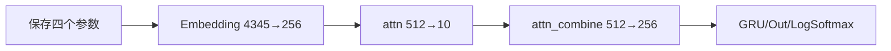
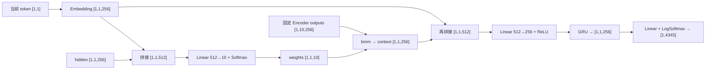

# 第 15 节：有 Attention Decoder 代码（上）：初始化九个成员

> 笔记编号 15/26 · 对应原视频 P94 · [打开这一集](https://www.bilibili.com/video/BV14mdfBDE4Q?p=94)

[← 上一节：14 课程版 Attention Decoder：拼接查询与隐藏状态计算 10 个权重](./14-attention-decoder-plan.md) · [返回总目录](./README.md) · [下一节：16 有 Attention Decoder 代码（下）：逐行完成拼接式 Attention →](./16-attention-decoder-code-part2.md)

## 这节解决什么问题

output_size、hidden_size、dropout_p 和 max_length 分别决定哪些层，为什么会出现两个 512 维线性变换？


图从左向右读。先跟着数据或推理过程走一遍，再学习下面的术语。

## 辅助流程图



### 带注意力 Decoder 单步形状流



## 老师原声整理稿（按讲解顺序）

### 0:00–3:47　四个构造参数分别控制词表、隐藏维、随机失活和固定句长

老师定义 output_size、hidden_size、dropout_p、max_length。output_size 是法语词表大小约 4345；hidden_size 与 Encoder 保持 256，保证 Encoder 最后 hidden 能直接作为 Decoder 初始 hidden；dropout_p 控制 Embedding 后的随机失活；max_length 在课程里设为 10。

### 3:47–7:51　Embedding 与第一个 Linear：把查询和 hidden 映射成十个位置权重

Embedding 把法语 token 从 4345 类映射到 256 维。当前词表示和上一 hidden 拼接后是 512 维，所以 `attn` 定义为 `Linear(512,10)`。它输出的是十个源位置的打分，之后才会经过 Softmax 成为权重。

老师特别解释 Linear 可以接三维张量：它只变换最后一维，前面的 batch 与时间维保持不变。因此 `[1,1,512]` 可以直接得到 `[1,1,10]`。

### 7:51–10:03　第二个 Linear 把查询与 context 从 512 维融合回 256 维

注意力权重汇总 Encoder outputs 后得到 256 维 context；它还要与当前词的 256 维 Embedding 再次拼接。因此 `attn_combine` 是 `Linear(512,256)`，负责把融合结果压回 GRU 所需的隐藏维。

两个 Linear 都从 512 开始，但作用完全不同：第一个产生 10 个位置分数，第二个生成 256 维融合特征。

### 10:03–11:35　Dropout、GRU、Out 与 LogSoftmax 完成剩余成员

课程随后创建 Dropout、`GRU(256,256)`、`Linear(256,4345)` 和 `LogSoftmax(dim=-1)`。最终输出是法语词表上的对数概率，因此训练阶段与 NLLLoss 配套。

本节只完成初始化，forward 的三项输入——当前词、hidden、固定长度 Encoder outputs——留到下一节逐步实现。

## 完整原声逐段记录

[查看本节按时间戳整理的完整音轨转写](./transcripts/p094.md)

逐段记录用于核查老师讲解是否遗漏；正文会进一步纠正口误和语音识别中的技术术语。

## 零基础先记住

- attn: 2H→max_length
- attn_combine: 2H→H
- GRU 输入仍是 H
- Out: H→法语词表
- LogSoftmax 配 NLLLoss

## 最小可运行代码

下面代码默认从项目根目录运行；专题配套实现见 [seq2seq_from_scratch 配套实现](../../seq2seq_from_scratch/README.md)。

```python
import torch
H,L,V=256,10,4345
attn=torch.nn.Linear(H*2,L)
combine=torch.nn.Linear(H*2,H)
out=torch.nn.Linear(H,V)
print(attn,combine,out)
```

### 输入和输出怎么看

打印课程版 Attention Decoder 三个关键线性层：512→10、512→256、256→4345。

## 最容易踩的坑

两个 512 维输入的 Linear 用途不同，不能把 attn_combine 误写成注意力打分层。

## 本节知识链

`保存四个参数 → Embedding 4345→256 → attn 512→10 → attn_combine 512→256 → GRU/Out/LogSoftmax`

## 自测

**问题：为什么课程版 GRU 的 input_size 是 256 而不是 512？**

<details>
<summary>点开核对答案</summary>

512 维拼接结果先经 attn_combine 降回 256，再进入 GRU。

</details>

## 学完检查

- [ ] 我能用自己的话复述老师的讲解顺序
- [ ] 我能在运行前预测关键输出或张量形状
- [ ] 我知道这节方法最容易用错的地方
- [ ] 我能独立回答自测题

[← 上一节：14 课程版 Attention Decoder：拼接查询与隐藏状态计算 10 个权重](./14-attention-decoder-plan.md) · [返回总目录](./README.md) · [下一节：16 有 Attention Decoder 代码（下）：逐行完成拼接式 Attention →](./16-attention-decoder-code-part2.md)
