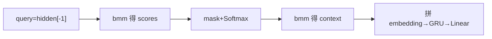
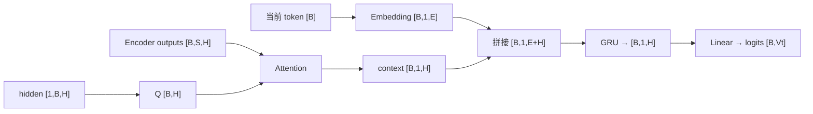

# 第 16 节：有 Attention Decoder 代码（下）：逐行完成 forward_step

> 笔记编号 16/26 · 对应原视频 P95 · [打开这一集](https://www.bilibili.com/video/BV14mdfBDE4Q?p=95)

[← 上一节：15 有 Attention Decoder 代码（上）：定义层与接口](./15-attention-decoder-code-part1.md) · [返回总目录](./README.md) · [下一节：17 测试 Attention Decoder：权重、mask 与单步输出 →](./17-test-attention-decoder.md)

## 这节解决什么问题

如何从隐藏状态一步步得到 logits，并确保每个变形都不误删维度？


图从左向右读。先跟着数据或推理过程走一遍，再学习下面的术语。

## 辅助流程图



### 带注意力 Decoder 单步形状流



## 老师原声整理稿（按讲解顺序）

### 0:00–5:52　Q/K 打分

query=hidden[-1] 得 [B,H]；query.unsqueeze(-1) 得 [B,H,1]；encoder_outputs[B,S,H] bmm 后得到 [B,S,1]，squeeze(-1) 成 [B,S]。

### 5:52–10:50　mask 与权重

PAD 位置分数填很小负数，再 Softmax(dim=-1)。这样权重非负、每样本和为 1、PAD 接近 0。

### 10:50–13:50　加权 V

weights.unsqueeze(1)[B,1,S] bmm encoder_outputs[B,S,H] 得 context[B,1,H]。

### 13:50–16:02　GRU 与分类

目标 embedding[B,1,E] 与 context 拼接，GRU 更新 hidden，Linear 输出 [B,Vt] logits。

## 完整原声逐段记录

[查看本节按时间戳整理的完整音轨转写](./transcripts/p095.md)

逐段记录用于核查老师讲解是否遗漏；正文会进一步纠正口误和语音识别中的技术术语。

## 零基础先记住

- squeeze 只删明确为 1 的维
- mask 在 Softmax 前
- context 保留时间维便于拼接

## 最小可运行代码

下面代码默认从项目根目录运行；专题配套实现见 [seq2seq_from_scratch 配套实现](../../seq2seq_from_scratch/README.md)。

```python
import torch
B,S,H=2,5,8
enc=torch.randn(B,S,H); q=torch.randn(B,H)
scores=torch.bmm(enc,q.unsqueeze(-1)).squeeze(-1)
w=torch.softmax(scores,-1); c=torch.bmm(w.unsqueeze(1),enc)
print(scores.shape,w.shape,c.shape)
```

### 输入和输出怎么看

scores/weights=[2,5]，context=[2,1,8]。

## 最容易踩的坑

使用 squeeze() 可能在 B=1 时误删 batch 维；写 squeeze(-1)。

## 本节知识链

`query=hidden[-1] → bmm 得 scores → mask+Softmax → bmm 得 context → 拼 embedding→GRU→Linear`

## 自测

**问题：为什么 context 是 [B,1,H] 而不是 [B,S,H]？**

<details>
<summary>点开核对答案</summary>

权重已把 S 个源位置加权求和成一个本步上下文。

</details>

## 学完检查

- [ ] 我能用自己的话复述老师的讲解顺序
- [ ] 我能在运行前预测关键输出或张量形状
- [ ] 我知道这节方法最容易用错的地方
- [ ] 我能独立回答自测题

[← 上一节：15 有 Attention Decoder 代码（上）：定义层与接口](./15-attention-decoder-code-part1.md) · [返回总目录](./README.md) · [下一节：17 测试 Attention Decoder：权重、mask 与单步输出 →](./17-test-attention-decoder.md)
