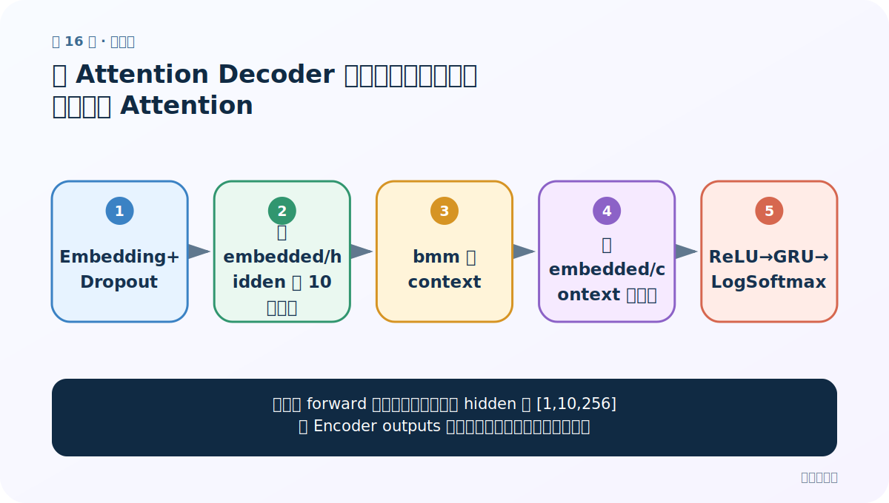
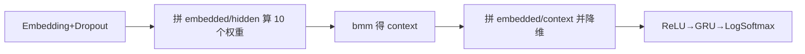
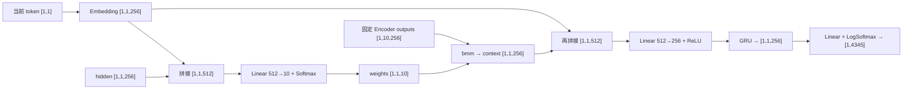

# 第 16 节：有 Attention Decoder 代码（下）：逐行完成拼接式 Attention

> 笔记编号 16/26 · 对应原视频 P95 · [打开这一集](https://www.bilibili.com/video/BV14mdfBDE4Q?p=95)

[← 上一节：15 有 Attention Decoder 代码（上）：初始化九个成员](./15-attention-decoder-code-part1.md) · [返回总目录](./README.md) · [下一节：17 测试 Attention Decoder：补成固定 10 步并逐个喂真实目标词 →](./17-test-attention-decoder.md)

## 这节解决什么问题

课堂版 forward 怎样从当前词、上一 hidden 和 [1,10,256] 的 Encoder outputs 得到对数概率、更新状态与权重？



图从左向右读。先跟着数据或推理过程走一遍，再学习下面的术语。

## 辅助流程图



### 带注意力 Decoder 单步形状流



## 老师原声整理稿（按讲解顺序）

### 0:00–4:17　三个输入的课程形状先对齐

forward 接收当前时间步 token、上一 hidden 和 Encoder 所有时间步输出。课堂 batch_size=1：token 形状为 `[1,1]`，hidden 为 `[1,1,256]`，Encoder outputs 已补进固定张量 `[1,10,256]`。

当前 token 经 Embedding 和 Dropout 后仍是 `[1,1,256]`。这份表示与 hidden 是注意力打分的两个输入，不是拿 hidden 与每个 Encoder output 做点积。

### 4:17–8:24　拼 embedded 与 hidden，经 attn 和 Softmax 得 [1,1,10]

老师用 `torch.cat((embedded, hidden), dim=-1)` 得到 `[1,1,512]`，交给上一节的 `attn: Linear(512,10)`，再沿最后一维做 Softmax。结果 `attn_weights` 为十个固定源位置分配概率，总和为 1。

这里没有显式 mask。长度不足 10 的 Encoder outputs 后部是零向量，但相应分数仍可能分到概率；这是课程实现的简化边界。

### 8:24–11:46　bmm 用十个权重汇总 Encoder outputs

`attn_weights [1,1,10]` 与 `encoder_outputs [1,10,256]` 做 `torch.bmm`，得到 `attn_applied [1,1,256]`。十个源位置在这一维被加权求和，只保留 256 维上下文。

老师把这一步称为“根据注意力权重计算上下文”，并用形状相乘说明为什么固定长度维必须一致。

### 11:46–14:28　再次拼接 embedded/context，再由 attn_combine 降回隐藏维

当前词表示和 context 各为 256 维，拼起来是 `[1,1,512]`。`attn_combine` 把最后一维从 512 降到 256，再经过 ReLU。老师在这里演示 unsqueeze、squeeze 与 Linear 对末维的作用，目的是让张量符合 GRU 输入。

### 14:28–16:02　GRU 更新 hidden，Out+LogSoftmax 返回三项结果

融合后的 256 维表示进入 GRU，得到本步 output 和新 hidden。output 经过适当的维度整理，再由 Linear 映射到 4345 个法语词，最后 LogSoftmax 得到 `[1,4345]` 对数概率。

函数返回 output、hidden、attn_weights。第三项并非 Decoder 计算必须的额外状态，而是为了后续可视化每个法语词对应的英语位置权重。

## 完整原声逐段记录

[查看本节按时间戳整理的完整音轨转写](./transcripts/p095.md)

逐段记录用于核查老师讲解是否遗漏；正文会进一步纠正口误和语音识别中的技术术语。

## 零基础先记住

- embedded 与 hidden 先拼接打分
- Softmax 输出固定十个源位置权重
- bmm 汇总 Encoder outputs
- embedded/context 再拼接融合
- 返回 log-probabilities、hidden、weights

## 最小可运行代码

下面代码默认从项目根目录运行；专题配套实现见 [seq2seq_from_scratch 配套实现](../../seq2seq_from_scratch/README.md)。

```python
import torch
B,H,L,V=1,256,10,4345
embedded=torch.randn(B,1,H); hidden=torch.randn(1,B,H); enc=torch.randn(B,L,H)
attn=torch.nn.Linear(H*2,L); combine=torch.nn.Linear(H*2,H); classifier=torch.nn.Linear(H,V)
w=torch.softmax(attn(torch.cat((embedded,hidden.transpose(0,1)),-1)),-1)
context=torch.bmm(w,enc)
fused=torch.relu(combine(torch.cat((embedded,context),-1)))
log_probs=torch.log_softmax(classifier(fused.squeeze(1)),-1)
print(w.shape,context.shape,log_probs.shape)
```

### 输入和输出怎么看

weights=[1,1,10]，context=[1,1,256]，log_probs=[1,4345]。

## 最容易踩的坑

课程代码没有 source mask，不要在整理稿中写成‘已屏蔽 PAD’；这只能作为后续改进建议。

## 本节知识链

`Embedding+Dropout → 拼 embedded/hidden 算 10 个权重 → bmm 得 context → 拼 embedded/context 并降维 → ReLU→GRU→LogSoftmax`

## 自测

**问题：attn 和 attn_combine 都接 512 维，它们分别输出什么？**

<details>
<summary>点开核对答案</summary>

attn 输出 10 个源位置分数；attn_combine 输出 256 维融合表示。

</details>

## 学完检查

- [ ] 我能用自己的话复述老师的讲解顺序
- [ ] 我能在运行前预测关键输出或张量形状
- [ ] 我知道这节方法最容易用错的地方
- [ ] 我能独立回答自测题

[← 上一节：15 有 Attention Decoder 代码（上）：初始化九个成员](./15-attention-decoder-code-part1.md) · [返回总目录](./README.md) · [下一节：17 测试 Attention Decoder：补成固定 10 步并逐个喂真实目标词 →](./17-test-attention-decoder.md)
