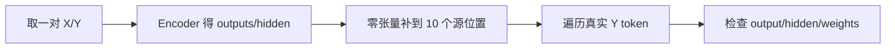
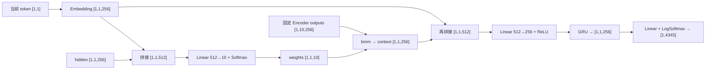

# 第 17 节：测试 Attention Decoder：补成固定 10 步并逐个喂真实目标词

> 笔记编号 17/26 · 对应原视频 P96 · [打开这一集](https://www.bilibili.com/video/BV14mdfBDE4Q?p=96)

[← 上一节：16 有 Attention Decoder 代码（下）：逐行完成拼接式 Attention](./16-attention-decoder-code-part2.md) · [返回总目录](./README.md) · [下一节：18 模型搭建总结：固定十步 Attention Decoder 的完整接口 →](./18-model-summary.md)

## 这节解决什么问题

怎样把变长 Encoder outputs 放进课程要求的 [1,10,256] 张量，再验证 Decoder 三个返回值的形状？


图从左向右读。先跟着数据或推理过程走一遍，再学习下面的术语。

## 辅助流程图



### 带注意力 Decoder 单步形状流



## 老师原声整理稿（按讲解顺序）

### 0:00–6:58　实例化 Encoder 与 Attention Decoder，先核对词表和隐藏维

老师仍先调用 DataLoader，再创建英文 Encoder 和法语 Attention Decoder。英文词表约 2803，法语词表约 4345，隐藏维都是 256，Decoder 额外接收 dropout 和 max_length=10。两套模型必须位于同一 device。

打印结构只是为了核对层尺寸；真正测试还需要从 DataLoader 取一对 X/Y 并走完整编码、解码调用。

### 6:58–12:41　Encoder 返回真实长度 outputs 和 final hidden

英文 X 进入 Encoder，得到所有时间步 output 和最后 hidden。例如源句实际有 6 个 token，outputs 形状是 `[1,6,256]`，hidden 是 `[1,1,256]`。老师逐项解释：outputs 保留六个源位置，hidden 汇总到最后时间步。

Decoder 初始 hidden 直接使用 Encoder hidden，因为两者隐藏维一致。

### 12:41–18:37　创建 [1,10,256] 零张量，只把真实 Encoder outputs 复制到前面

课程版注意力层固定输出十个权重，所以老师先创建 `[1,10,256]` 的零张量，再根据真实源长把 `outputs[:, :source_len]` 复制进去。若源长为 6，前六个位置保存真实编码状态，后四个位置保持零。

这叫固定长度存储，不等于已经实现带 mask 的 padding。后四个零位置仍参与注意力打分，这是课程演示方案的限制。

### 18:37–23:46　按真实法语长度逐词调用 Decoder

测试循环遍历 Y 的真实长度，每次取 `y[:, i]` 作为当前 Decoder 输入。和 P92 一样，这里喂的是已知法语 token，用于验收接口；不是从 SOS 开始让模型自由生成。

每一步同时传入上一 hidden 与固定长度 Encoder outputs，得到当前输出、新 hidden 和注意力权重。

### 23:46–27:17　三项形状分别是 [1,4345]、[1,1,256]、[1,1,10]

老师打印三项结果：output 覆盖 4345 个法语候选，hidden 保持一层、一个样本、256 维，attention weights 对十个固定源位置分配概率。目标句有几个 token，就会重复打印几组。

未训练时这些概率和权重没有翻译意义；本节只证明 Encoder、固定长度缓冲区与 Attention Decoder 的接口能够贯通。训练完成后返回 weights，才用于观察不同目标词的关注位置。

## 完整原声逐段记录

[查看本节按时间戳整理的完整音轨转写](./transcripts/p096.md)

逐段记录用于核查老师讲解是否遗漏；正文会进一步纠正口误和语音识别中的技术术语。

## 零基础先记住

- Encoder outputs 先复制进固定长度 10 的零张量
- Decoder hidden 直接接 Encoder hidden
- 测试逐词喂真实 Y
- 每步返回 [1,4345]、[1,1,256]、[1,1,10]

## 最小可运行代码

下面代码默认从项目根目录运行；专题配套实现见 [seq2seq_from_scratch 配套实现](../../seq2seq_from_scratch/README.md)。

```python
import torch
max_length,H=10,256
encoder_outputs=torch.randn(1,6,H); hidden=torch.randn(1,1,H)
fixed=torch.zeros(1,max_length,H)
fixed[:,:encoder_outputs.shape[1],:]=encoder_outputs
print(encoder_outputs.shape,fixed.shape,hidden.shape)
```

### 输入和输出怎么看

真实 6 步 Encoder outputs 被放进 [1,10,256] 缓冲区，剩余位置为零。

## 最容易踩的坑

不要把这段真实目标词循环写成推理，也不要声称零填充位置已经被 mask 为零权重。

## 本节知识链

`取一对 X/Y → Encoder 得 outputs/hidden → 零张量补到 10 个源位置 → 遍历真实 Y token → 检查 output/hidden/weights`

## 自测

**问题：为什么源句只有 6 个 token，attention weights 仍有 10 个位置？**

<details>
<summary>点开核对答案</summary>

课程把注意力输出长度固定为 max_length=10，真实六步之外用零向量补齐。

</details>

## 学完检查

- [ ] 我能用自己的话复述老师的讲解顺序
- [ ] 我能在运行前预测关键输出或张量形状
- [ ] 我知道这节方法最容易用错的地方
- [ ] 我能独立回答自测题

[← 上一节：16 有 Attention Decoder 代码（下）：逐行完成拼接式 Attention](./16-attention-decoder-code-part2.md) · [返回总目录](./README.md) · [下一节：18 模型搭建总结：固定十步 Attention Decoder 的完整接口 →](./18-model-summary.md)
