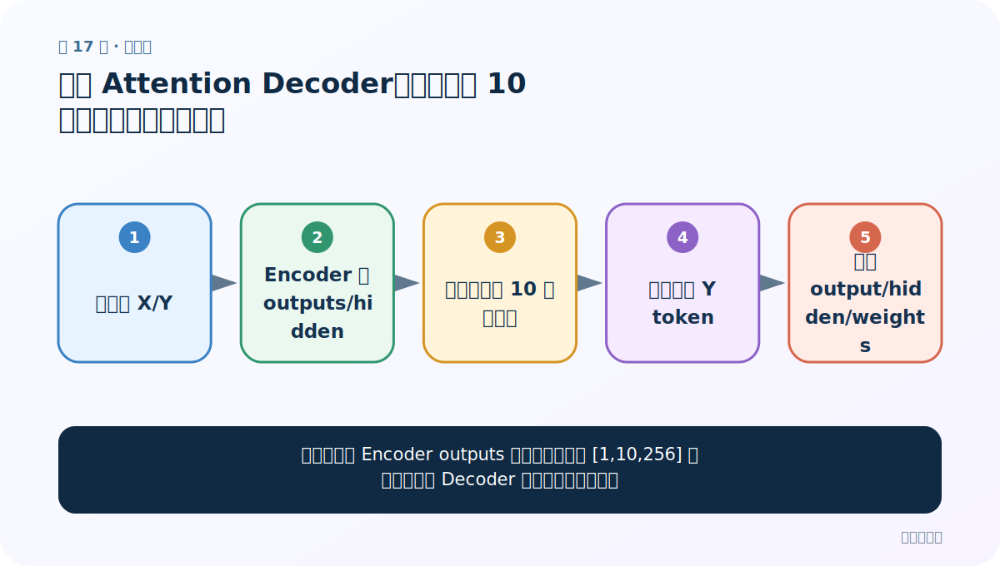
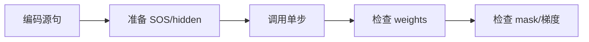
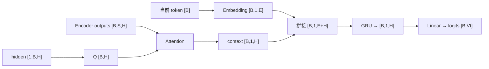

# 第 17 节：测试 Attention Decoder：权重、mask 与单步输出

> 笔记编号 17/26 · 对应原视频 P96 · [打开这一集](https://www.bilibili.com/video/BV14mdfBDE4Q?p=96)

[← 上一节：16 有 Attention Decoder 代码（下）：逐行完成 forward_step](./16-attention-decoder-code-part2.md) · [返回总目录](./README.md) · [下一节：18 模型搭建总结：三个模块如何对接 →](./18-model-summary.md)

## 这节解决什么问题

怎样证明注意力 Decoder 真正在看源序列，而不只是形状能跑？



图从左向右读。先跟着数据或推理过程走一遍，再学习下面的术语。

## 辅助流程图



### 带注意力 Decoder 单步形状流



## 老师原声整理稿（按讲解顺序）

### 0:00–7:55　测试输入

创建小词表和短源句，先跑 Encoder 得 outputs/hidden，再用 SOS 调 Decoder。

### 7:55–15:50　形状断言

logits[B,Vt]、new_hidden[1,B,H]、weights[B,S]。每行 weights 和约等于 1。

### 15:50–22:42　mask 与 batch

把源尾部设为 PAD 并传 mask，确认对应权重为 0；batch>1 可发现 squeeze/广播错误。

### 22:42–27:17　数值意义

未训练权重没有语言解释；测试关注概率性质、梯度可回传和有限值。训练后才可观察对齐。

## 完整原声逐段记录

[查看本节按时间戳整理的完整音轨转写](./transcripts/p096.md)

逐段记录用于核查老师讲解是否遗漏；正文会进一步纠正口误和语音识别中的技术术语。

## 零基础先记住

- 权重和为 1
- PAD 权重为 0
- 测试 batch>1

## 最小可运行代码

下面代码默认从项目根目录运行；专题配套实现见 [seq2seq_from_scratch 配套实现](../../seq2seq_from_scratch/README.md)。

```python
import torch
from seq2seq_from_scratch.model import EncoderGRU,AttentionDecoderGRU
enc=EncoderGRU(20,6,8); dec=AttentionDecoderGRU(25,7,8)
o,h=enc(torch.randint(3,20,(2,5))); logits,h,w=dec.forward_step(torch.ones(2,dtype=torch.long),h,o)
print(logits.shape,w.sum(-1))
```

### 输入和输出怎么看

logits=[2,25]，每条权重和为 1。

## 最容易踩的坑

只打印一大串随机数不如写 shape 和性质断言。

## 本节知识链

`编码源句 → 准备 SOS/hidden → 调用单步 → 检查 weights → 检查 mask/梯度`

## 自测

**问题：未训练时某词权重最高能说明翻译对齐吗？**

<details>
<summary>点开核对答案</summary>

不能，只是随机初始化结果。

</details>

## 学完检查

- [ ] 我能用自己的话复述老师的讲解顺序
- [ ] 我能在运行前预测关键输出或张量形状
- [ ] 我知道这节方法最容易用错的地方
- [ ] 我能独立回答自测题

[← 上一节：16 有 Attention Decoder 代码（下）：逐行完成 forward_step](./16-attention-decoder-code-part2.md) · [返回总目录](./README.md) · [下一节：18 模型搭建总结：三个模块如何对接 →](./18-model-summary.md)
