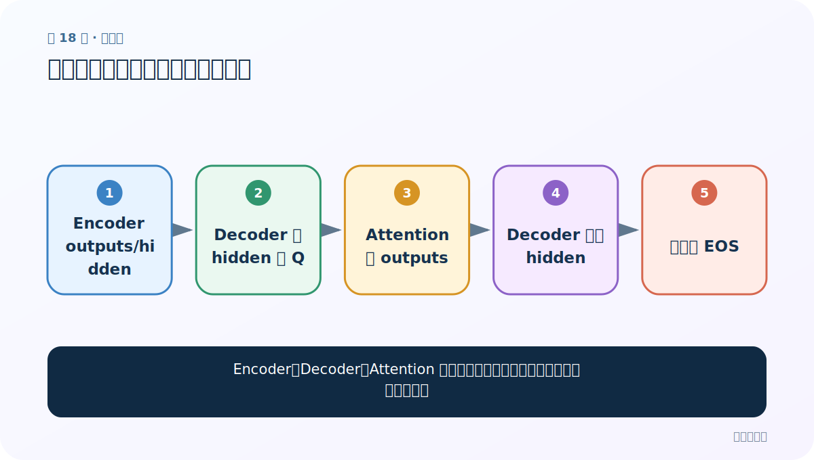
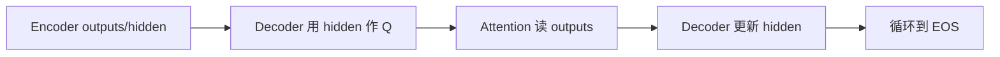
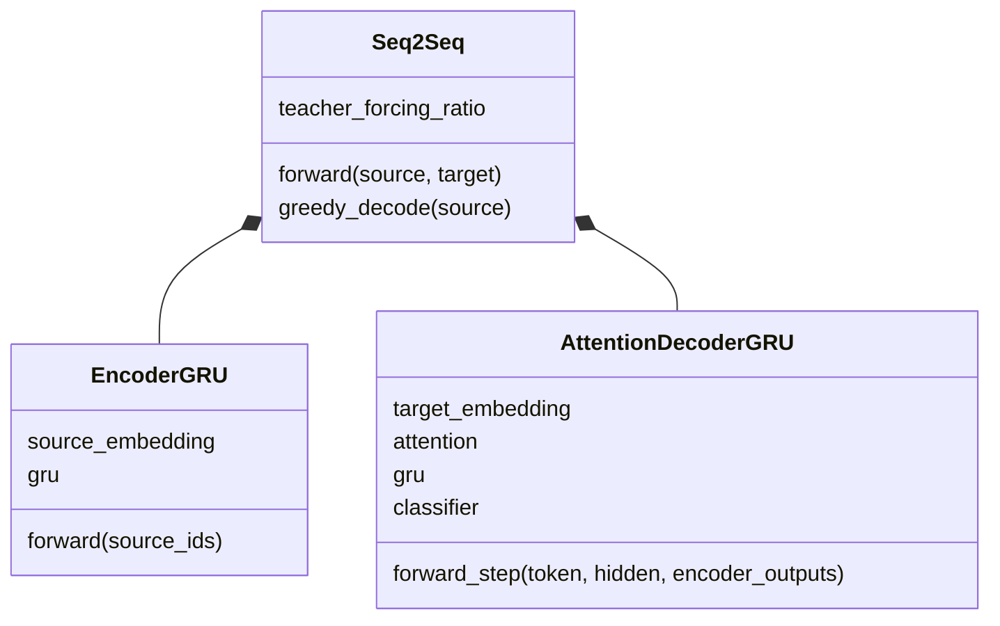
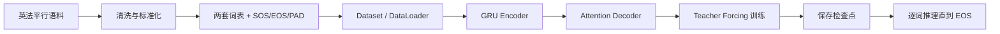

# 第 18 节：模型搭建总结：三个模块如何对接

> 笔记编号 18/26 · 对应原视频 P97 · [打开这一集](https://www.bilibili.com/video/BV14mdfBDE4Q?p=97)

[← 上一节：17 测试 Attention Decoder：权重、mask 与单步输出](./17-test-attention-decoder.md) · [返回总目录](./README.md) · [下一节：19 Teacher Forcing：训练时有时喂真值上一词 →](./19-teacher-forcing.md)

## 这节解决什么问题

Encoder、Decoder、Attention 的输出输入怎样闭环，哪里最容易尺寸不一致？



图从左向右读。先跟着数据或推理过程走一遍，再学习下面的术语。

## 辅助流程图



### Seq2Seq 模块 UML



### 英法翻译从数据到预测的总流程



## 老师原声整理稿（按讲解顺序）

### 0:00–3:47　三类接口

Encoder 输入源 ID，输出全部状态和 final hidden；Decoder 单步输入 token、hidden、Encoder outputs，输出 logits/new hidden/weights。

### 3:47–6:22　统一隐藏维

最简实现让 Encoder H 与 Decoder H 相同，final hidden 直接初始化 Decoder。若不同，需桥接 Linear；双向 Encoder 还需合并方向。

## 完整原声逐段记录

[查看本节按时间戳整理的完整音轨转写](./transcripts/p097.md)

逐段记录用于核查老师讲解是否遗漏；正文会进一步纠正口误和语音识别中的技术术语。

## 零基础先记住

- 接口先写 shape 再写代码
- Encoder/Decoder hidden 不同需桥接
- attention 连接全部 Encoder outputs

## 最小可运行代码

下面代码默认从项目根目录运行；专题配套实现见 [seq2seq_from_scratch 配套实现](../../seq2seq_from_scratch/README.md)。

```python
import torch
from seq2seq_from_scratch.model import EncoderGRU, AttentionDecoderGRU, Seq2Seq
encoder=EncoderGRU(100,16,32)
decoder=AttentionDecoderGRU(120,16,32)
model=Seq2Seq(encoder,decoder,start_id=1,end_id=2)
print(type(model).__name__)
```

### 输入和输出怎么看

统一 hidden_size=32，接口可直接连接。

## 最容易踩的坑

双向 Encoder hidden 第一维含两个方向，不能直接当单向 Decoder 初始状态。

## 本节知识链

`Encoder outputs/hidden → Decoder 用 hidden 作 Q → Attention 读 outputs → Decoder 更新 hidden → 循环到 EOS`

## 自测

**问题：为什么本例 Encoder/Decoder hidden 都设 32？**

<details>
<summary>点开核对答案</summary>

简化对接，使 final hidden 可直接传给 Decoder。

</details>

## 学完检查

- [ ] 我能用自己的话复述老师的讲解顺序
- [ ] 我能在运行前预测关键输出或张量形状
- [ ] 我知道这节方法最容易用错的地方
- [ ] 我能独立回答自测题

[← 上一节：17 测试 Attention Decoder：权重、mask 与单步输出](./17-test-attention-decoder.md) · [返回总目录](./README.md) · [下一节：19 Teacher Forcing：训练时有时喂真值上一词 →](./19-teacher-forcing.md)
