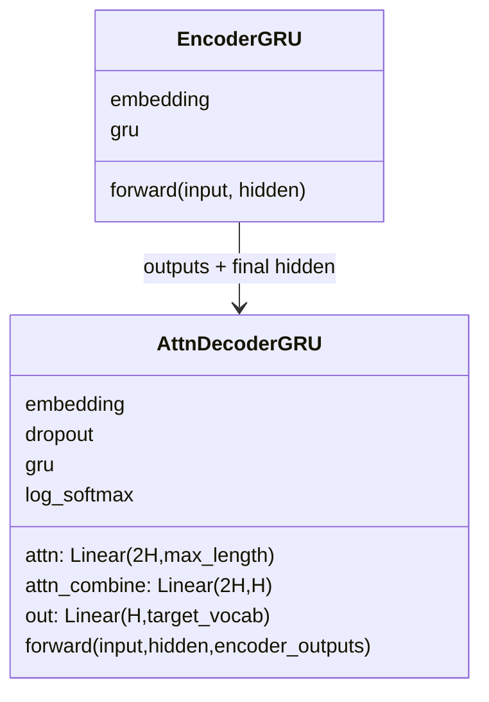
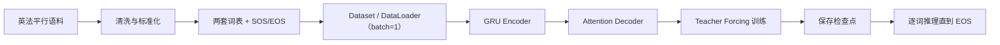

# 第 18 节：模型搭建总结：固定十步 Attention Decoder 的完整接口

> 笔记编号 18/26 · 对应原视频 P97 · [打开这一集](https://www.bilibili.com/video/BV14mdfBDE4Q?p=97)

[← 上一节：17 测试 Attention Decoder：补成固定 10 步并逐个喂真实目标词](./17-test-attention-decoder.md) · [返回总目录](./README.md) · [下一节：19 Teacher Forcing：训练时有时喂真值上一词 →](./19-teacher-forcing.md)

## 这节解决什么问题

Encoder 与课程版 Attention Decoder 已写完，哪些尺寸和返回值必须保持一致？


图从左向右读。先跟着数据或推理过程走一遍，再学习下面的术语。

## 辅助流程图


### Seq2Seq 模块 UML



### 英法翻译从数据到预测的总流程



## 老师原声整理稿（按讲解顺序）

### 0:00–2:19　Encoder 提供两份结果，Decoder 不能只拿最后状态

老师总结 Encoder 输入英文 ID 后返回所有时间步 outputs 和 final hidden。hidden 用来初始化 Decoder；outputs 要复制到固定 `[1,10,256]` 缓冲区，供每个目标时间步重新计算注意力。

无 Attention 版本只依赖最后状态，课程版 Attention 则同时保留整段源序列信息。

### 2:19–4:34　Decoder 内部有两次拼接和两个不同 Linear

当前法语输入的 Embedding 与上一 hidden 先拼成 512 维，经 `attn` 得十个位置权重；权重与固定 Encoder outputs 做 bmm 得 context。随后 Embedding 与 context 再拼成 512 维，经 `attn_combine` 降回 256，才进入 GRU。

若只记“拼接”却不区分两次目的，很容易把 512→10 和 512→256 两个 Linear 写反。

### 4:34–6:22　输出约定决定损失与可视化

每步返回法语词表上的 LogSoftmax 对数概率、新 hidden 和十维 attention weights。对数概率与 NLLLoss 配套；weights 留给后续热力图。

Encoder 与 Decoder hidden_size 都是 256，才能直接传 hidden。课程 batch_size=1、max_length=10，也没有 source mask；这些是本案例接口的一部分，不应悄悄改写成另一套实现。

## 完整原声逐段记录

[查看本节按时间戳整理的完整音轨转写](./transcripts/p097.md)

逐段记录用于核查老师讲解是否遗漏；正文会进一步纠正口误和语音识别中的技术术语。

## 零基础先记住

- final hidden 初始化 Decoder
- 全部 outputs 复制进固定十步缓冲区
- 两次拼接作用不同
- LogSoftmax 配 NLLLoss
- weights 用于可视化

## 配套现代化实现示例（点积 Attention，与课堂版公式不同）

下面代码默认从项目根目录运行；专题配套实现见 [seq2seq_from_scratch 配套实现](../../seq2seq_from_scratch/README.md)。

```python
import torch
from seq2seq_from_scratch.model import EncoderGRU, AttentionDecoderGRU, Seq2Seq
encoder=EncoderGRU(100,16,32)
decoder=AttentionDecoderGRU(120,16,32)
model=Seq2Seq(encoder,decoder,start_id=1,end_id=2)
print(type(model).__name__)
```

### 输入和输出怎么看

示例展示一个可运行的现代化点积 Attention 变体；正文仍以老师的拼接式固定长度实现为准。

## 最容易踩的坑

配套 Python 包采用点积 Attention，不能反过来把课堂视频说成点积实现。

## 本节知识链

`Encoder 返回 outputs/hidden → outputs 复制进 [1,10,H] → 当前词+hidden 计算十个权重 → context 融合后更新 hidden → 返回 log_probs/hidden/weights`

## 自测

**问题：课程版为什么需要把真实 Encoder outputs 复制到长度 10？**

<details>
<summary>点开核对答案</summary>

attn 线性层固定输出十个权重，bmm 的源位置维必须与它一致。

</details>

## 学完检查

- [ ] 我能用自己的话复述老师的讲解顺序
- [ ] 我能在运行前预测关键输出或张量形状
- [ ] 我知道这节方法最容易用错的地方
- [ ] 我能独立回答自测题

[← 上一节：17 测试 Attention Decoder：补成固定 10 步并逐个喂真实目标词](./17-test-attention-decoder.md) · [返回总目录](./README.md) · [下一节：19 Teacher Forcing：训练时有时喂真值上一词 →](./19-teacher-forcing.md)
