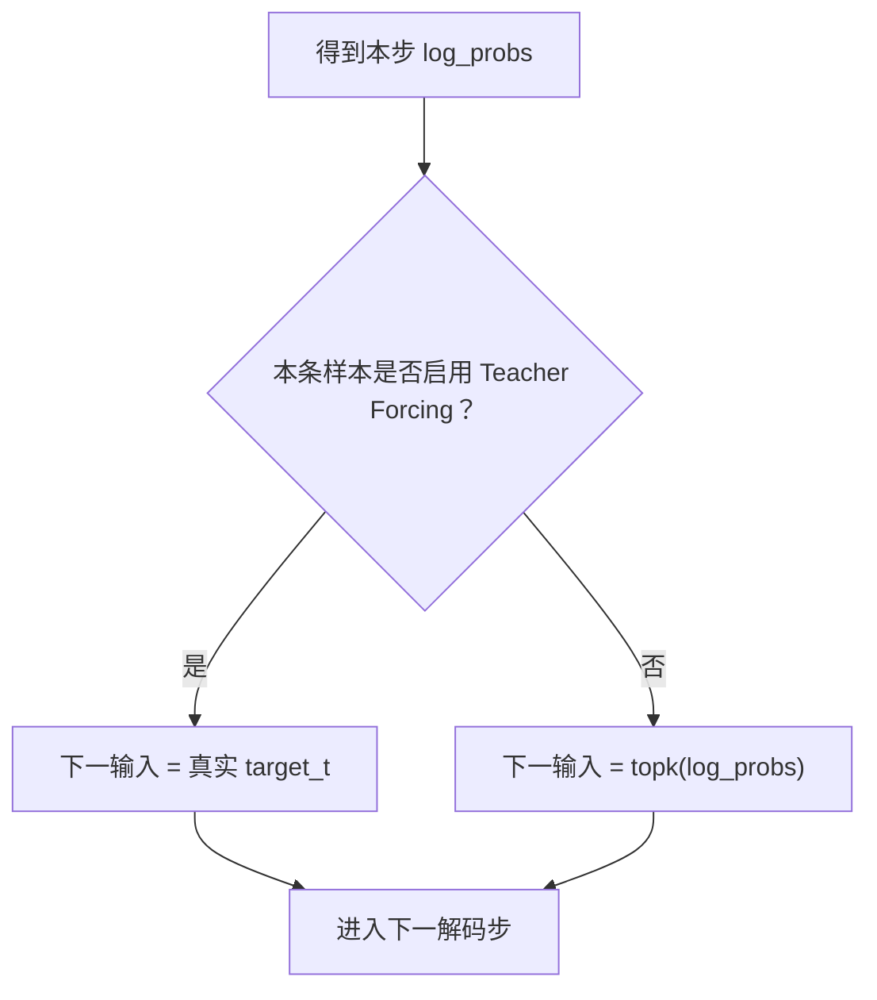

# 第 19 节：Teacher Forcing：训练时有时喂真值上一词

> 笔记编号 19/26 · 对应原视频 P98 · [打开这一集](https://www.bilibili.com/video/BV14mdfBDE4Q?p=98)

[← 上一节：18 模型搭建总结：固定十步 Attention Decoder 的完整接口](./18-model-summary.md) · [返回总目录](./README.md) · [下一节：20 单样本训练函数：Teacher Forcing 两条分支怎样累计 NLLLoss →](./20-train-one-batch.md)

## 这节解决什么问题

为什么教师强制能加快训练，又会带来训练/推理不一致？


图从左向右读。先跟着数据或推理过程走一遍，再学习下面的术语。

## 辅助流程图


### Teacher Forcing 分支时序



## 老师原声整理稿（按讲解顺序）

### 0:00–4:50　真实目标是标签，Teacher Forcing 决定它是否也作为下一输入

老师先把英文 X 称为特征、法语 Y 称为真实目标。Decoder 逐词预测时，本步输出无论对错都能与真实 Y 计算损失；Teacher Forcing 额外决定下一步是否直接喂真实词，而不是喂刚才的预测。

### 4:50–8:47　数学推导类比：中间一步错后，先纠正再让学生继续

老师用辅导孩子做多步数学题类比。若第三步错了却把错误结果继续带到第四、第五步，后面大概率越来越偏；Teacher Forcing 相当于告诉他第三步的正确结果，再从正确状态继续推导。

它不是把后续答案全部提前泄露，而是在每个解码位置提供正确历史，减少早期随机错误的连锁影响。

### 8:47–11:35　作用与边界：收敛更快更稳，但预测时不会再有人纠正

老师总结两点作用：纠正错误、避免越错越离谱，并加快训练收敛。下一节课程用随机数和 0.5 比例决定一条样本是否走 Teacher Forcing 分支。

预测阶段没有真实法语可喂，只能使用模型自己的输出。课程总结还提醒比例不宜盲目设得过高，否则训练时过度依赖真值历史，实际生成可能不稳定。

## 完整原声逐段记录

[查看本节按时间戳整理的完整音轨转写](./transcripts/p098.md)

逐段记录用于核查老师讲解是否遗漏；正文会进一步纠正口误和语音识别中的技术术语。

## 零基础先记住

- 真实 Y 始终是监督标签
- Teacher Forcing 额外把真值作为下一输入
- 避免错误逐步累积
- 只用于训练
- 课程下一节按样本随机选择分支

## 最小可运行代码

下面代码默认从项目根目录运行；专题配套实现见 [seq2seq_from_scratch 配套实现](../../seq2seq_from_scratch/README.md)。

```python
for ratio in (1.0,.5,0.0):
    print(ratio,"真值概率",ratio)
```

### 输入和输出怎么看

显示三个常见教师强制比例的含义。

## 最容易踩的坑

不要把 Teacher Forcing 说成‘发现哪一步错就精准纠正’；课程代码只按随机概率选择分支。

## 本节知识链

`Decoder 预测本词 → 抛随机数 → 真值上一词或预测词 → 作为下一输入 → 重复到目标末尾`

## 自测

**问题：Teacher Forcing 改变的是监督目标还是下一步输入？**

<details>
<summary>点开核对答案</summary>

改变下一步输入；监督损失仍然与真实目标词比较。

</details>

## 学完检查

- [ ] 我能用自己的话复述老师的讲解顺序
- [ ] 我能在运行前预测关键输出或张量形状
- [ ] 我知道这节方法最容易用错的地方
- [ ] 我能独立回答自测题

[← 上一节：18 模型搭建总结：固定十步 Attention Decoder 的完整接口](./18-model-summary.md) · [返回总目录](./README.md) · [下一节：20 单样本训练函数：Teacher Forcing 两条分支怎样累计 NLLLoss →](./20-train-one-batch.md)
