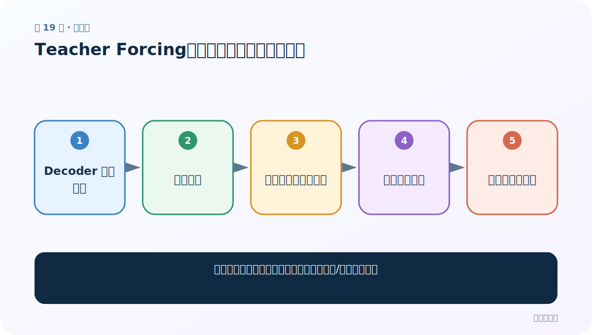
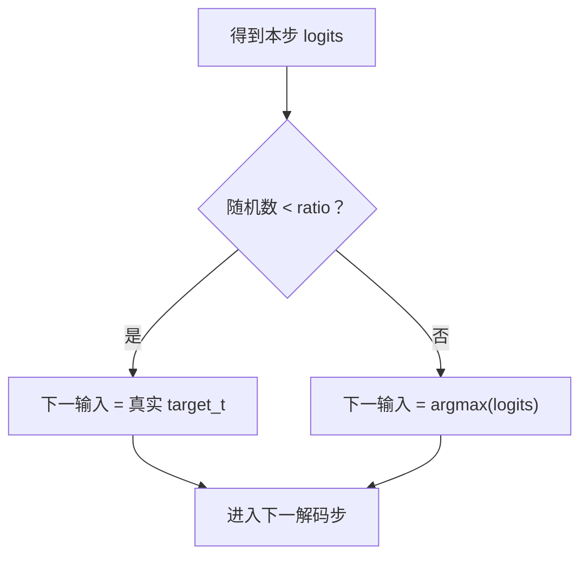

# 第 19 节：Teacher Forcing：训练时有时喂真值上一词

> 笔记编号 19/26 · 对应原视频 P98 · [打开这一集](https://www.bilibili.com/video/BV14mdfBDE4Q?p=98)

[← 上一节：18 模型搭建总结：三个模块如何对接](./18-model-summary.md) · [返回总目录](./README.md) · [下一节：20 模型训练（单批次）：先把一次前向和损失走通 →](./20-train-one-batch.md)

## 这节解决什么问题

为什么教师强制能加快训练，又会带来训练/推理不一致？



图从左向右读。先跟着数据或推理过程走一遍，再学习下面的术语。

## 辅助流程图


### Teacher Forcing 分支时序



## 老师原声整理稿（按讲解顺序）

### 0:00–4:50　两种下一输入

Teacher Forcing 使用真实目标上一词；自由运行使用模型自己的预测。比例 1 表示总用真值，0 表示从不使用。

### 4:50–8:47　为什么训练更稳

早期模型预测很差，若错误不断传递，后面输入全乱；真值能让每个位置先学会局部下一词预测。

### 8:47–11:35　暴露偏差

推理时没有真值，模型没充分见过自身错误会产生 exposure bias。可逐步降低比例（scheduled sampling），但策略也需验证。

## 完整原声逐段记录

[查看本节按时间戳整理的完整音轨转写](./transcripts/p098.md)

逐段记录用于核查老师讲解是否遗漏；正文会进一步纠正口误和语音识别中的技术术语。

## 零基础先记住

- Teacher Forcing 只用于训练
- ratio 是概率，不是固定前半句
- 推理永远使用模型输出

## 最小可运行代码

下面代码默认从项目根目录运行；专题配套实现见 [seq2seq_from_scratch 配套实现](../../seq2seq_from_scratch/README.md)。

```python
for ratio in (1.0,.5,0.0):
    print(ratio,"真值概率",ratio)
```

### 输入和输出怎么看

显示三个常见教师强制比例的含义。

## 最容易踩的坑

不要在验证/推理指标中偷偷使用真实上一词。

## 本节知识链

`Decoder 预测本词 → 抛随机数 → 真值上一词或预测词 → 作为下一输入 → 重复到目标末尾`

## 自测

**问题：ratio=0.5 是否一定每句恰好一半真值？**

<details>
<summary>点开核对答案</summary>

不一定；通常每步随机决定，长期期望约一半。

</details>

## 学完检查

- [ ] 我能用自己的话复述老师的讲解顺序
- [ ] 我能在运行前预测关键输出或张量形状
- [ ] 我知道这节方法最容易用错的地方
- [ ] 我能独立回答自测题

[← 上一节：18 模型搭建总结：三个模块如何对接](./18-model-summary.md) · [返回总目录](./README.md) · [下一节：20 模型训练（单批次）：先把一次前向和损失走通 →](./20-train-one-batch.md)
