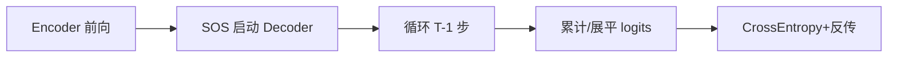
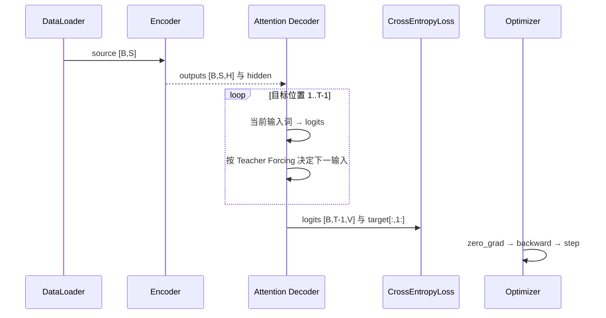

# 第 20 节：模型训练（单批次）：先把一次前向和损失走通

> 笔记编号 20/26 · 对应原视频 P99 · [打开这一集](https://www.bilibili.com/video/BV14mdfBDE4Q?p=99)

[← 上一节：19 Teacher Forcing：训练时有时喂真值上一词](./19-teacher-forcing.md) · [返回总目录](./README.md) · [下一节：21 view()：只改观察形状，不改元素顺序 →](./21-view-function.md)

## 这节解决什么问题

完整 epoch 前，怎样只用一批数据验证解码循环和损失对齐？


图从左向右读。先跟着数据或推理过程走一遍，再学习下面的术语。

## 辅助流程图



### 训练时一批数据的调用时序



## 老师原声整理稿（按讲解顺序）

### 0:00–7:49　一批数据先验形状

source[B,S]，target[B,T]；Encoder outputs[B,S,H]；最终 logits 计划堆成 [B,T-1,Vt]。

### 7:49–17:54　解码循环

decoder_input=target[:,0]（SOS），每步输出 logits，保存到列表；按 Teacher Forcing 决定下一输入。循环 step=1..T-1。

### 17:54–27:42　标签对齐

预测第 1 个真实词对应 target[:,1]，所以标签是 target[:,1:]。PAD 目标位置应在损失中用 ignore_index。

### 27:42–34:18　单批反向

把 logits 与标签展平为 [B(T-1),V] 和 [B(T-1)]，计算 CrossEntropyLoss，zero_grad、backward、梯度裁剪、step。先确认一批能稳定下降，再开完整训练。

## 完整原声逐段记录

[查看本节按时间戳整理的完整音轨转写](./transcripts/p099.md)

逐段记录用于核查老师讲解是否遗漏；正文会进一步纠正口误和语音识别中的技术术语。

## 零基础先记住

- 目标第 0 位 SOS 不作为标签
- PAD 用 ignore_index
- 先单批过拟合是强力调试方法

## 最小可运行代码

下面代码默认从项目根目录运行；专题配套实现见 [seq2seq_from_scratch 配套实现](../../seq2seq_from_scratch/README.md)。

```python
import torch
logits=torch.randn(2,4,10); labels=torch.randint(0,10,(2,4))
loss=torch.nn.CrossEntropyLoss()(logits.reshape(-1,10),labels.reshape(-1))
print(loss.item())
```

### 输入和输出怎么看

把 batch×time 合并后得到一个标量交叉熵。

## 最容易踩的坑

logits 与 target 错一位会让模型学习“预测当前输入”而非下一个词。

## 本节知识链

`Encoder 前向 → SOS 启动 Decoder → 循环 T-1 步 → 累计/展平 logits → CrossEntropy+反传`

## 自测

**问题：target 长 5 时为什么只产生 4 个训练 logits？**

<details>
<summary>点开核对答案</summary>

第 0 位 SOS 是初始输入，预测位置是 1..4。

</details>

## 学完检查

- [ ] 我能用自己的话复述老师的讲解顺序
- [ ] 我能在运行前预测关键输出或张量形状
- [ ] 我知道这节方法最容易用错的地方
- [ ] 我能独立回答自测题

[← 上一节：19 Teacher Forcing：训练时有时喂真值上一词](./19-teacher-forcing.md) · [返回总目录](./README.md) · [下一节：21 view()：只改观察形状，不改元素顺序 →](./21-view-function.md)
