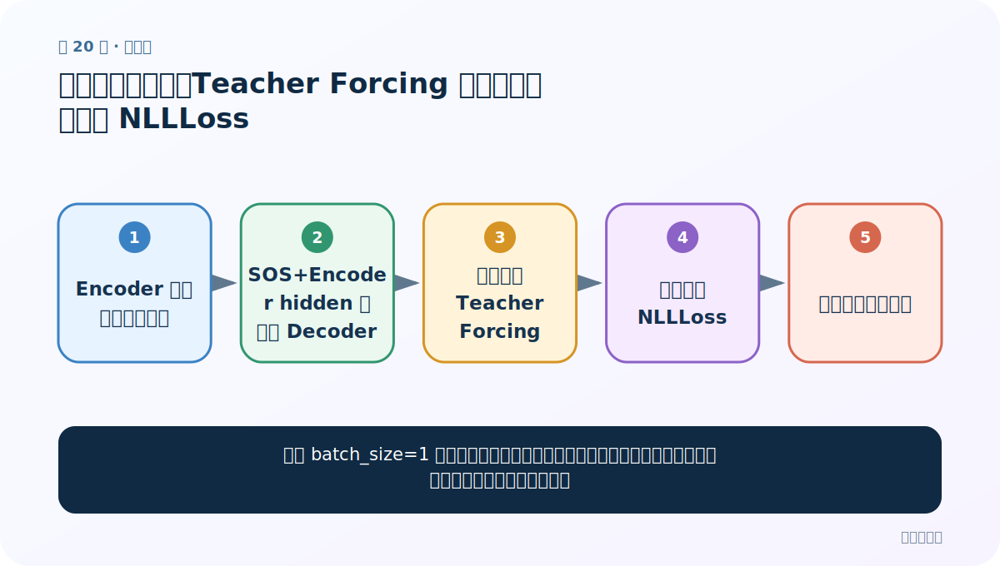
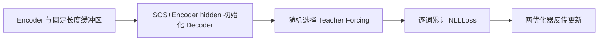
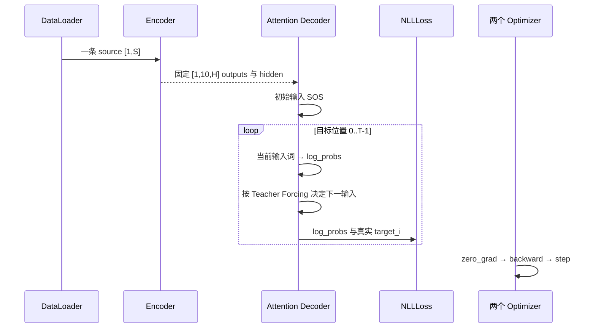

# 第 20 节：单样本训练函数：Teacher Forcing 两条分支怎样累计 NLLLoss

> 笔记编号 20/26 · 对应原视频 P99 · [打开这一集](https://www.bilibili.com/video/BV14mdfBDE4Q?p=99)

[← 上一节：19 Teacher Forcing：训练时有时喂真值上一词](./19-teacher-forcing.md) · [返回总目录](./README.md) · [下一节：21 view(1,-1)：把单个 token 标量整理成 Decoder 需要的二维输入 →](./21-view-function.md)

## 这节解决什么问题

课堂 batch_size=1 时，一对英法句子怎样完成编码、逐词解码、两种下一输入策略、反向传播和参数更新？



图从左向右读。先跟着数据或推理过程走一遍，再学习下面的术语。

## 辅助流程图



### 训练时一批数据的调用时序



## 老师原声整理稿（按讲解顺序）

### 0:00–7:12　为什么把单批训练单独抽成函数

老师先解释结构选择：Seq2Seq 的单批训练包含编码、固定长度复制、逐词解码和 Teacher Forcing 分支，代码远长于普通分类任务。如果直接塞进 epoch×batch 双循环，函数会很难读，所以先把“一条句对如何训练”封装，外层训练函数只负责反复调用。

课堂 DataLoader 的 batch_size=1，因此老师口中的“一批”实际是一条英法句对。函数接收 X、Y、Encoder、Attention Decoder、两个优化器和损失函数。

### 7:12–13:36　Encoder 前向后复制到 [1,10,256]，Decoder 从 SOS 和 Encoder hidden 开始

英文 X 先进入 Encoder，得到真实长度 outputs 和 final hidden。和测试 Attention Decoder 一样，老师创建固定 `[1,10,256]` 缓冲区，把真实 outputs 逐位置复制到前面。

Decoder 初始 hidden 直接取 Encoder final hidden；初始输入是形状 `[1,1]` 的 SOS_token，并迁移到相同 device。目标长度来自 Y 的第二维，决定最多循环多少个法语位置。

### 13:36–20:41　随机数只决定本条样本走 Teacher Forcing 还是自由回馈分支

课程先生成一次随机数，与 teacher_forcing_ratio（示例 0.5）比较，得到本批是否使用 Teacher Forcing。它不是精准检测哪一步预测错了再纠正，而是按概率选择训练策略。

Teacher Forcing 分支中，每个时间步调用 Decoder 后，用真实 `y[:, i]` 作为当前监督目标并累计损失，同时把这个真实 token 作为下一步输入。这样即使本步预测错了，下一步仍从正确历史继续。

### 20:41–29:42　非 Teacher Forcing 分支用 topk 预测回馈，并允许 EOS 提前停止

不使用 Teacher Forcing 时，每步仍用真实 `y[:, i]` 计算监督损失，但下一输入来自输出分布中概率最大的 token。课程用 `topk(1)` 同时取得最大值和对应索引，再把索引 detach 后作为下一步输入。

若预测 token 等于 EOS，解码循环立即 break；否则继续生成。这里必须区分“用于算损失的真实目标”和“作为下一输入的模型预测”，不能把二者写成同一个张量。

### 29:42–34:18　两条分支汇合后统一反传，并按目标长度返回平均损失

循环结束后，老师对 Encoder 和 Decoder 两个优化器分别 zero_grad，累计损失执行 backward，再分别 step 更新参数。课程 Decoder 已输出 LogSoftmax，所以传入的实际损失对象是 NLLLoss；变量名即使写成 cross_entropy_loss，也不能改变它的真实类型。

函数最后返回累计损失除以目标句长度，供外层打印和画图。课程没有在这里使用 PAD ignore_index、批量展平或梯度裁剪；这些可以作为工程扩展，但不能冒充本节代码。

## 完整原声逐段记录

[查看本节按时间戳整理的完整音轨转写](./transcripts/p099.md)

逐段记录用于核查老师讲解是否遗漏；正文会进一步纠正口误和语音识别中的技术术语。

## 零基础先记住

- 课堂一批就是一条句对
- Decoder 初始输入是 SOS
- 真实 Y 始终用于监督损失
- 下一输入由 Teacher Forcing 分支决定
- LogSoftmax 输出配 NLLLoss

## 课堂训练伪代码（省略完整类与优化器定义）

下面代码默认从项目根目录运行；专题配套实现见 [seq2seq_from_scratch 配套实现](../../seq2seq_from_scratch/README.md)。

```python
# 伪代码保留课堂两条分支
use_teacher = random.random() < teacher_forcing_ratio
for i in range(target.shape[1]):
    log_probs, hidden, weights = decoder(decoder_input, hidden, fixed_encoder_outputs)
    truth = target[:, i]
    loss = loss + nll_loss(log_probs, truth)
    if use_teacher:
        decoder_input = truth.view(1, -1)
    else:
        decoder_input = log_probs.topk(1).indices.detach()
        if decoder_input.item() == EOS_token:
            break
```

### 输入和输出怎么看

两条分支都用真实目标累计 NLLLoss，区别只在下一步喂真值还是模型预测。

## 最容易踩的坑

不要把课程输出叫 logits 后再配 CrossEntropyLoss；也不要声称本节已实现 PAD ignore_index 或批量展平。

## 本节知识链

`Encoder 与固定长度缓冲区 → SOS+Encoder hidden 初始化 Decoder → 随机选择 Teacher Forcing → 逐词累计 NLLLoss → 两优化器反传更新`

## 自测

**问题：非 Teacher Forcing 分支还需要真实 Y 吗？**

<details>
<summary>点开核对答案</summary>

需要；真实 Y 用来计算监督损失，只是下一步输入改用模型 topk 预测。

</details>

## 学完检查

- [ ] 我能用自己的话复述老师的讲解顺序
- [ ] 我能在运行前预测关键输出或张量形状
- [ ] 我知道这节方法最容易用错的地方
- [ ] 我能独立回答自测题

[← 上一节：19 Teacher Forcing：训练时有时喂真值上一词](./19-teacher-forcing.md) · [返回总目录](./README.md) · [下一节：21 view(1,-1)：把单个 token 标量整理成 Decoder 需要的二维输入 →](./21-view-function.md)
