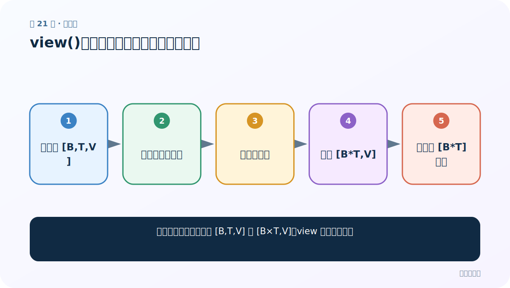
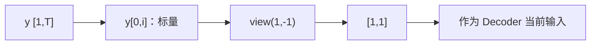

# 第 21 节：view(1,-1)：把单个 token 标量整理成 Decoder 需要的二维输入

> 笔记编号 21/26 · 对应原视频 P100 · [打开这一集](https://www.bilibili.com/video/BV14mdfBDE4Q?p=100)

[← 上一节：20 单样本训练函数：Teacher Forcing 两条分支怎样累计 NLLLoss](./20-train-one-batch.md) · [返回总目录](./README.md) · [下一节：22 完整训练代码：多轮遍历、分段统计、逐轮保存与损失曲线 →](./22-full-training.md)

## 这节解决什么问题

P99 为什么反复对 y[0,i]、topi 调用 view(1,-1)，其中 1 和 -1 到底代表什么？



图从左向右读。先跟着数据或推理过程走一遍，再学习下面的术语。

## 辅助流程图


### 损失前的展平关系



## 老师原声整理稿（按讲解顺序）

### 0:00–1:44　问题来自 P99：索引一个目标词后只剩标量

老师回到上一节的 `y[0, i]`。Y 原本形如 `[1,T]`，先取 batch 中第一个样本，再取第 i 个词后，只剩一个整数标量。可是课堂 Decoder 的当前输入约定为二维 `[1,1]`，不能直接把零维标量传进去。

### 1:44–3:37　view 只改变张量的形状解释，不会创造或删除元素

老师用单独小脚本模拟数据，强调 view 前后元素总数必须相同。一个标量只有一个元素，所以它可以整理成一行一列，不能凭空改成两行三列。

`view(1,-1)` 中第一个 1 指定第一维为 1，-1 让 PyTorch 根据元素总数自动推导另一维；这里只有一个元素，最终就是 `[1,1]`。

### 3:37–5:26　真实 token 与 topk 预测都要整理成同一输入接口

Teacher Forcing 分支中的真实 token，以及非 Teacher Forcing 分支取出的 topi，下一步都要成为 Decoder 输入，所以课程对它们做相同的二维整理。

本节没有讲 `[B,T,V]→[B×T,V]` 的损失展平，也没有讨论 transpose 后内存是否连续。那些是 view 的其他用途，不能替换老师本节围绕单 token 的解释。

## 完整原声逐段记录

[查看本节按时间戳整理的完整音轨转写](./transcripts/p100.md)

逐段记录用于核查老师讲解是否遗漏；正文会进一步纠正口误和语音识别中的技术术语。

## 零基础先记住

- 索引单个 token 后是标量
- view 不改变元素数量
- 1 固定第一维
- -1 自动推导剩余维
- 课程最终需要 [1,1]

## 最小可运行代码

下面代码默认从项目根目录运行；专题配套实现见 [seq2seq_from_scratch 配套实现](../../seq2seq_from_scratch/README.md)。

```python
import torch
y=torch.tensor([[119,297,465]])
token=y[0,1]
print(token.shape,token.view(1,-1),token.view(1,-1).shape)
```

### 输入和输出怎么看

标量 token 被整理成值不变的 [1,1] 张量。

## 最容易踩的坑

不要把本节误写成损失前展平 logits；老师解释的是单个 token 标量如何恢复二维输入。

## 本节知识链

`先取一个 token 标量 → 元素数量保持不变 → 指定第一维为 1 → -1 自动推导剩余维 → 得到 [1,1] 输入`

## 自测

**问题：一个元素执行 view(1,-1) 后，-1 会被推导成多少？**

<details>
<summary>点开核对答案</summary>

1，所以形状是 [1,1]。

</details>

## 学完检查

- [ ] 我能用自己的话复述老师的讲解顺序
- [ ] 我能在运行前预测关键输出或张量形状
- [ ] 我知道这节方法最容易用错的地方
- [ ] 我能独立回答自测题

[← 上一节：20 单样本训练函数：Teacher Forcing 两条分支怎样累计 NLLLoss](./20-train-one-batch.md) · [返回总目录](./README.md) · [下一节：22 完整训练代码：多轮遍历、分段统计、逐轮保存与损失曲线 →](./22-full-training.md)
