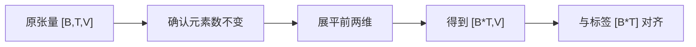
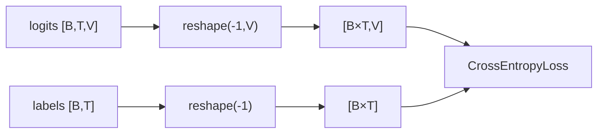

# 第 21 节：view()：只改观察形状，不改元素顺序

> 笔记编号 21/26 · 对应原视频 P100 · [打开这一集](https://www.bilibili.com/video/BV14mdfBDE4Q?p=100)

[← 上一节：20 模型训练（单批次）：先把一次前向和损失走通](./20-train-one-batch.md) · [返回总目录](./README.md) · [下一节：22 完整训练代码：epoch、验证、保存与日志 →](./22-full-training.md)

## 这节解决什么问题

为什么训练损失前要把 [B,T,V] 变 [B×T,V]，view 有什么限制？


图从左向右读。先跟着数据或推理过程走一遍，再学习下面的术语。

## 辅助流程图



### 损失前的展平关系



## 老师原声整理稿（按讲解顺序）

### 0:00–2:48　元素总数守恒

view/reshape 只改变维度解释，不改变数据。新形状各维乘积必须等于原元素数。

### 2:48–5:26　连续内存

view 通常要求内存连续；transpose/permute 后可能报错，可先 contiguous().view 或直接 reshape。课程用 view 展平 logits 和标签。

## 完整原声逐段记录

[查看本节按时间戳整理的完整音轨转写](./transcripts/p100.md)

逐段记录用于核查老师讲解是否遗漏；正文会进一步纠正口误和语音识别中的技术术语。

## 零基础先记住

- V 类别维必须保留
- 前两维展平为样本位置
- reshape 对非连续张量更方便

## 最小可运行代码

下面代码默认从项目根目录运行；专题配套实现见 [seq2seq_from_scratch 配套实现](../../seq2seq_from_scratch/README.md)。

```python
import torch
x=torch.arange(24).reshape(2,3,4)
print(x.reshape(-1,4).shape)
```

### 输入和输出怎么看

从 [2,3,4] 变为 [6,4]，24 个元素不变。

## 最容易踩的坑

不能把类别维 V 也压平后交给 CrossEntropyLoss。

## 本节知识链

`原张量 [B,T,V] → 确认元素数不变 → 展平前两维 → 得到 [B*T,V] → 与标签 [B*T] 对齐`

## 自测

**问题：[2,5,10] 展平前两维后是什么？**

<details>
<summary>点开核对答案</summary>

[10,10]：10 个 token 位置，每个 10 类 logits。

</details>

## 学完检查

- [ ] 我能用自己的话复述老师的讲解顺序
- [ ] 我能在运行前预测关键输出或张量形状
- [ ] 我知道这节方法最容易用错的地方
- [ ] 我能独立回答自测题

[← 上一节：20 模型训练（单批次）：先把一次前向和损失走通](./20-train-one-batch.md) · [返回总目录](./README.md) · [下一节：22 完整训练代码：epoch、验证、保存与日志 →](./22-full-training.md)
