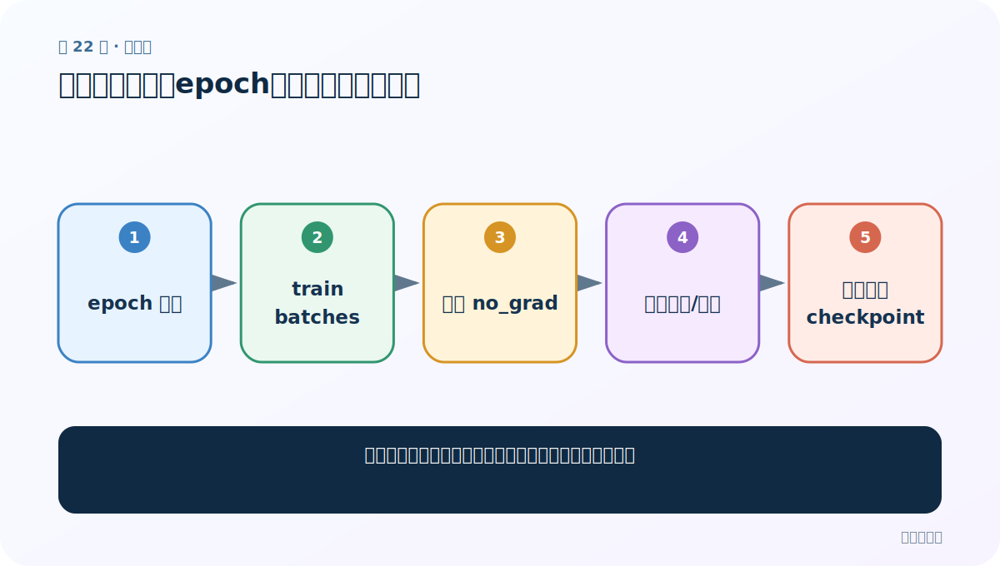
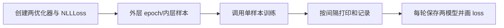
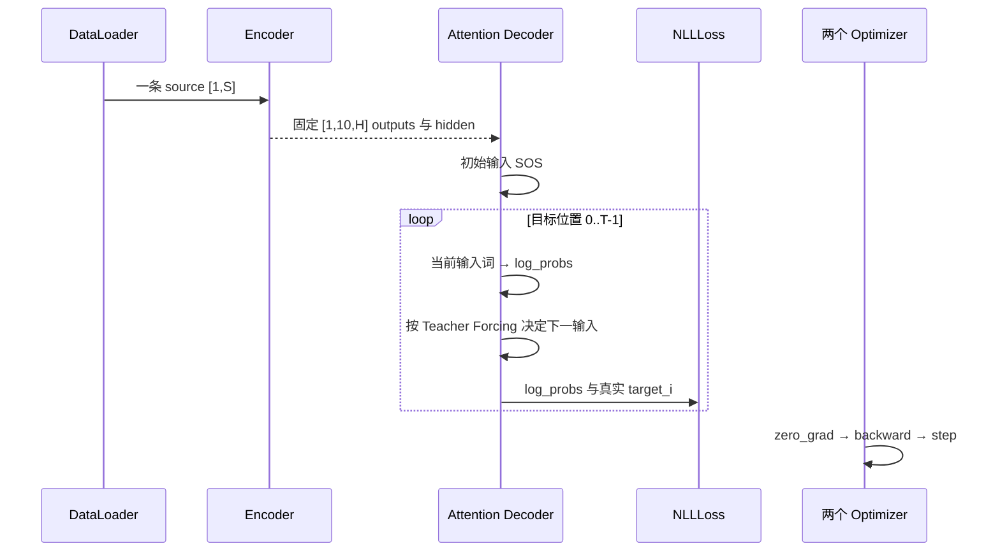
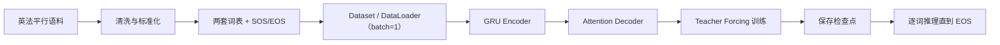

# 第 22 节：完整训练代码：多轮遍历、分段统计、逐轮保存与损失曲线

> 笔记编号 22/26 · 对应原视频 P101 · [打开这一集](https://www.bilibili.com/video/BV14mdfBDE4Q?p=101)

[← 上一节：21 view(1,-1)：把单个 token 标量整理成 Decoder 需要的二维输入](./21-view-function.md) · [返回总目录](./README.md) · [下一节：23 训练结果与总结：五轮曲线下降，但 3000 条演示不代表充分训练 →](./23-training-summary.md)

## 这节解决什么问题

老师怎样把 P99 的单样本训练函数放进 epoch×DataLoader 循环，并观察训练是否收敛？



图从左向右读。先跟着数据或推理过程走一遍，再学习下面的术语。

## 辅助流程图



### 训练时一批数据的调用时序



### 英法翻译从数据到预测的总流程



## 老师原声整理稿（按讲解顺序）

### 0:00–8:14　外层函数只搭训练骨架，具体前向仍调用 P99

老师把完整训练函数定义成“多轮、多批次”的控制层。参数包括 DataLoader、Encoder、Attention Decoder、epoch 数、学习率、Teacher Forcing 比例，以及打印/画图间隔。单条句对怎样前向和反传不再重复书写，而是调用 P99 的训练函数。

这种拆分不是改变算法，而是避免把二三十行单样本逻辑嵌进双重循环后形成上百行函数。

### 8:14–14:27　分别创建 Encoder/Decoder 优化器，损失使用 NLLLoss

课程为 Encoder 和 Decoder 各创建一个优化器，因为两套模型对象分别保存、分别 step。Decoder 内已调用 LogSoftmax，所以损失对象明确使用 `nn.NLLLoss()`。老师还再次提醒：如果删掉 Decoder 里的 LogSoftmax，才可改用 CrossEntropyLoss。

本课程没有 PAD token，也没有传 ignore_index。把它写进主流程会让读者误以为词表中已有 PAD。

### 14:27–22:43　epoch×DataLoader 双循环，每条样本返回一个平均损失

外层循环控制训练轮数，内层遍历 DataLoader 中的 X/Y。每次调用单样本训练函数，传入两模型、两优化器、NLLLoss 和 Teacher Forcing 比例，得到当前法语句长度归一化后的损失。

老师的演示为了缩短录制时间，只训练每轮前约 3000 条，而完整语料有六万多条。他明确说明这会影响最终翻译效果，不能把演示结果当成充分训练后的性能。

### 22:43–30:48　两套累加器分别服务控制台打印和损失曲线

课程设置两个间隔：例如每 1000 条打印一次平均损失和耗时，每 100 条把平均损失追加到绘图列表。每次计算完区间均值后，相应累加器必须归零，否则下一段会混入之前样本。

打印频率与绘图频率不同，所以老师维护两套总损失。曲线更密并不等于模型更好，只是记录点更频繁。

### 30:48–36:53　每轮分别保存 Encoder/Decoder，训练结束保存并显示 loss 曲线

由于一轮可能耗时较长，老师在每个 epoch 结束时分别保存 Encoder 和 Attention Decoder 的参数文件，文件名带轮次。五轮会得到五个 Encoder 文件和五个 Decoder 文件。

训练结束后用记录的区间平均损失绘图，并先 savefig 再 show。课堂没有验证集、最佳模型选择、统一 checkpoint 或恢复优化器状态；这些属于后续工程改进，不能写成老师已经做过。

## 完整原声逐段记录

[查看本节按时间戳整理的完整音轨转写](./transcripts/p101.md)

逐段记录用于核查老师讲解是否遗漏；正文会进一步纠正口误和语音识别中的技术术语。

## 零基础先记住

- 两模型各有一个优化器
- 课程损失是 NLLLoss
- 外层 epoch、内层 DataLoader
- 打印与绘图使用不同间隔
- 每轮分别保存两套 state_dict

## 课堂训练调度伪代码（需配合 P99 函数）

下面代码默认从项目根目录运行；专题配套实现见 [seq2seq_from_scratch 配套实现](../../seq2seq_from_scratch/README.md)。

```python
criterion = torch.nn.NLLLoss()
for epoch in range(1, epochs + 1):
    for index, (x, y) in enumerate(data_loader):
        loss = train_one_pair(x, y, encoder, decoder, enc_opt, dec_opt, criterion, .5)
        print_loss_total += loss
        plot_loss_total += loss
    torch.save(encoder.state_dict(), f"encoder_{epoch}.pth")
    torch.save(decoder.state_dict(), f"decoder_{epoch}.pth")
```

### 输入和输出怎么看

每轮遍历样本、累计损失，并分别保存 Encoder 与 Decoder 参数。

## 最容易踩的坑

不要声称本节包含验证集、最佳 checkpoint、PAD ignore_index 或梯度裁剪；课堂没有实现这些步骤。

## 本节知识链

`创建两优化器与 NLLLoss → 外层 epoch/内层样本 → 调用单样本训练 → 按间隔打印和记录 → 每轮保存两模型并画 loss`

## 自测

**问题：为什么损失用 NLLLoss 而不是 CrossEntropyLoss？**

<details>
<summary>点开核对答案</summary>

Decoder 已经输出 LogSoftmax 对数概率，NLLLoss 与它配套。

</details>

## 学完检查

- [ ] 我能用自己的话复述老师的讲解顺序
- [ ] 我能在运行前预测关键输出或张量形状
- [ ] 我知道这节方法最容易用错的地方
- [ ] 我能独立回答自测题

[← 上一节：21 view(1,-1)：把单个 token 标量整理成 Decoder 需要的二维输入](./21-view-function.md) · [返回总目录](./README.md) · [下一节：23 训练结果与总结：五轮曲线下降，但 3000 条演示不代表充分训练 →](./23-training-summary.md)
