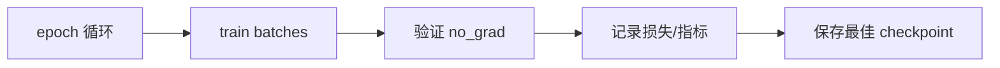
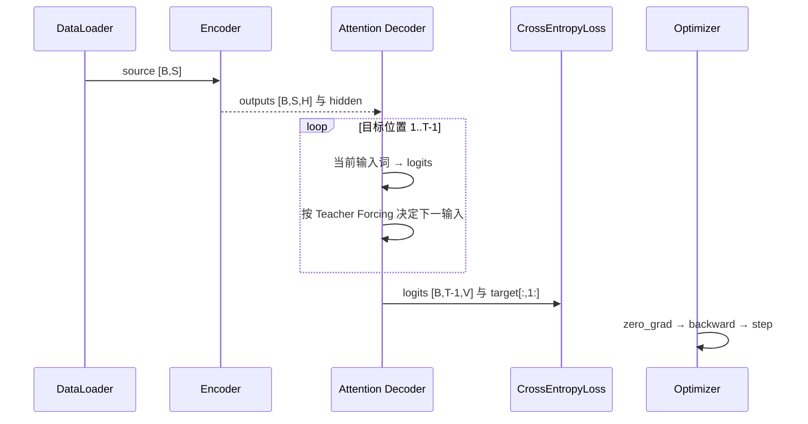
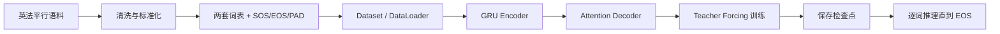

# 第 22 节：完整训练代码：epoch、验证、保存与日志

> 笔记编号 22/26 · 对应原视频 P101 · [打开这一集](https://www.bilibili.com/video/BV14mdfBDE4Q?p=101)

[← 上一节：21 view()：只改观察形状，不改元素顺序](./21-view-function.md) · [返回总目录](./README.md) · [下一节：23 训练总结：把 800 行压缩成一条可复述主线 →](./23-training-summary.md)

## 这节解决什么问题

单批训练正确后，怎样扩成可恢复、可比较的完整实验？


图从左向右读。先跟着数据或推理过程走一遍，再学习下面的术语。

## 辅助流程图



### 训练时一批数据的调用时序



### 英法翻译从数据到预测的总流程



## 老师原声整理稿（按讲解顺序）

### 0:00–8:55　准备对象

创建 Encoder/Decoder 或统一 Seq2Seq、优化器、CrossEntropyLoss(ignore_index=PAD)、DataLoader、device 与训练配置。

### 8:55–18:51　训练循环

model.train；每批迁移设备；前向；展平损失；zero_grad/backward；clip_grad_norm_ 缓解循环网络梯度爆炸；step；累计按有效 token 归一化的损失。

### 18:51–27:54　验证循环

model.eval 与 no_grad；Teacher Forcing 比例应明确，翻译质量最好用真实推理方式评估。不能在验证集反传。

### 27:54–34:49　检查点

保存 model/optimizer state_dict、epoch、最佳指标、两套词表、模型超参数和随机状态，才能恢复训练/推理。

### 34:49–36:53　日志与结束

记录每 epoch 的训练/验证损失和耗时。只保存最后一轮可能错过最佳泛化点，应按验证指标保存最佳。

## 完整原声逐段记录

[查看本节按时间戳整理的完整音轨转写](./transcripts/p101.md)

逐段记录用于核查老师讲解是否遗漏；正文会进一步纠正口误和语音识别中的技术术语。

## 零基础先记住

- 验证不反传
- PAD 不计损失
- checkpoint 要包含词表与配置

## 最小可运行代码

下面代码默认从项目根目录运行；专题配套实现见 [seq2seq_from_scratch 配套实现](../../seq2seq_from_scratch/README.md)。

```python
# 核心骨架
model.train()
optimizer.zero_grad()
logits=model(source,target,teacher_forcing_ratio=.5)
loss=criterion(logits.reshape(-1,logits.size(-1)),target[:,1:].reshape(-1))
loss.backward()
torch.nn.utils.clip_grad_norm_(model.parameters(),1.0)
optimizer.step()
```

### 输入和输出怎么看

完成一批可训练的 Seq2Seq 更新。

## 最容易踩的坑

训练 loss 的分母若包含大量 PAD，不同 batch 的平均值不可比。

## 本节知识链

`epoch 循环 → train batches → 验证 no_grad → 记录损失/指标 → 保存最佳 checkpoint`

## 自测

**问题：为什么保存词表？**

<details>
<summary>点开核对答案</summary>

权重输出的是 ID；没有同一 id_to_token 就无法正确还原法语词。

</details>

## 学完检查

- [ ] 我能用自己的话复述老师的讲解顺序
- [ ] 我能在运行前预测关键输出或张量形状
- [ ] 我知道这节方法最容易用错的地方
- [ ] 我能独立回答自测题

[← 上一节：21 view()：只改观察形状，不改元素顺序](./21-view-function.md) · [返回总目录](./README.md) · [下一节：23 训练总结：把 800 行压缩成一条可复述主线 →](./23-training-summary.md)
