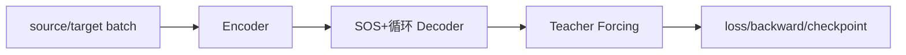
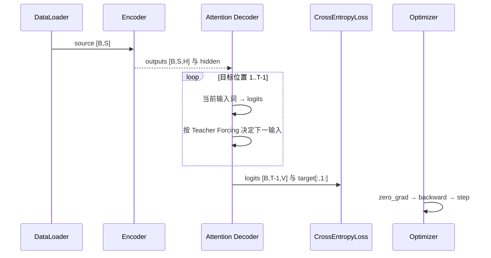

# 第 23 节：训练总结：把 800 行压缩成一条可复述主线

> 笔记编号 23/26 · 对应原视频 P102 · [打开这一集](https://www.bilibili.com/video/BV14mdfBDE4Q?p=102)

[← 上一节：22 完整训练代码：epoch、验证、保存与日志](./22-full-training.md) · [返回总目录](./README.md) · [下一节：24 模型预测代码：无真值时逐词生成 →](./24-prediction-code.md)

## 这节解决什么问题

怎样用几分钟完整复述英译法训练数据流？


图从左向右读。先跟着数据或推理过程走一遍，再学习下面的术语。

## 辅助流程图



### 训练时一批数据的调用时序



## 老师原声整理稿（按讲解顺序）

### 0:00–3:43　口头复述

源句进 Encoder 得 outputs/hidden；Decoder 从 SOS 开始，每步对 outputs 做注意力并预测下一法语词；按 Teacher Forcing 选择下一输入；所有 logits 与 target 后移标签算损失；反传更新。

### 3:43–4:08　验收清单

会说出每个张量形状、SOS/EOS/PAD 作用、训练/推理差异、注意力 weights 形状和保存内容，才算真正跑通。

## 完整原声逐段记录

[查看本节按时间戳整理的完整音轨转写](./transcripts/p102.md)

逐段记录用于核查老师讲解是否遗漏；正文会进一步纠正口误和语音识别中的技术术语。

## 零基础先记住

- 先复述再看代码
- 每个模块都能写输入输出 shape
- 训练闭环最终由 loss 连接

## 最小可运行代码

下面代码默认从项目根目录运行；专题配套实现见 [seq2seq_from_scratch 配套实现](../../seq2seq_from_scratch/README.md)。

```python
print("source→Encoder→Attention Decoder→logits→shifted target loss→backward")
```

### 输入和输出怎么看

输出训练主线。

## 最容易踩的坑

只记函数名但说不出张量语义，换数据就会崩。

## 本节知识链

`source/target batch → Encoder → SOS+循环 Decoder → Teacher Forcing → loss/backward/checkpoint`

## 自测

**问题：哪一个张量同时连接 Encoder 与每一步 Attention？**

<details>
<summary>点开核对答案</summary>

encoder_outputs，包含每个源位置的隐藏状态。

</details>

## 学完检查

- [ ] 我能用自己的话复述老师的讲解顺序
- [ ] 我能在运行前预测关键输出或张量形状
- [ ] 我知道这节方法最容易用错的地方
- [ ] 我能独立回答自测题

[← 上一节：22 完整训练代码：epoch、验证、保存与日志](./22-full-training.md) · [返回总目录](./README.md) · [下一节：24 模型预测代码：无真值时逐词生成 →](./24-prediction-code.md)
