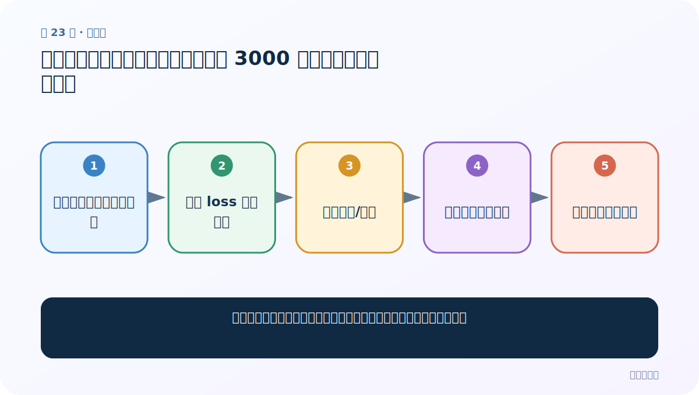
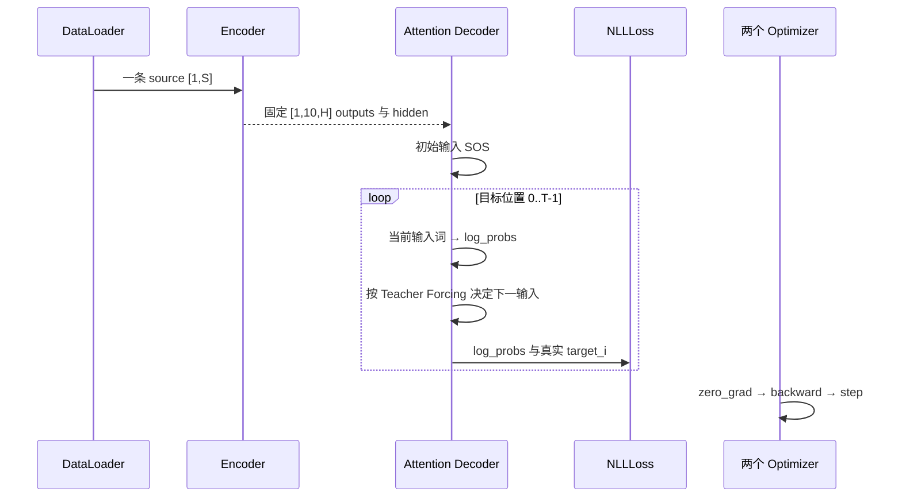

# 第 23 节：训练结果与总结：五轮曲线下降，但 3000 条演示不代表充分训练

> 笔记编号 23/26 · 对应原视频 P102 · [打开这一集](https://www.bilibili.com/video/BV14mdfBDE4Q?p=102)

[← 上一节：22 完整训练代码：多轮遍历、分段统计、逐轮保存与损失曲线](./22-full-training.md) · [返回总目录](./README.md) · [下一节：24 模型评估函数：关闭梯度后自回归生成并截取有效注意力矩阵 →](./24-prediction-code.md)

## 这节解决什么问题

老师怎样判断本次训练正在收敛，并总结单样本与多轮训练两层结构？



图从左向右读。先跟着数据或推理过程走一遍，再学习下面的术语。

## 辅助流程图


### 训练时一批数据的调用时序



## 老师原声整理稿（按讲解顺序）

### 0:00–1:21　五轮训练产出十个模型文件和一张损失图

程序跑完五轮后，老师先检查控制台耗时、模型目录和 loss 图片。因为每轮分别保存 Encoder 与 Decoder，所以五轮一共出现十个参数文件。打印日志显示每隔一段样本的平均损失和耗时。

### 1:21–2:33　loss 整体下降只能说明优化在推进，不能证明翻译已经充分可靠

老师打开损失曲线，看到整体向下，判断模型在当前训练数据上逐步收敛。曲线可以通过缩短记录间隔画得更密，但形状仍应结合实际样本判断。

本次演示每轮只取约 3000 条，远少于六万多条完整语料，因此生成效果仍有限。loss 下降不是“翻译完全正确”的证明。

### 2:33–3:31　单样本训练主线：编码、解码、Teacher Forcing、反传更新

英文先经 Encoder 得到 outputs/hidden，再构造固定长度缓冲区；Decoder 从 SOS 和 Encoder hidden 开始逐词生成。若使用 Teacher Forcing，下一输入取真实法语词；否则取本步预测，并在 EOS 时提前停止。每步用真实目标累计 NLLLoss，最后反传并更新两模型。

### 3:31–4:08　多轮函数只负责外层调度，Teacher Forcing 比例不能误解

外层训练函数完成 epoch×样本循环、区间损失记录、逐轮保存和绘图。老师最后用选择题强调：Teacher Forcing 可能造成训练与实际生成不一致，比例不宜简单设得过高；课程示例使用 0.5。

本节没有 PAD，也没有 target shift 的批量矩阵实现。复述时应以课堂的 batch_size=1 逐词循环为准。

## 完整原声逐段记录

[查看本节按时间戳整理的完整音轨转写](./transcripts/p102.md)

逐段记录用于核查老师讲解是否遗漏；正文会进一步纠正口误和语音识别中的技术术语。

## 零基础先记住

- 五轮对应五对模型文件
- loss 下降不等于翻译已充分训练
- Teacher Forcing 只改变下一输入
- 单样本训练与外层循环分开

## 最小可运行代码

下面代码默认从项目根目录运行；专题配套实现见 [seq2seq_from_scratch 配套实现](../../seq2seq_from_scratch/README.md)。

```python
print("X→Encoder→固定10步outputs→Decoder逐词→NLLLoss→两优化器更新")
print("下一输入：真实词（Teacher Forcing）或本步topk预测")
```

### 输入和输出怎么看

输出与课堂一致的训练主线和两种下一输入。

## 最容易踩的坑

不要把只训练约 3000 条的演示模型描述成完整语料训练结果，也不要用训练 loss 下降替代翻译质量评估。

## 本节知识链

`查看五轮耗时和模型文件 → 观察 loss 曲线下降 → 复述编码/解码 → 区分两种下一输入 → 理解演示训练边界`

## 自测

**问题：Teacher Forcing 分支与非 Teacher Forcing 分支，哪一项始终不变？**

<details>
<summary>点开核对答案</summary>

两者都用真实目标词计算监督损失；变化的是下一步输入来源。

</details>

## 学完检查

- [ ] 我能用自己的话复述老师的讲解顺序
- [ ] 我能在运行前预测关键输出或张量形状
- [ ] 我知道这节方法最容易用错的地方
- [ ] 我能独立回答自测题

[← 上一节：22 完整训练代码：多轮遍历、分段统计、逐轮保存与损失曲线](./22-full-training.md) · [返回总目录](./README.md) · [下一节：24 模型评估函数：关闭梯度后自回归生成并截取有效注意力矩阵 →](./24-prediction-code.md)
