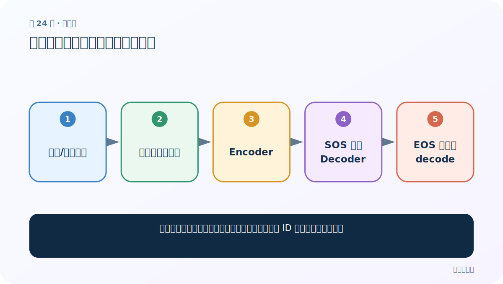
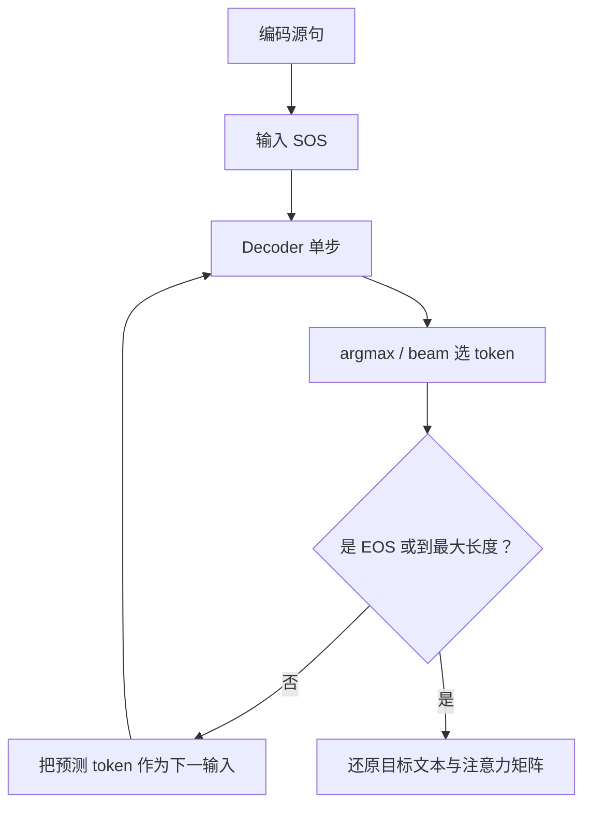

# 第 24 节：模型预测代码：无真值时逐词生成

> 笔记编号 24/26 · 对应原视频 P103 · [打开这一集](https://www.bilibili.com/video/BV14mdfBDE4Q?p=103)

[← 上一节：23 训练总结：把 800 行压缩成一条可复述主线](./23-training-summary.md) · [返回总目录](./README.md) · [下一节：25 预测代码测试：从样例翻译发现数据与模型问题 →](./25-prediction-test.md)

## 这节解决什么问题

推理阶段没有法语答案，怎样从一条英文句子生成 ID 序列和注意力矩阵？



图从左向右读。先跟着数据或推理过程走一遍，再学习下面的术语。

## 辅助流程图


### 推理时逐词生成流程



## 老师原声整理稿（按讲解顺序）

### 0:00–6:51　准备输入与模型

对英文使用训练时完全相同的清洗和 src 词表；创建同结构模型，加载 state_dict，eval/no_grad。

### 6:51–13:48　编码与启动

source_ids 加 EOS、增加 batch 维、迁移 device；Encoder 得状态；decoder_input 初始化为 SOS。

### 13:48–20:47　逐步生成

每步 logits.argmax 得 token ID，保存 ID 与 weights；若为 EOS 结束，否则作为下一输入。最大长度防止不结束。

### 20:47–26:22　还原文本

用目标 id_to_token 解码，移除 SOS/EOS/PAD。未知输入映射 UNK。返回翻译与 [T,S] 注意力矩阵。

## 完整原声逐段记录

[查看本节按时间戳整理的完整音轨转写](./transcripts/p103.md)

逐段记录用于核查老师讲解是否遗漏；正文会进一步纠正口误和语音识别中的技术术语。

## 零基础先记住

- 预测绝不使用目标真值
- eval+no_grad
- 保存每步 attention

## 最小可运行代码

下面代码默认从项目根目录运行；专题配套实现见 [seq2seq_from_scratch 配套实现](../../seq2seq_from_scratch/README.md)。

```python
import torch
from seq2seq_from_scratch.model import EncoderGRU,AttentionDecoderGRU,Seq2Seq
m=Seq2Seq(EncoderGRU(20,6,8),AttentionDecoderGRU(25,7,8),start_id=1,end_id=2)
ids,w=m.greedy_decode(torch.randint(3,20,(1,5)),maximum_length=6)
print(ids.shape,w.shape)
```

### 输入和输出怎么看

预测 ID 为 [1,T]，注意力为 [1,T,5]。

## 最容易踩的坑

加载权重前模型结构/词表大小不一致会报错或语义错位。

## 本节知识链

`清洗/编码英文 → 加载词表与权重 → Encoder → SOS 循环 Decoder → EOS 停止并 decode`

## 自测

**问题：为什么要返回注意力矩阵？**

<details>
<summary>点开核对答案</summary>

可检查每个目标词主要查看哪些源位置，并画热力图调试。

</details>

## 学完检查

- [ ] 我能用自己的话复述老师的讲解顺序
- [ ] 我能在运行前预测关键输出或张量形状
- [ ] 我知道这节方法最容易用错的地方
- [ ] 我能独立回答自测题

[← 上一节：23 训练总结：把 800 行压缩成一条可复述主线](./23-training-summary.md) · [返回总目录](./README.md) · [下一节：25 预测代码测试：从样例翻译发现数据与模型问题 →](./25-prediction-test.md)
