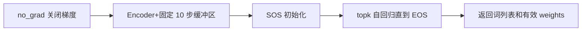
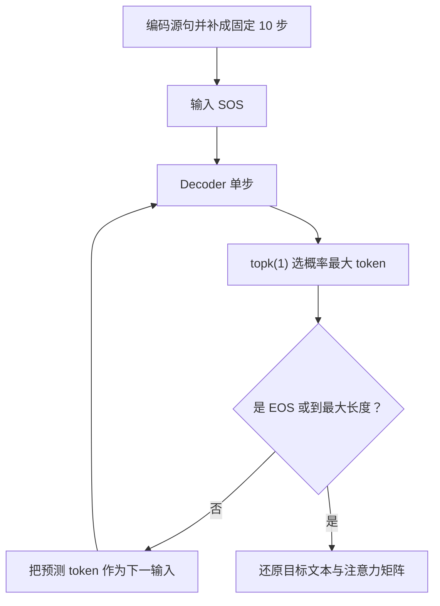

# 第 24 节：模型评估函数：关闭梯度后自回归生成并截取有效注意力矩阵

> 笔记编号 24/26 · 对应原视频 P103 · [打开这一集](https://www.bilibili.com/video/BV14mdfBDE4Q?p=103)

[← 上一节：23 训练结果与总结：五轮曲线下降，但 3000 条演示不代表充分训练](./23-training-summary.md) · [返回总目录](./README.md) · [下一节：25 模型评估测试：加载两份权重并对照英文、真值法语和预测法语 →](./25-prediction-test.md)

## 这节解决什么问题

训练完成后，怎样只给英文张量，在最多 10 步内生成法语词并保存每一步的十维注意力？


图从左向右读。先跟着数据或推理过程走一遍，再学习下面的术语。

## 辅助流程图



### 推理时逐词生成流程



## 老师原声整理稿（按讲解顺序）

### 0:00–5:14　评估开始先关闭梯度；含 Dropout 的 Decoder 还必须切到 eval

老师把评估函数放在 `torch.no_grad()` 环境中。训练结束后权重已经固定，预测不需要保存反向传播图；关闭梯度能减少内存和计算。这个操作只用于评估/预测，训练阶段不能照搬。

原课堂演示重点讲 no_grad，没有单独展示 `model.eval()`；但 Attention Decoder 含 Dropout，正确评估还应对 Encoder 和 Decoder 调用 `.eval()`，否则 Dropout 仍随机丢弃特征，同一句话可能得到不稳定结果。函数接收已经数值化的英文 X、Encoder 和 Attention Decoder，加载权重和准备测试句放在下一节。

### 5:14–10:37　编码后仍要构造固定 [1,10,256] 的 Encoder outputs

英文 X 进入 Encoder 得到真实长度 outputs 与 hidden。课程版 Attention Decoder 固定对十个源位置打分，所以评估函数也创建 `[1,10,256]` 零张量，把真实 outputs 复制到前面。

Decoder hidden 初始化为 Encoder hidden，当前输入初始化为 SOS_token。这里与训练一致，区别是后面没有真实法语 Y 可用。

### 10:37–16:49　准备法语词列表和 [10,10] 注意力矩阵

老师创建列表保存生成的法语单词，并初始化 `[10,10]` 注意力矩阵。第一维预留最多十个目标生成步，第二维对应固定十个英文位置。

每次 Decoder 返回一行 `[1,1,10]` 权重，将它写入当前目标步所在的矩阵行。这样后面可以画出“目标词 × 源位置”的热力图。

### 16:49–22:48　每步用 topk 取概率最大词，EOS 时停止，否则回馈预测

循环最多运行 max_length 次。每步调用 Decoder 得到对数概率、新 hidden 和注意力权重；用 `topk(1)` 取最大候选索引。若索引是 EOS，立即 break；否则通过法语 index2word 查回单词并加入列表。

当前预测索引随后 detach，并作为下一时间步输入。这正是自回归：预测阶段没有真实 Y，也绝不能使用 Teacher Forcing。

### 22:48–26:22　只返回实际生成步对应的注意力行

如果第五步已经生成 EOS，预分配矩阵后面的行仍全是零，没有可视化意义。老师用当前 index 截取前 `index+1` 行，只返回实际执行过的注意力权重。

函数最终返回法语词列表和形如 `[生成步数,10]` 的注意力矩阵。课程词表没有 UNK/PAD 设计；下一节自定义英文句必须由现有英文词表中的词组成。

## 完整原声逐段记录

[查看本节按时间戳整理的完整音轨转写](./transcripts/p103.md)

逐段记录用于核查老师讲解是否遗漏；正文会进一步纠正口误和语音识别中的技术术语。

## 零基础先记住

- 预测用 no_grad
- 含 Dropout 的模型还要 eval
- 源和目标最多都按 10 步处理
- 从 SOS 开始
- topk 预测回馈
- EOS 终止
- 注意力矩阵只截取有效生成行

## 课堂评估伪代码（需配合完整模型与词表）

下面代码默认从项目根目录运行；专题配套实现见 [seq2seq_from_scratch 配套实现](../../seq2seq_from_scratch/README.md)。

```python
# 课堂评估循环骨架
decoded_words=[]
attention_matrix=torch.zeros(max_length,max_length)
decoder_input=torch.tensor([[SOS_token]],device=device)
for index in range(max_length):
    log_probs,hidden,weights=decoder(decoder_input,hidden,fixed_encoder_outputs)
    attention_matrix[index]=weights.squeeze(0).squeeze(0)
    topi=log_probs.topk(1).indices
    if topi.item()==EOS_token: break
    decoded_words.append(fr_index2word[topi.item()])
    decoder_input=topi.detach()
return decoded_words,attention_matrix[:index+1]
```

### 输入和输出怎么看

得到预测法语词列表，以及 [实际生成步数,10] 的注意力矩阵。

## 最容易踩的坑

预测阶段不能使用真实法语词；课程词表也没有 UNK，直接输入词表外英文会查表失败。

## 本节知识链

`no_grad 关闭梯度 → Encoder+固定 10 步缓冲区 → SOS 初始化 → topk 自回归直到 EOS → 返回词列表和有效 weights`

## 自测

**问题：为什么返回 attention_matrix[:index+1] 而不是完整 [10,10]？**

<details>
<summary>点开核对答案</summary>

EOS 可能提前结束，后面的预留行全是零，不属于实际生成步骤。

</details>

## 学完检查

- [ ] 我能用自己的话复述老师的讲解顺序
- [ ] 我能在运行前预测关键输出或张量形状
- [ ] 我知道这节方法最容易用错的地方
- [ ] 我能独立回答自测题

[← 上一节：23 训练结果与总结：五轮曲线下降，但 3000 条演示不代表充分训练](./23-training-summary.md) · [返回总目录](./README.md) · [下一节：25 模型评估测试：加载两份权重并对照英文、真值法语和预测法语 →](./25-prediction-test.md)
