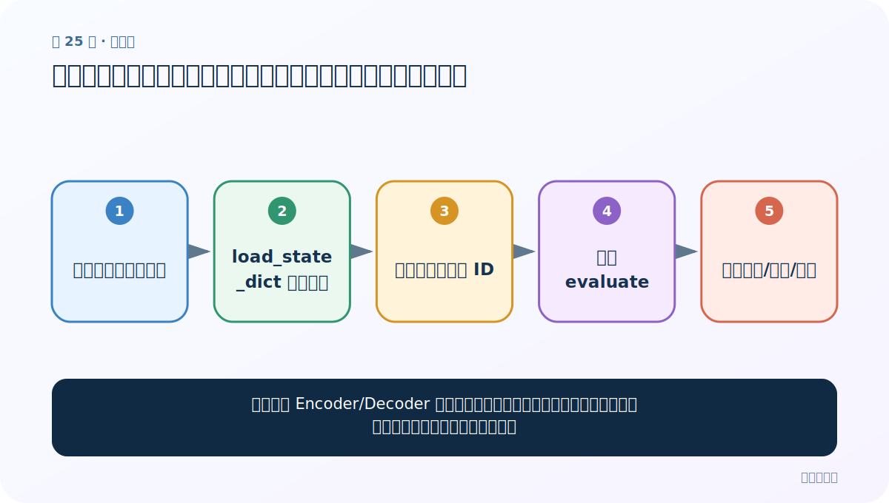
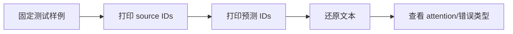
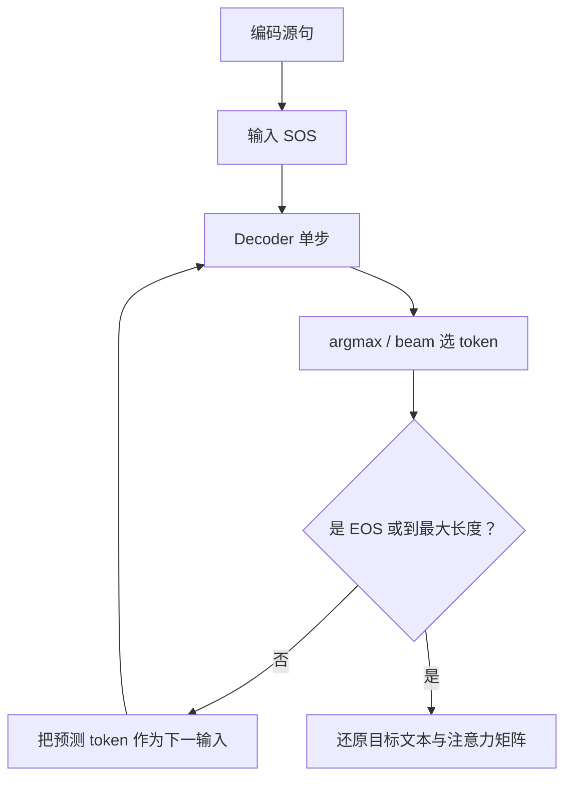

# 第 25 节：预测代码测试：从样例翻译发现数据与模型问题

> 笔记编号 25/26 · 对应原视频 P104 · [打开这一集](https://www.bilibili.com/video/BV14mdfBDE4Q?p=104)

[← 上一节：24 模型预测代码：无真值时逐词生成](./24-prediction-code.md) · [返回总目录](./README.md) · [下一节：26 绘制张量图：用图检查模块连接，不把图当性能证明 →](./26-tensorboard-graph.md)

## 这节解决什么问题

翻译出一句话后，怎样判断问题来自模型、词表还是预处理？



图从左向右读。先跟着数据或推理过程走一遍，再学习下面的术语。

## 辅助流程图



### 推理时逐词生成流程



## 老师原声整理稿（按讲解顺序）

### 0:00–5:55　固定样例

老师加载训练权重，对若干英文句子预测法语。测试句应同时包含训练分布内样例和未见组合。

### 5:55–12:54　逐层排错

若输出全 UNK，先查词表；立即 EOS，查训练与结束标签；重复词，查解码循环/训练不足；注意力全落 PAD，查 mask。

### 12:54–18:50　不要只看一个成功例

至少报告验证集损失和翻译指标，并人工抽样。贪心解码不是唯一策略，beam search 可保留多个候选但更慢。

### 18:50–22:36　注意力图

目标步×源位置的矩阵应与两句 token 标签对齐。热力图只是模型内部对齐线索，不是翻译正确性的证明。

## 完整原声逐段记录

[查看本节按时间戳整理的完整音轨转写](./transcripts/p104.md)

逐段记录用于核查老师讲解是否遗漏；正文会进一步纠正口误和语音识别中的技术术语。

## 零基础先记住

- 固定回归样例
- 按数据→词表→模型→解码逐层排错
- 单例成功不代表泛化

## 最小可运行代码

下面代码默认从项目根目录运行；专题配套实现见 [seq2seq_from_scratch 配套实现](../../seq2seq_from_scratch/README.md)。

```python
checks=["是否立即EOS","是否重复","是否全UNK","是否关注PAD"]
for x in checks: print("-",x)
```

### 输入和输出怎么看

打印预测调试清单。

## 最容易踩的坑

拿训练句预测很漂亮，可能只是记忆，不代表新句有效。

## 本节知识链

`固定测试样例 → 打印 source IDs → 打印预测 IDs → 还原文本 → 查看 attention/错误类型`

## 自测

**问题：注意力集中正确但翻译错，可能吗？**

<details>
<summary>点开核对答案</summary>

可能；对齐只是中间过程，目标词分类层或语言建模仍可能出错。

</details>

## 学完检查

- [ ] 我能用自己的话复述老师的讲解顺序
- [ ] 我能在运行前预测关键输出或张量形状
- [ ] 我知道这节方法最容易用错的地方
- [ ] 我能独立回答自测题

[← 上一节：24 模型预测代码：无真值时逐词生成](./24-prediction-code.md) · [返回总目录](./README.md) · [下一节：26 绘制张量图：用图检查模块连接，不把图当性能证明 →](./26-tensorboard-graph.md)
