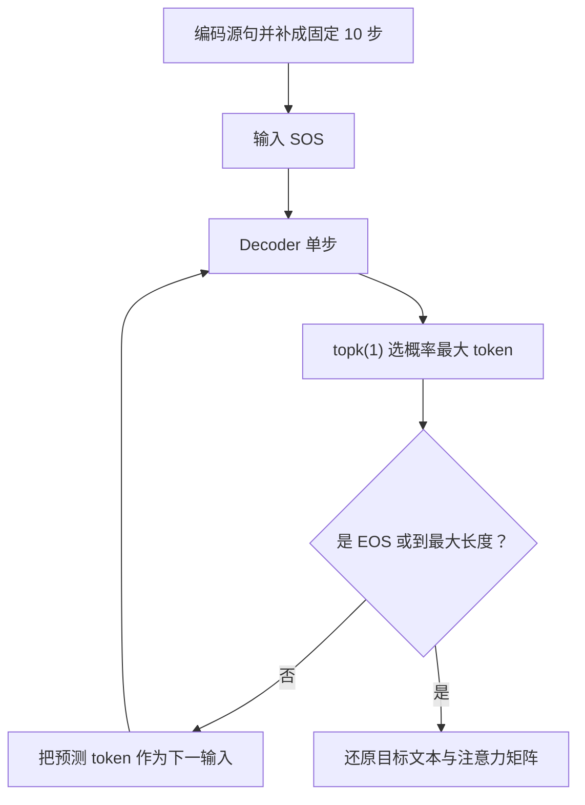

# 第 25 节：模型评估测试：加载两份权重并对照英文、真值法语和预测法语

> 笔记编号 25/26 · 对应原视频 P104 · [打开这一集](https://www.bilibili.com/video/BV14mdfBDE4Q?p=104)

[← 上一节：24 模型评估函数：关闭梯度后自回归生成并截取有效注意力矩阵](./24-prediction-code.md) · [返回总目录](./README.md) · [下一节：26 绘制注意力热力图：横轴英语、纵轴法语，颜色表示依赖程度 →](./26-tensorboard-graph.md)

## 这节解决什么问题

怎样恢复 Encoder/Decoder 参数，对数据集样本或词表内自定义句子进行翻译，并正确理解演示结果的局限？


图从左向右读。先跟着数据或推理过程走一遍，再学习下面的术语。

## 辅助流程图


### 推理时逐词生成流程



## 老师原声整理稿（按讲解顺序）

### 0:00–5:36　先按训练时相同结构创建 Encoder 与 Decoder

老师指定某一轮保存的 Encoder、Attention Decoder 参数路径，再用相同英文词表大小、法语词表大小、hidden_size、dropout 和 max_length 重建模型。结构参数必须一致，否则 state_dict 不能正确加载。

两套模型都迁移到当前 device。加载时使用 map_location，使 GPU 训练的权重也能映射到 CPU 预测。课堂代码显式写了 `weights_only=False`；这只应加载自己信任的文件，因为完整 pickle 反序列化不适合不可信来源。对于只保存 `state_dict` 的现代 PyTorch 环境，兼容时优先使用 `weights_only=True`。加载后还应调用 `.eval()` 关闭 Decoder 的 Dropout。

### 5:36–10:51　数据处理函数同时提供句对与两套正反词表

评估不仅需要模型参数，还需要训练时相同的英文 word2index 和法语 index2word。前者把英文输入编码成 ID，后者把 Decoder 预测 ID 还原成法语词。

词表与模型输出行号必须来自同一版本。只拿到权重而换了一套索引，即使形状一致，ID 的词义也会错位。

### 10:51–16:47　既可遍历数据集句对，也可输入词表覆盖范围内的自定义英文

老师准备若干英文、法文句对，依次取 source 和真实 target。英文按空格切词，通过英文词表查 ID，追加 EOS，再创建 `[1,S]` long 张量并迁移设备。

由于课程没有 UNK，自定义句子中的每个英文词都必须已经存在于约 2803 词的英文词表中，否则直接索引会报错。

### 16:47–20:15　调用 evaluate 后同时打印原文、真值译文和预测译文

评估函数返回预测法语词列表和注意力矩阵。老师用空格拼接预测词，并把英文原句、数据集中的真实法语、模型预测法语并排打印，便于直观比较。

这不是只展示一个成功例，而是让同学看到当前模型仍会出错。预测阶段不再提供真实法语给 Decoder，真值只用于人眼对照。

### 20:15–22:36　演示只训练少量数据，结果不准首先应回到训练覆盖率

老师解释当前每轮只训练约 3000 条，而完整语料有六万多条，所以模型看到的数据比例很小。要改善效果，应取消演示用的提前 break，让更多语料、更多轮次参与训练，同时承担更长计算时间。

课堂没有实现 UNK、beam search、自动验证指标或 PAD mask；这些可以作为后续升级方向，但不能写成本节已经完成的错误诊断流程。

## 完整原声逐段记录

[查看本节按时间戳整理的完整音轨转写](./transcripts/p104.md)

逐段记录用于核查老师讲解是否遗漏；正文会进一步纠正口误和语音识别中的技术术语。

## 零基础先记住

- 模型结构必须与权重一致
- 词表必须与训练时一致
- 预测只输入英文
- 真实法语只用于对照
- 少量演示训练不能代表最终质量

## 课堂评估调用骨架（需配合完整模型与词表）

下面代码默认从项目根目录运行；专题配套实现见 [seq2seq_from_scratch 配套实现](../../seq2seq_from_scratch/README.md)。

```python
encoder.load_state_dict(torch.load(encoder_path,map_location=device,weights_only=True))
decoder.load_state_dict(torch.load(decoder_path,map_location=device,weights_only=True))
encoder.eval(); decoder.eval()
for english,true_french in pairs:
    x_ids=[en_word2index[word] for word in english.split()]+[EOS_token]
    x=torch.tensor(x_ids,dtype=torch.long,device=device).view(1,-1)
    predicted,weights=evaluate(x,encoder,decoder)
    print(english,"|",true_french,"|"," ".join(predicted))
```

### 输入和输出怎么看

逐条打印英文原句、真实法语和模型预测法语。

## 最容易踩的坑

课程没有 UNK；自定义英文含词表外单词时不会自动回退，而会查表失败。

## 本节知识链

`按同结构创建两模型 → load_state_dict 恢复权重 → 准备句对和英文 ID → 调用 evaluate → 打印英文/真值/预测`

## 自测

**问题：为什么只加载模型权重还不够？**

<details>
<summary>点开核对答案</summary>

还必须使用训练时相同的词表映射，否则同一个输出 ID 会被还原成错误单词。

</details>

## 学完检查

- [ ] 我能用自己的话复述老师的讲解顺序
- [ ] 我能在运行前预测关键输出或张量形状
- [ ] 我知道这节方法最容易用错的地方
- [ ] 我能独立回答自测题

[← 上一节：24 模型评估函数：关闭梯度后自回归生成并截取有效注意力矩阵](./24-prediction-code.md) · [返回总目录](./README.md) · [下一节：26 绘制注意力热力图：横轴英语、纵轴法语，颜色表示依赖程度 →](./26-tensorboard-graph.md)
