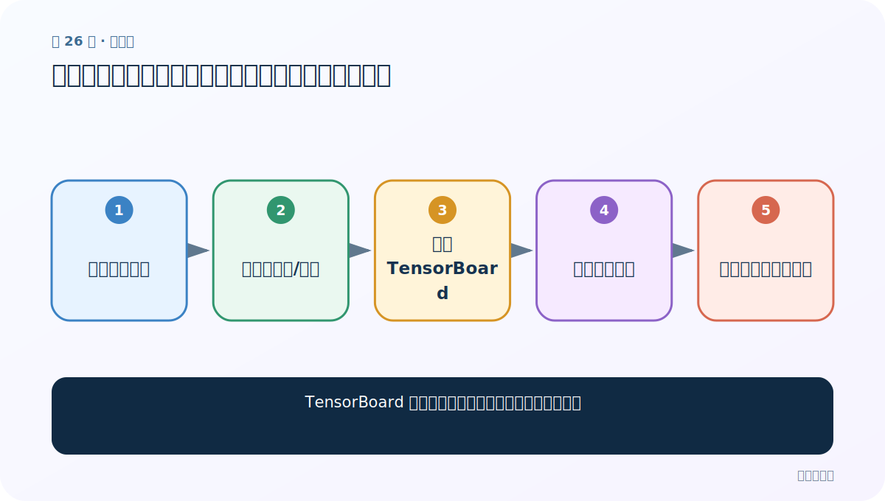
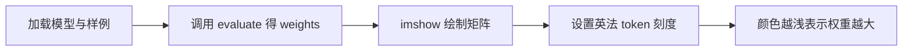
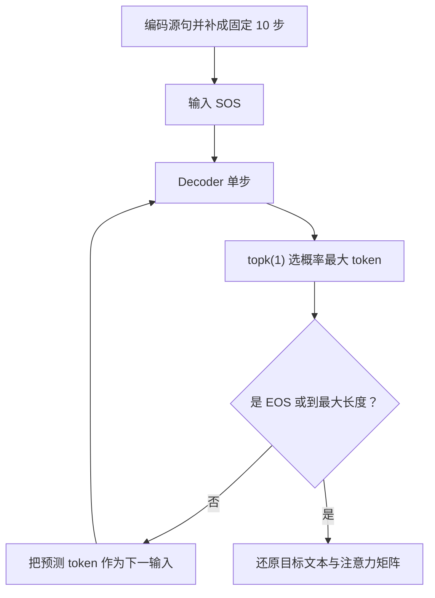

# 第 26 节：绘制注意力热力图：横轴英语、纵轴法语，颜色表示依赖程度

> 笔记编号 26/26 · 对应原视频 P105 · [打开这一集](https://www.bilibili.com/video/BV14mdfBDE4Q?p=105)

[← 上一节：25 模型评估测试：加载两份权重并对照英文、真值法语和预测法语](./25-prediction-test.md) · [返回总目录](./README.md) · 已是最后一节 →

## 这节解决什么问题

evaluate 返回的 [目标步数,10] 权重怎样画成热力图，又该如何避免把图读反？



图从左向右读。先跟着数据或推理过程走一遍，再学习下面的术语。

## 辅助流程图



### 推理时逐词生成流程



## 老师原声整理稿（按讲解顺序）

### 0:00–4:42　本节画的是注意力矩阵，不是 TensorBoard 计算图

老师先展示一张翻译对齐热力图：一条轴对应英语源句，另一条轴对应生成的法语词，格子的明暗代表生成某个法语词时对某个英语位置的权重。代码主要用于查看，老师明确说不要求同学逐行抄写。

因此本节目标是解释模型关注关系，不是用 SummaryWriter 或 add_graph 检查网络结构。

### 4:42–8:58　复用评估流程取得预测词和注意力矩阵

函数先准备 DataLoader、Encoder、Attention Decoder，并加载训练好的两份权重。选定英文句子后，按训练词表编码、追加 EOS，再调用上一节 evaluate，得到预测法语词列表和裁剪后的注意力矩阵。

如果模型生成 7 个步骤，返回矩阵约为 `[7,10]`：7 是实际目标生成步，10 是课程固定源长度。

### 8:58–12:42　imshow 把矩阵画出来，刻度必须与真实 token 对齐

老师将注意力张量转成 NumPy 后交给 Matplotlib `imshow`，再设置横纵轴刻度标签并保存图片。源句真实 token 少于 10 时，图中仍可能包含补出的固定位置；标签和矩阵列数必须对齐。

预测词列表与矩阵行数也要对应；EOS 是否显示取决于返回词列表和刻度构造，不能只凭坐标数字猜词。课堂口头解释中有一处把横纵轴说反；按 evaluate 返回的矩阵 `[目标生成步, 源位置]` 直接 imshow 时，列/x 轴是英语源位置，行/y 轴是法语目标步骤。应以张量维度和实际 set_xticklabels/set_yticklabels 代码为准。

### 12:42–17:45　正确读图：一个法语词对应一整行源位置权重

阅读时选定一个生成的法语词，沿对应矩阵行观察它对各英语位置的权重。课堂配色中颜色越浅表示依赖越强；具体明暗方向取决于 colormap，换配色后必须看色标，不能把“越浅越强”当作所有热力图的通则。

老师用前后词的大致对齐说明 Attention 会随生成步变化。热力图展示模型内部权重，不保证翻译一定正确；本节最后以这张图收束 RNN、GRU、Attention 与英法翻译案例。

## 完整原声逐段记录

[查看本节按时间戳整理的完整音轨转写](./transcripts/p105.md)

逐段记录用于核查老师讲解是否遗漏；正文会进一步纠正口误和语音识别中的技术术语。

## 零基础先记住

- 本节是 attention heatmap，不是 TensorBoard
- 矩阵行对应目标生成步
- 矩阵列对应固定十个源位置
- 刻度必须与 token 对齐
- 颜色意义要结合 colormap

## 注意力绘图调用骨架（需传入评估结果）

下面代码默认从项目根目录运行；专题配套实现见 [seq2seq_from_scratch 配套实现](../../seq2seq_from_scratch/README.md)。

```python
import matplotlib.pyplot as plt
plt.imshow(attention_weights.cpu().numpy(),aspect="auto",cmap="bone")
plt.xlabel("English source positions")
plt.ylabel("Generated French positions")
plt.colorbar()
plt.savefig("attention.png")
plt.show()
```

### 输入和输出怎么看

生成目标步×源位置的注意力热力图。

## 最容易踩的坑

不要把横纵轴读反，也不要把注意力高直接等同于翻译正确；换 colormap 后先查看色标方向。

## 本节知识链

`加载模型与样例 → 调用 evaluate 得 weights → imshow 绘制矩阵 → 设置英法 token 刻度 → 颜色越浅表示权重越大`

## 自测

**问题：注意力矩阵形状是 [7,10] 时两个数字分别表示什么？**

<details>
<summary>点开核对答案</summary>

7 个实际目标生成步骤，每一步对固定 10 个英语源位置各有一个权重。

</details>

## 学完检查

- [ ] 我能用自己的话复述老师的讲解顺序
- [ ] 我能在运行前预测关键输出或张量形状
- [ ] 我知道这节方法最容易用错的地方
- [ ] 我能独立回答自测题

[← 上一节：25 模型评估测试：加载两份权重并对照英文、真值法语和预测法语](./25-prediction-test.md) · [返回总目录](./README.md) · 已是最后一节 →
