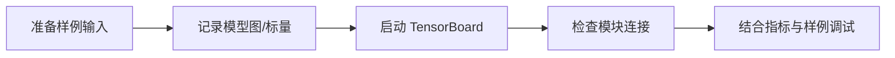
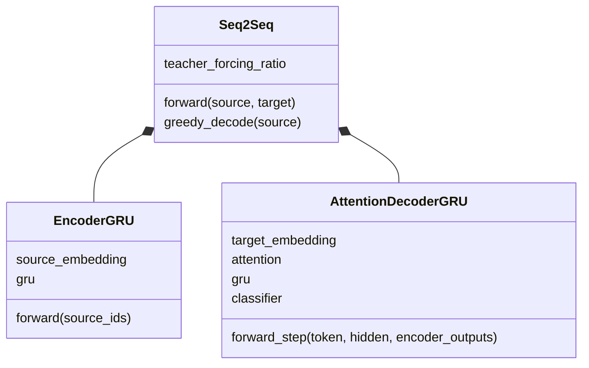

# 第 26 节：绘制张量图：用图检查模块连接，不把图当性能证明

> 笔记编号 26/26 · 对应原视频 P105 · [打开这一集](https://www.bilibili.com/video/BV14mdfBDE4Q?p=105)

[← 上一节：25 预测代码测试：从样例翻译发现数据与模型问题](./25-prediction-test.md) · [返回总目录](./README.md) · 已是最后一节 →

## 这节解决什么问题

TensorBoard 计算图能帮助看什么，又不能说明什么？


图从左向右读。先跟着数据或推理过程走一遍，再学习下面的术语。

## 辅助流程图



### Seq2Seq 模块 UML



## 老师原声整理稿（按讲解顺序）

### 0:00–5:52　SummaryWriter

老师创建 writer，准备符合 forward 签名的样例张量，并尝试 add_graph。复杂循环、随机 Teacher Forcing 或多返回值可能让 tracing 失败，可单独包装确定性前向。

### 5:52–11:48　图怎样看

检查 Embedding→Encoder GRU→Attention Decoder→Linear 的模块连接和张量流；同时记录 loss、学习率、梯度范数。

### 11:48–17:45　边界

计算图能发现错接、维度和模块复用，但不能证明翻译好。性能仍需验证集、翻译指标、人工检查和错误分析。日志目录要分实验，避免多次运行混在一起。

## 完整原声逐段记录

[查看本节按时间戳整理的完整音轨转写](./transcripts/p105.md)

逐段记录用于核查老师讲解是否遗漏；正文会进一步纠正口误和语音识别中的技术术语。

## 零基础先记住

- 图用于结构调试
- 随机控制流可能不易 tracing
- 不同实验用不同日志目录

## 最小可运行代码

下面代码默认从项目根目录运行；专题配套实现见 [seq2seq_from_scratch 配套实现](../../seq2seq_from_scratch/README.md)。

```python
# 示例：writer.add_scalar("train/loss", loss.item(), step)
print("记录结构 + 标量 + 配置，三者一起看")
```

### 输入和输出怎么看

提示 TensorBoard 的正确用途。

## 最容易踩的坑

看到漂亮计算图不等于模型学会翻译。

## 本节知识链

`准备样例输入 → 记录模型图/标量 → 启动 TensorBoard → 检查模块连接 → 结合指标与样例调试`

## 自测

**问题：计算图最适合发现哪类问题？**

<details>
<summary>点开核对答案</summary>

模块是否正确连接、张量是否流经预期层，以及部分形状/复用问题。

</details>

## 学完检查

- [ ] 我能用自己的话复述老师的讲解顺序
- [ ] 我能在运行前预测关键输出或张量形状
- [ ] 我知道这节方法最容易用错的地方
- [ ] 我能独立回答自测题

[← 上一节：25 预测代码测试：从样例翻译发现数据与模型问题](./25-prediction-test.md) · [返回总目录](./README.md) · 已是最后一节 →
