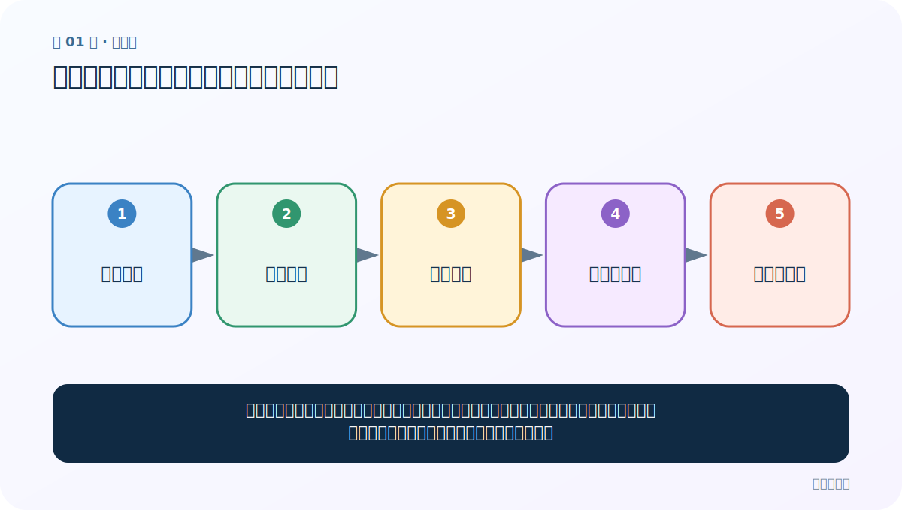
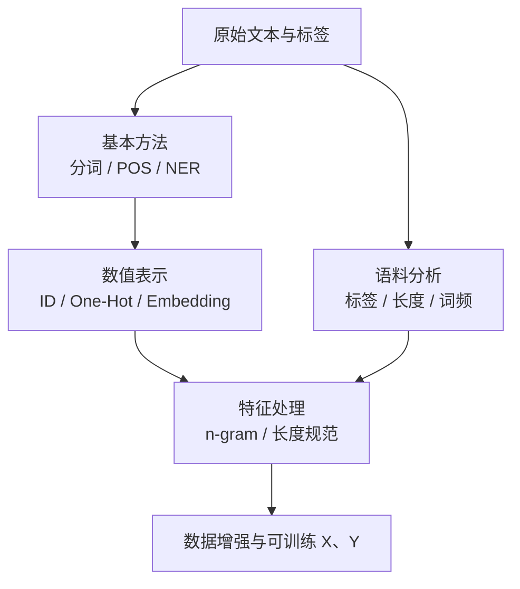

# 第 1 节：文本预处理全景：先看清问题，再动手处理

> 笔记编号 1/33 · 对应原视频 P5 · [打开这一集](https://www.bilibili.com/video/BV14mdfBDE4Q?p=5)

← 已是第一节 · [返回总目录](./README.md) · [下一节：02 环境准备与分词：机器眼中的句子没有天然词界 →](./02-environment-and-tokenization.md)

## 这节解决什么问题

原始文字不能直接、稳定地送进模型。我们要先把文字切成有意义的单位，再变成数字，检查数据有没有偏斜，最后才做特征加工和数据增强。



图要从左向右读。每个方框都是数据的一次变化，不是四个互不相关的名词。

## 辅助流程图


### 五类任务依赖图



## 零基础精讲：把这一节慢下来

### 先看一个具体场景

你拿到 10 万条商品评论，最危险的做法是马上训练模型。先抽样会发现：有空文本、有重复评论、正负标签比例悬殊，而且句子长度差别很大。文本预处理就是先把这些问题看清，再决定哪些处理真的有用。

### 数据究竟怎样一步步变化

1. 保留一条原始评论和它的标签
2. 把评论切成模型可处理的单位
3. 把这些单位映射成数字
4. 统计标签、长度和词频后再定规则

把上面四步和流程图对照起来：

> 原始文本 → 基础处理 → 数字表示 → 分析与特征 → 可训练数据

这里的箭头表示“左边的数据经过一次处理，变成右边的数据”，不是四个需要孤立背诵的名词。

### 第一次读代码，只盯住这一件事

先运行代码，确认五个阶段有固定先后。现在不用掌握每个阶段的 API，只要能解释为什么“先分析数据，再截断或增强”。

运行前先在纸上写出你预计的结果；即使猜错，也要指出自己是在哪个箭头上理解错了。这样比复制代码后看到“能运行”更接近真正学会。

### 本节暂时不要误会

预处理不是清洗得越干净越好；任何会改变意思的操作都要谨慎。

用一句话过关：**原始文字不能直接、稳定地送进模型。我们要先把文字切成有意义的单位，再变成数字，检查数据有没有偏斜，最后才做特征加工和数据增强。**

## 老师原声整理稿（按讲解顺序）

### 0:00–3:51　先建立五项任务的全景

老师开场说明，文本预处理不只是“分一下词”。这一章分成五类工作：基本方法、文本张量表示、语料分析、特征处理和数据增强。先看全景，是为了后面每学一个 API 都知道它在整条流水线中的位置。

基本方法包括分词、词性标注、命名实体识别；表示方法包括 One-Hot、Word2Vec 和 Embedding。老师特别预告 Word2Vec 的 CBOW 与 Skip-Gram 是当天难点，需要提前把“谁预测谁”分清。

### 3:51–7:42　模型为什么不能直接吃原始文字

神经网络底层进行矩阵乘法、加法和求导，不能直接对“天气很好”四个字运算。文本必须先切成 token，再按词表变成 ID 或向量。

原始数据还可能缺失、格式不一致、长度不同。老师用截断与补齐说明：若统一长度为 10，超过 10 的序列截掉后部，不足 10 的补 PAD。但长度 10 不能凭感觉指定，后面要先看长度分布。

预处理的目的不是让数据“看起来整齐”，而是得到模型需要的 X 与标签 Y，同时尽量保留任务相关信息。

### 7:42–10:22　基本方法：边界、角色和现实对象

分词把句段切成词元；词性标注判断名词、动词、形容词等语法角色；命名实体识别提取人名、地名、机构名等现实对象。

老师用“我爱北京天安门”等句子让同学找实体。三项任务互相关联但不相同：有了词边界，不代表已经知道词性；知道某词是名词，也不等于确认它是机构实体。

### 10:22–15:15　稀疏 One-Hot 与稠密词向量

老师先举五词句子。One-Hot 的维度等于词表大小，只有对应词位置为 1，其余全为 0。词表扩大后，大量零造成稀疏表示，而且“猫”和“狗”的向量不会天然比“猫”和“汽车”更接近。

Word2Vec/Embedding 用较短的稠密向量表示词，每一维都可参与计算。老师强调读音应为 Word-to-Vector，并预告 CBOW、Skip-Gram 两种训练方向。稠密不等于每个数字都有人工可解释含义，而是模型从任务中学习分布式特征。

### 15:15–20:12　拿到语料先分析，再决定怎么处理

老师用班级男女数量解释标签分布：类别严重不平衡时，只看准确率会产生错觉。还要分析句子长度、词频与缺失数据。

不同句长会影响 batch 训练，因此需要选择截断/补齐长度；但应根据直方图、分位数和任务需求决定。若大部分只有 10 个 token，少量 200 token，直接按最大值补齐会浪费计算。

### 20:12–26:05　特征处理：绘图、n-gram 和长度规范

词云本质是按词频绘制大小不同的词，适合快速观察常见词，但不能替代定量分析。

n-gram 把连续 n 个 token 组合为局部特征：

- unigram：单个 token；
- bigram：相邻两个；
- trigram：相邻三个。

老师用“今天天气很好适合……”逐步组合说明。n 越大，局部语序信息越多，但组合数量上升、数据更稀疏，通常先从 1–3 gram 尝试。

文本长度规范则根据前面的分布选择截断和 Padding，使同 batch 张量形状统一。

### 26:05–33:02　数据增强与回译

数据不够时可以补采真实业务数据、构造或增强已有文本。老师重点演示回译：中文先翻成英语、法语、德语等，再翻回中文，得到意思相近但表达不同的句子。

例如“你好帅，我好喜欢”可回译为“你很英俊，我非常喜欢你”等。回译可以增加语言表述多样性，但翻译错误也会改变标签；情感、否定、数字和实体必须抽样核查。

### 33:02–36:09　最后用 X、Y 串起全流程

老师要求截图保存思维导图，并用选择题复习。整章最终围绕：

> 原始文本/标签 → 基本处理 → 数字表示 → 数据分析 → 特征/增强 → 可训练 X、Y。

不是每个项目都必须把五项全部用一遍。预处理要由任务决定：删除停用词、截断、增强等操作都可能损伤语义，必须通过验证集检查。

## 完整原声逐段记录

[查看本节按时间戳整理的完整音轨转写](./transcripts/p005.md)

这份记录用于核查老师讲过的内容是否遗漏；正文会纠正口误与语音识别中的技术术语。

## 零基础先记住

- 基础方法：分词、词性标注、命名实体识别
- 数值表示：One-Hot、Word2Vec、Embedding
- 语料分析：标签、长度、词频；特征与增强：n-gram、相似度、回译

## 最小可运行代码

在项目根目录运行下面代码。课程原理的标准库版本集中在 [text_preprocessing_from_scratch](../../text_preprocessing_from_scratch/README.md)；需要 jieba、PyTorch、FastText 等的示例，请先按代码注释安装依赖。

```python
pipeline = ["分词", "数字化", "语料分析", "特征处理", "数据增强"]
for step, name in enumerate(pipeline, 1):
    print(step, name)
```

### 输入和输出怎么看

程序会按顺序打印 5 个阶段。真正项目不一定每一步都用，但“先分析、后决定”不能省。

## 最容易踩的坑

预处理不是越多越好。比如情感分类中删掉“没”“不”，会把意思反过来；应让任务决定规则。

## 本节知识链

`原始文本 → 基础处理 → 数字表示 → 分析与特征 → 可训练数据`

如果中间任意一个箭头说不清楚，就回到图上，用代码中的一个具体值手算一遍；能预测输出，才算真正理解。

## 自测

**问题：为什么不能看到文本很长，就直接统一截成 128 个词？**

<details>
<summary>点开核对答案</summary>

因为还没看长度分布；128 可能截掉大量关键信息，也可能浪费绝大多数计算。

</details>

## 学完检查

- [ ] 我能不用术语，用自己的话解释“这节解决什么问题”
- [ ] 我能在运行前大致猜出代码输出
- [ ] 我知道本节方法不适用或容易出错的情况
- [ ] 我能回答自测题，而不只是记住答案

← 已是第一节 · [返回总目录](./README.md) · [下一节：02 环境准备与分词：机器眼中的句子没有天然词界 →](./02-environment-and-tokenization.md)
