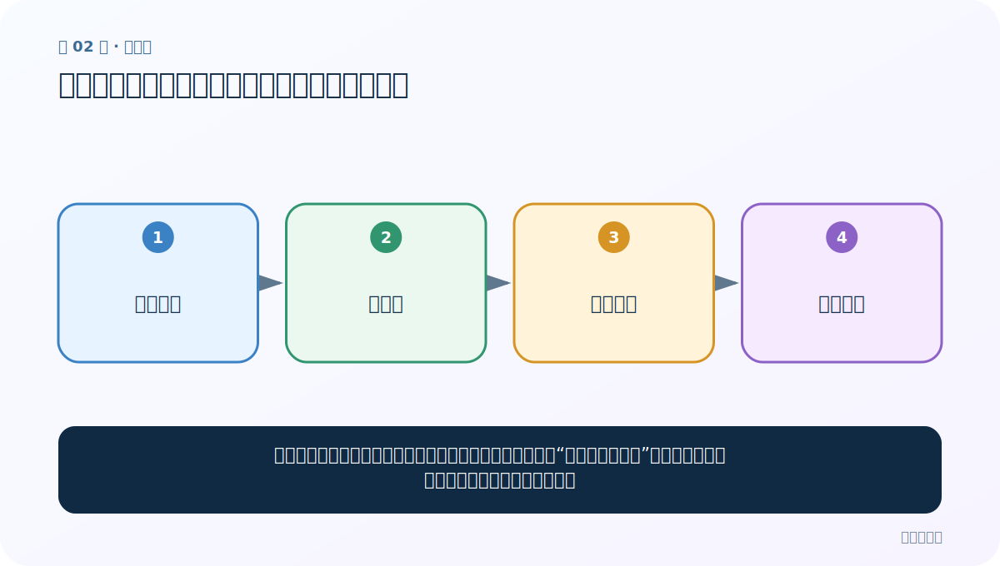

# 第 2 节：环境准备与分词：机器眼中的句子没有天然词界

> 笔记编号 2/33 · 对应原视频 P6 · [打开这一集](https://www.bilibili.com/video/BV14mdfBDE4Q?p=6)

[← 上一节：01 文本预处理全景：先看清问题，再动手处理](./01-overview.md) · [返回总目录](./README.md) · [下一节：03 jieba 精确模式：给句子一条主要切分路径 →](./03-jieba-precise-mode.md)

## 这节解决什么问题

英文常用空格提示词界，中文通常连在一起。分词就是决定“南京市长江大桥”应切成哪些词，让后续统计和建模有稳定单位。



图要从左向右读。每个方框都是数据的一次变化，不是四个互不相关的名词。

## 辅助流程图


## 零基础精讲：把这一节慢下来

### 先看一个具体场景

人看到“南京市长江大桥”会尝试按词义断开，程序只看到连续七个汉字。分成“南京市 / 长江大桥”还是“南京 / 市长 / 江大桥”，会直接影响后面的统计和理解。

### 数据究竟怎样一步步变化

1. 输入一整句连续中文
2. 分词器查词典并比较可能边界
3. 选出一条或多条切分路径
4. 输出可以逐个遍历的词元

把上面四步和流程图对照起来：

> 连续中文 → 分词器 → 词元边界 → 词元列表

这里的箭头表示“左边的数据经过一次处理，变成右边的数据”，不是四个需要孤立背诵的名词。

### 第一次读代码，只盯住这一件事

先确认运行代码的 Python 正是安装 jieba 的那个解释器，再观察 list(jieba.cut(...)) 如何把生成器变成可见列表。

运行前先在纸上写出你预计的结果；即使猜错，也要指出自己是在哪个箭头上理解错了。这样比复制代码后看到“能运行”更接近真正学会。

### 本节暂时不要误会

虚拟环境只负责隔离版本；它不会让分词自动变准。

用一句话过关：**英文常用空格提示词界，中文通常连在一起。分词就是决定“南京市长江大桥”应切成哪些词，让后续统计和建模有稳定单位。**

## 老师原声整理稿（按讲解顺序）

### 0:00–3:54　中文为什么需要分词

老师从“字、词、句、段、篇、章”回顾语言层级。英文常有空格提示词边界，中文连续书写，没有天然的空格分隔，因此程序需要决定哪些字符组成一个 token。

课程把分词结果先近似理解为 token。这里要补充：现代大模型 tokenizer 可能按子词、字节或字符切分，不一定等于日常词语；jieba 解决的是传统中文词分词。

### 3:54–6:54　常见中文分词工具

老师介绍 jieba，并扩展 SnowNLP、HanLP、LTP、THULAC、IK 等工具。它们面向的场景不同：有的包含完整 NLP 管线，有的常用于搜索引擎。学习这份课程先掌握 jieba 的模式与词典，其他工具做到知道名称和用途。

工具多不代表需要全部安装。选型要看语言、领域、速度、部署方式和下游模型。

### 6:54–10:53　环境版本与课程接口

课程建议 Python 3.10 与 jieba 0.42.1，并说明 jieba 支持简体、繁体以及用户自定义词典。老师强调若版本差异造成接口或结果变化，可参考课堂版本。

虚拟环境解决依赖隔离：一个项目升级包，不影响另一个项目。它不会直接提高分词准确率。

### 10:53–16:52　用 Conda 创建独立环境

老师现场演示大致命令：

```bash
conda create -n nlp_base python=3.10
conda activate nlp_base
pip install jieba==0.42.1
```

创建时 Conda 会列出待安装包并询问确认。环境名可自定，但应有语义。安装完成后可导出依赖版本，便于其他机器复现。

### 16:52–23:56　把 IDE 解释器切到新环境

只在终端创建环境还不够，PyCharm/IDE 项目必须选择对应 Python Interpreter。老师演示新增 Conda 环境、切换已有环境、删除错误解释器和在右下角快速切换。

最常见问题是“明明 pip install 了，代码仍提示找不到 jieba”，通常因为终端 pip 和 IDE Python 不属于同一环境。可同时打印：

```python
import sys, jieba
print(sys.executable)
print(jieba.__version__)
```

确认实际解释器与包版本。

## 完整原声逐段记录

[查看本节按时间戳整理的完整音轨转写](./transcripts/p006.md)

这份记录用于核查老师讲过的内容是否遗漏；正文会纠正口误与语音识别中的技术术语。

## 零基础先记住

- 课程使用 Python 3.10、jieba 0.42.1；版本不同可能有小差异
- 虚拟环境把本项目依赖与其他项目隔离
- token（词元）是模型处理的基本单位，不一定等于日常所说的“词”

## 最小可运行代码

在项目根目录运行下面代码。课程原理的标准库版本集中在 [text_preprocessing_from_scratch](../../text_preprocessing_from_scratch/README.md)；需要 jieba、PyTorch、FastText 等的示例，请先按代码注释安装依赖。

```python
# 安装一次：pip install jieba==0.42.1
import jieba
text = "我正在学习自然语言处理"
print(list(jieba.cut(text)))
```

### 输入和输出怎么看

输入是一整句中文；输出是若干词元组成的列表。具体边界由词典和统计规则共同决定。

## 最容易踩的坑

不要把“分词结果”当绝对真理。同一句话在搜索、命名实体识别和语言模型中可能需要不同粒度。

## 本节知识链

`连续中文 → 分词器 → 词元边界 → 词元列表`

如果中间任意一个箭头说不清楚，就回到图上，用代码中的一个具体值手算一遍；能预测输出，才算真正理解。

## 自测

**问题：虚拟环境解决的是分词准确率问题吗？**

<details>
<summary>点开核对答案</summary>

不是。它解决依赖隔离和版本复现问题；准确率仍取决于算法、词典和语料。

</details>

## 学完检查

- [ ] 我能不用术语，用自己的话解释“这节解决什么问题”
- [ ] 我能在运行前大致猜出代码输出
- [ ] 我知道本节方法不适用或容易出错的情况
- [ ] 我能回答自测题，而不只是记住答案

[← 上一节：01 文本预处理全景：先看清问题，再动手处理](./01-overview.md) · [返回总目录](./README.md) · [下一节：03 jieba 精确模式：给句子一条主要切分路径 →](./03-jieba-precise-mode.md)
