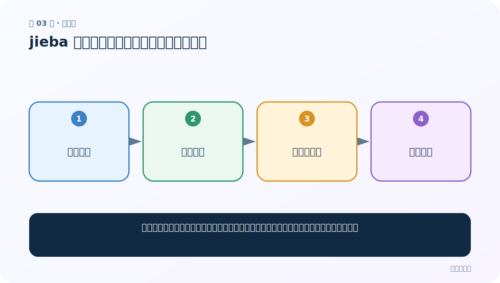
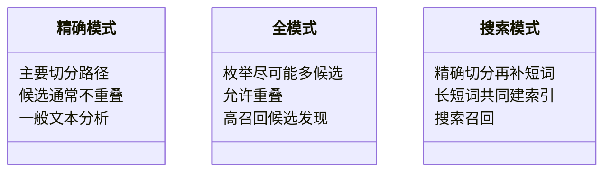

# 第 3 节：jieba 精确模式：给句子一条主要切分路径

> 笔记编号 3/33 · 对应原视频 P7 · [打开这一集](https://www.bilibili.com/video/BV14mdfBDE4Q?p=7)

[← 上一节：02 环境准备与分词：机器眼中的句子没有天然词界](./02-environment-and-tokenization.md) · [返回总目录](./README.md) · [下一节：04 jieba 全模式：把可能的词尽量找出来 →](./04-jieba-full-mode.md)

## 这节解决什么问题

精确模式尽量把句子切成一组互不重叠、适合一般文本分析的词。它是最常用的默认模式。



图要从左向右读。每个方框都是数据的一次变化，不是四个互不相关的名词。

## 辅助流程图


### 三种分词模式对照图



## 零基础精讲：把这一节慢下来

### 先看一个具体场景

做评论词频时，同一个字符位置最好只属于一个主要词，否则会重复计数。精确模式像拿笔在句子上画一组不重叠的分隔线。

### 数据究竟怎样一步步变化

1. 输入“小明硕士毕业于中国科学院计算所”
2. 精确模式计算候选词的组合
3. 保留一条主要切分路径
4. 用斜杠显示每个边界

把上面四步和流程图对照起来：

> 一句中文 → 精确模式 → 唯一主路径 → 词元序列

这里的箭头表示“左边的数据经过一次处理，变成右边的数据”，不是四个需要孤立背诵的名词。

### 第一次读代码，只盯住这一件事

先猜 words 是列表还是字符串，再运行。比较 jieba.cut 返回的生成器与 jieba.lcut 直接返回的列表。

运行前先在纸上写出你预计的结果；即使猜错，也要指出自己是在哪个箭头上理解错了。这样比复制代码后看到“能运行”更接近真正学会。

### 本节暂时不要误会

“精确”是模式名称，不代表每个领域词都一定切对；专业词仍可能需要用户词典。

用一句话过关：**精确模式尽量把句子切成一组互不重叠、适合一般文本分析的词。它是最常用的默认模式。**

## 老师原声整理稿（按讲解顺序）

### 0:00–3:55　先回顾模式与评估术语插曲

老师开始 jieba 精确模式前，回顾精确率、召回率等旧知识，并列出 jieba 的精确、全、搜索引擎、繁体与自定义词典能力。课堂插曲较多，学习主线是先掌握三种模式的切分粒度。

精确模式力图给句子一条主要、不重叠的切分路径，适合普通文本分析。

### 3:55–9:50　模式差异本质是切分粒度

老师再次提到 SnowNLP、LTP、THULAC、IK 等工具，并解释精确模式尽量消除歧义；全模式枚举更多候选、速度快但有重叠；搜索模式为检索补充短词。

同一句话没有唯一绝对正确的切法。新闻分析、搜索索引、实体识别可能需要不同粒度，后续任务决定选择。

### 9:50–13:47　jieba.cut 与 cut_all=False

代码先导入 jieba，准备中文文本，再调用：

```python
result = jieba.cut(content, cut_all=False)
```

cut_all=False 表示精确模式。返回值不是列表，而是生成器。生成器惰性地产生 token，适合大文本逐个处理，但直接 print 只会看到对象信息。

`jieba.lcut(...)` 则相当于直接返回 list。

### 13:47–18:44　三种读取生成器的方法与“指针跑完”

老师先用 next(result) 逐个取词，再用 for 循环继续遍历。for 会从当前未消费位置开始，不会自动回到开头。

生成器遍历完后，再调用 list(result) 得到空列表。课堂把它类比为“指针已经跑到末尾”。若需要多次使用：

- 第一次就转成列表保存；
- 或重新调用 jieba.cut 创建新生成器。

### 18:44–21:04　lcut 更适合课堂查看

```python
words = jieba.lcut(content, cut_all=False)
```

直接得到列表，能重复遍历、拼接和检查。代价是一次把全部 token 放入内存。小文本和调试通常用 lcut，大语料流式处理可保留 cut 生成器。

精确模式结果应人工用 “/” 连接检查边界。代码运行不报错，只说明接口正确，不说明领域词一定切对。

## 完整原声逐段记录

[查看本节按时间戳整理的完整音轨转写](./transcripts/p007.md)

这份记录用于核查老师讲过的内容是否遗漏；正文会纠正口误与语音识别中的技术术语。

## 零基础先记住

- jieba.cut(text, cut_all=False) 返回生成器
- jieba.lcut(text) 直接返回列表
- 生成器节省内存，但通常只能从头到尾消费一次

## 最小可运行代码

在项目根目录运行下面代码。课程原理的标准库版本集中在 [text_preprocessing_from_scratch](../../text_preprocessing_from_scratch/README.md)；需要 jieba、PyTorch、FastText 等的示例，请先按代码注释安装依赖。

```python
import jieba
text = "小明硕士毕业于中国科学院计算所"
words = jieba.lcut(text, cut_all=False)
print(words)
print("/".join(words))
```

### 输入和输出怎么看

输入句子被切成一条主要路径；第二行用 / 显示边界，便于人工检查。

## 最容易踩的坑

把 cut 的结果打印出来可能只看到 generator 地址。需要 list(...)，或直接使用 lcut。

## 本节知识链

`一句中文 → 精确模式 → 唯一主路径 → 词元序列`

如果中间任意一个箭头说不清楚，就回到图上，用代码中的一个具体值手算一遍；能预测输出，才算真正理解。

## 自测

**问题：为什么同一个生成器第二次 list(...) 可能为空？**

<details>
<summary>点开核对答案</summary>

生成器是惰性的一次性迭代器，第一次遍历已经把其中元素消费完了。

</details>

## 学完检查

- [ ] 我能不用术语，用自己的话解释“这节解决什么问题”
- [ ] 我能在运行前大致猜出代码输出
- [ ] 我知道本节方法不适用或容易出错的情况
- [ ] 我能回答自测题，而不只是记住答案

[← 上一节：02 环境准备与分词：机器眼中的句子没有天然词界](./02-environment-and-tokenization.md) · [返回总目录](./README.md) · [下一节：04 jieba 全模式：把可能的词尽量找出来 →](./04-jieba-full-mode.md)
