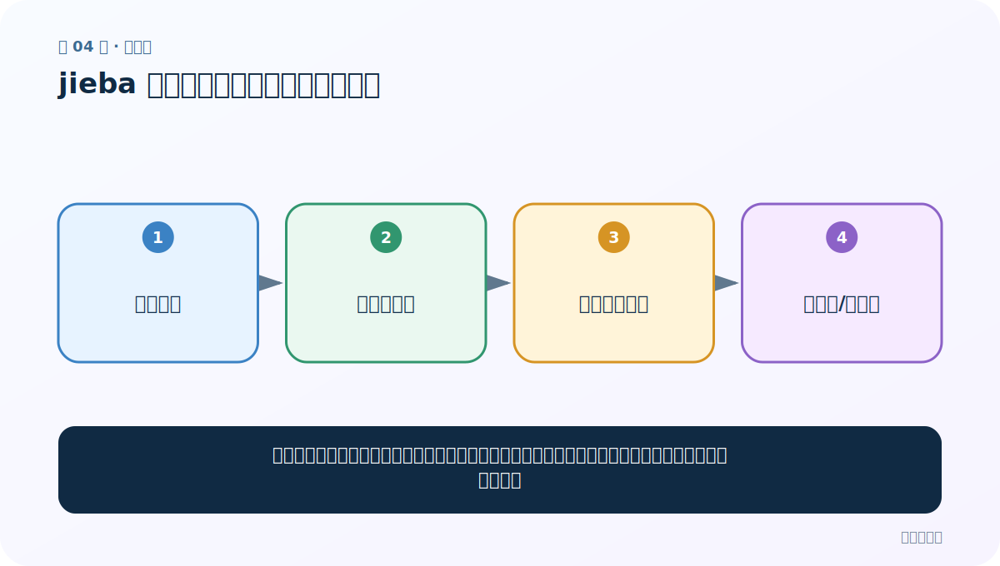
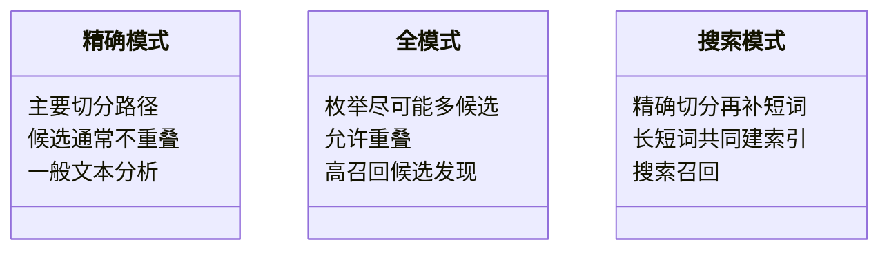

# 第 4 节：jieba 全模式：把可能的词尽量找出来

> 笔记编号 4/33 · 对应原视频 P8 · [打开这一集](https://www.bilibili.com/video/BV14mdfBDE4Q?p=8)

[← 上一节：03 jieba 精确模式：给句子一条主要切分路径](./03-jieba-precise-mode.md) · [返回总目录](./README.md) · [下一节：05 jieba 搜索引擎模式：长词再拆一层，提高召回 →](./05-jieba-search-mode.md)

## 这节解决什么问题

全模式会扫描句子中所有可能成词的片段，因此召回多、速度快，但会产生互相重叠甚至互相冲突的词。



图要从左向右读。每个方框都是数据的一次变化，不是四个互不相关的名词。

## 辅助流程图


### 三种分词模式对照图



## 老师原声整理稿（按讲解顺序）

### 0:00–1:57　全模式解决的不是“唯一切法”

老师从精确模式转到全模式。全模式会扫描文本中尽可能多的成词片段，适合只希望把候选关键词尽量找全的场景。它召回高，但不能消除歧义。

例如“南京市长江大桥”可能同时出现“南京”“南京市”“市长”“长江”“大桥”等重叠候选。它们不能按输出顺序直接拼回原句。

### 1:57–3:55　cut_all=True 与生成器

代码只是把上一节改为：

```python
result = jieba.cut(content, cut_all=True)
```

返回仍是生成器，打印地址值每次运行可能不同，不必纠结。需要 list 或 for 才能看到 token。

复制上一节测试代码时，老师提醒注释/修改旧测试，避免精确与全模式输出混在一起，误判是哪段代码产生结果。

### 3:55–4:42　比较结果而不是比较数量

老师运行全模式并与精确模式对照。全模式词更多只是因为包含重叠候选，并不等于更准确。

普通词频统计通常使用精确模式，否则同一字符范围可能被多次计数；搜索召回或候选生成可以考虑全模式。选择标准是“下游是否允许重叠”。

## 完整原声逐段记录

[查看本节按时间戳整理的完整音轨转写](./transcripts/p008.md)

这份记录用于核查老师讲过的内容是否遗漏；正文会纠正口误与语音识别中的技术术语。

## 零基础先记住

- 调用 jieba.lcut(text, cut_all=True)
- 适合快速枚举候选词，不适合作为严格的句子切分结果
- 它回答“可能包含哪些词”，不是“唯一该怎么切”

## 最小可运行代码

在项目根目录运行下面代码。课程原理的标准库版本集中在 [text_preprocessing_from_scratch](../../text_preprocessing_from_scratch/README.md)；需要 jieba、PyTorch、FastText 等的示例，请先按代码注释安装依赖。

```python
import jieba
text = "南京市长江大桥"
print("精确：", jieba.lcut(text, cut_all=False))
print("全模式：", jieba.lcut(text, cut_all=True))
```

### 输入和输出怎么看

比较两行输出：全模式一般包含更多且重叠的候选，如“南京”“南京市”“长江”“大桥”等。

## 最容易踩的坑

全模式词多不代表更准确。把重叠候选直接按顺序拼回去，已经不再是原句的一次切分。

## 本节知识链

`原句字符 → 全模式扫描 → 多个重叠候选 → 高召回/有歧义`

如果中间任意一个箭头说不清楚，就回到图上，用代码中的一个具体值手算一遍；能预测输出，才算真正理解。

## 自测

**问题：做普通词频统计时，为什么通常先选精确模式？**

<details>
<summary>点开核对答案</summary>

词频需要每个位置尽量只归属一个词；全模式的重叠会重复计数。

</details>

## 学完检查

- [ ] 我能不用术语，用自己的话解释“这节解决什么问题”
- [ ] 我能在运行前大致猜出代码输出
- [ ] 我知道本节方法不适用或容易出错的情况
- [ ] 我能回答自测题，而不只是记住答案

[← 上一节：03 jieba 精确模式：给句子一条主要切分路径](./03-jieba-precise-mode.md) · [返回总目录](./README.md) · [下一节：05 jieba 搜索引擎模式：长词再拆一层，提高召回 →](./05-jieba-search-mode.md)
