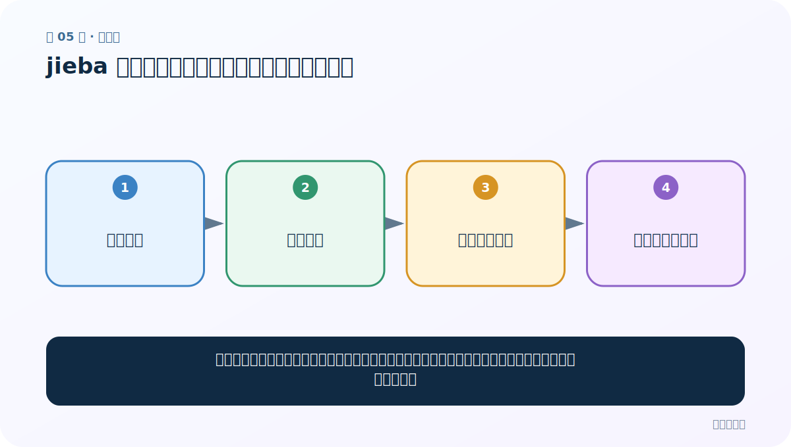
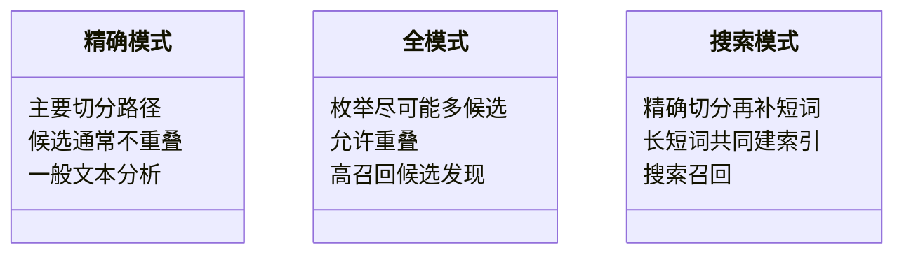

# 第 5 节：jieba 搜索引擎模式：长词再拆一层，提高召回

> 笔记编号 5/33 · 对应原视频 P9 · [打开这一集](https://www.bilibili.com/video/BV14mdfBDE4Q?p=9)

[← 上一节：04 jieba 全模式：把可能的词尽量找出来](./04-jieba-full-mode.md) · [返回总目录](./README.md) · [下一节：06 繁体中文分词：接口相同，词典覆盖决定效果 →](./06-traditional-chinese.md)

## 这节解决什么问题

搜索模式先做较准确的切分，再把较长的词补充拆成短词。用户只搜到其中一部分时，也更容易命中文档。



图要从左向右读。每个方框都是数据的一次变化，不是四个互不相关的名词。

## 辅助流程图


### 三种分词模式对照图



## 零基础精讲：把这一节慢下来

### 先看一个具体场景

商品名是“华为手机保护壳”，用户可能只搜索“手机壳”。搜索模式既保留较长词，又补充短词入口，让部分查询也能找到原文档。

### 数据究竟怎样一步步变化

1. 先做较准确的主切分
2. 找到其中较长的词
3. 把长词再补充拆成短片段
4. 长短片段一起进入搜索索引

把上面四步和流程图对照起来：

> 长词文本 → 精确切分 → 长词二次拆分 → 建立多粒度索引

这里的箭头表示“左边的数据经过一次处理，变成右边的数据”，不是四个需要孤立背诵的名词。

### 第一次读代码，只盯住这一件事

比较 lcut 与 lcut_for_search 两行输出；新增的短词就是额外检索入口，不是另一句新文本。

运行前先在纸上写出你预计的结果；即使猜错，也要指出自己是在哪个箭头上理解错了。这样比复制代码后看到“能运行”更接近真正学会。

### 本节暂时不要误会

搜索模式的目标是少漏搜，不是得到最干净的训练序列。

用一句话过关：**搜索模式先做较准确的切分，再把较长的词补充拆成短词。用户只搜到其中一部分时，也更容易命中文档。**

## 老师原声整理稿（按讲解顺序）

### 0:00–1:58　搜索模式为什么为检索服务

老师说明搜索引擎模式适合建立索引。精确模式保留较完整长词；搜索模式在此基础上把较长词再切出短片段，使用户只输入长词的一部分时也可能命中文档。

调用：

```python
jieba.cut_for_search(content)
# 或 jieba.lcut_for_search(content)
```

### 1:58–4:54　用“黑马程序员”解释召回

若文档只按完整长词建立索引，用户搜索“程序”可能匹配不到“黑马程序员”。搜索模式同时保存长词和部分短词，相当于建立多个检索入口。

这里的“智能”不是模型理解了用户全部意图，而是索引粒度更丰富，减少了漏检。

### 4:54–7:52　“苹果手机保护套”示例

老师继续问：用户只搜“手机壳/保护套”，能否找到“苹果手机保护套”。精确切分可能只保留长词组合，搜索模式会补充“苹果、手机、保护、保护套”等候选，提升召回。

召回提高也可能带来无关结果增加，所以真实搜索还需要相关性排序、同义词、字段权重等，不能仅靠分词。

### 7:52–10:43　复制代码最容易留下旧变量

课堂从上一文件复制函数并改成搜索模式，提醒检查函数名、测试名和实际调用。若测试仍调用旧函数，输出正常却不是本节逻辑。

搜索模式返回的生成器同样可 list 转换。保存为列表后才能重复打印或比较。

### 10:43–12:03　三种模式最终对比

- 精确模式：主要切分路径，适合一般分析；
- 全模式：尽量枚举候选，重叠最多；
- 搜索模式：精确结果上补短词，面向索引召回。

三者差异是粒度与使用目标，不是“高级模式一定比低级模式准确”。训练序列模型通常需要稳定的不重叠序列，不能直接把搜索模式重叠输出当作时间步。

## 完整原声逐段记录

[查看本节按时间戳整理的完整音轨转写](./transcripts/p009.md)

这份记录用于核查老师讲过的内容是否遗漏；正文会纠正口误与语音识别中的技术术语。

## 零基础先记住

- 使用 jieba.lcut_for_search(text)
- 兼顾长词语义与短词检索入口
- 典型目标是提高搜索召回率，而非生成最干净的语言序列

## 最小可运行代码

在项目根目录运行下面代码。课程原理的标准库版本集中在 [text_preprocessing_from_scratch](../../text_preprocessing_from_scratch/README.md)；需要 jieba、PyTorch、FastText 等的示例，请先按代码注释安装依赖。

```python
import jieba
text = "小明毕业于中国科学院计算所"
print(jieba.lcut(text))
print(jieba.lcut_for_search(text))
```

### 输入和输出怎么看

搜索模式通常在精确结果基础上补充较短片段；长词和短词可能同时出现。

## 最容易踩的坑

搜索模式的输出也可能重叠。训练序列模型时直接使用，会把原始位置关系弄复杂。

## 本节知识链

`长词文本 → 精确切分 → 长词二次拆分 → 建立多粒度索引`

如果中间任意一个箭头说不清楚，就回到图上，用代码中的一个具体值手算一遍；能预测输出，才算真正理解。

## 自测

**问题：电商搜索为什么希望“华为手机壳”还能被“手机壳”命中？**

<details>
<summary>点开核对答案</summary>

用户查询常只包含长词的一部分；补充短词索引可以减少漏检。

</details>

## 学完检查

- [ ] 我能不用术语，用自己的话解释“这节解决什么问题”
- [ ] 我能在运行前大致猜出代码输出
- [ ] 我知道本节方法不适用或容易出错的情况
- [ ] 我能回答自测题，而不只是记住答案

[← 上一节：04 jieba 全模式：把可能的词尽量找出来](./04-jieba-full-mode.md) · [返回总目录](./README.md) · [下一节：06 繁体中文分词：接口相同，词典覆盖决定效果 →](./06-traditional-chinese.md)
