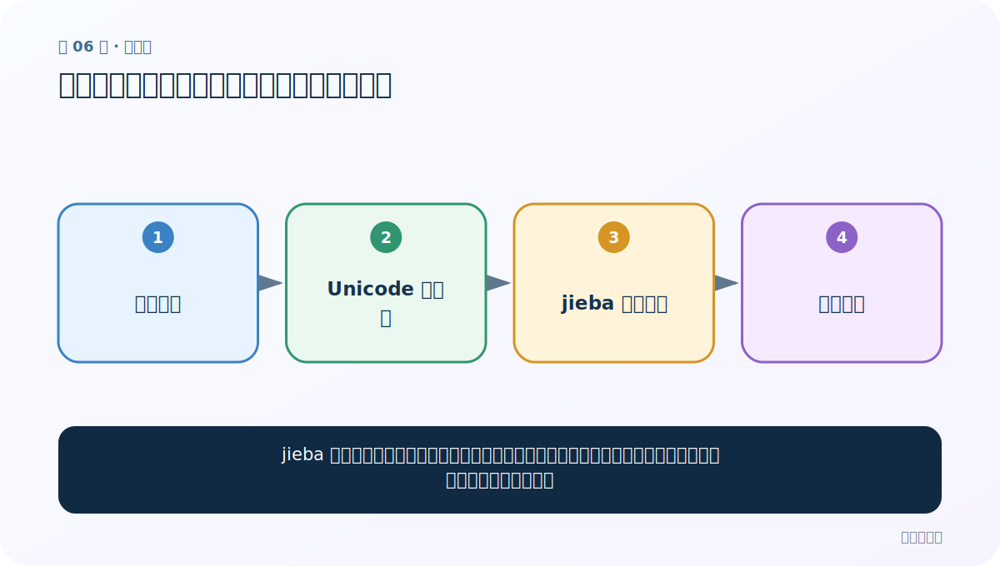
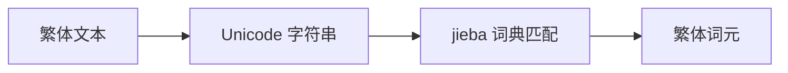

# 第 6 节：繁体中文分词：接口相同，词典覆盖决定效果

> 笔记编号 6/33 · 对应原视频 P10 · [打开这一集](https://www.bilibili.com/video/BV14mdfBDE4Q?p=10)

[← 上一节：05 jieba 搜索引擎模式：长词再拆一层，提高召回](./05-jieba-search-mode.md) · [返回总目录](./README.md) · [下一节：07 自定义词典：教分词器认识你的领域词 →](./07-custom-dictionary.md)

## 这节解决什么问题

jieba 可以直接接收繁体中文字符串，调用方法不变。真正需要关注的是所用词典是否覆盖领域词和地区用语。



图要从左向右读。每个方框都是数据的一次变化，不是四个互不相关的名词。

## 辅助流程图




## 老师原声整理稿（按讲解顺序）

### 0:00–1:54　繁体文本不需要换一套 API

老师继续完成 jieba 的繁体中文演示。Python 3 字符串使用 Unicode，繁体文字可直接传给 jieba；精确模式仍是 `cut_all=False`，全模式改 True，搜索模式使用 cut_for_search。

接口相同不表示效果必然相同。实际边界取决于词典是否包含当地用语、繁体词和领域专名。

### 1:54–3:05　三种模式在繁体上的调用

课堂分别调用精确、全和搜索模式，并打印结果。代码重点是：

```python
text = "我來到北京清華大學"
print(jieba.lcut(text, cut_all=False))
print(jieba.lcut(text, cut_all=True))
print(jieba.lcut_for_search(text))
```

是否先做简繁转换取决于任务。检索若希望简繁互通，可同时保留原文和规范化字段；生成、档案或姓名任务可能需要保留原貌。机械转换会误伤专名，因此要抽样验证。

## 完整原声逐段记录

[查看本节按时间戳整理的完整音轨转写](./transcripts/p010.md)

这份记录用于核查老师讲过的内容是否遗漏；正文会纠正口误与语音识别中的技术术语。

## 零基础先记住

- Python 3 字符串天然支持 Unicode
- 简繁转换不是所有任务的必选步骤
- 保留原文还是统一字形，要看检索、分类或生成任务的目标

## 最小可运行代码

在项目根目录运行下面代码。课程原理的标准库版本集中在 [text_preprocessing_from_scratch](../../text_preprocessing_from_scratch/README.md)；需要 jieba、PyTorch、FastText 等的示例，请先按代码注释安装依赖。

```python
import jieba
text = "我來到北京清華大學"
print(jieba.lcut(text, cut_all=False))
print(jieba.lcut_for_search(text))
```

### 输入和输出怎么看

输入繁体文本，仍得到词元列表；不同版本词典可能导致个别切分不同。

## 最容易踩的坑

机械简繁转换可能合并本来不同的用词，或损伤人名、地名。转换前应保留原始字段并抽样检查。

## 本节知识链

`繁体文本 → Unicode 字符串 → jieba 词典匹配 → 繁体词元`

如果中间任意一个箭头说不清楚，就回到图上，用代码中的一个具体值手算一遍；能预测输出，才算真正理解。

## 自测

**问题：看到繁体文本，第一步必须转成简体吗？**

<details>
<summary>点开核对答案</summary>

不一定。若工具已支持、任务需要保留原貌，就可以直接处理；统一字形应是有目的的选择。

</details>

## 学完检查

- [ ] 我能不用术语，用自己的话解释“这节解决什么问题”
- [ ] 我能在运行前大致猜出代码输出
- [ ] 我知道本节方法不适用或容易出错的情况
- [ ] 我能回答自测题，而不只是记住答案

[← 上一节：05 jieba 搜索引擎模式：长词再拆一层，提高召回](./05-jieba-search-mode.md) · [返回总目录](./README.md) · [下一节：07 自定义词典：教分词器认识你的领域词 →](./07-custom-dictionary.md)
