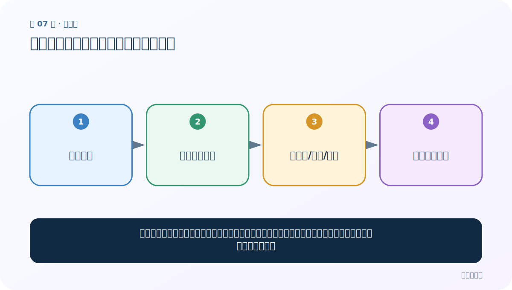

# 第 7 节：自定义词典：教分词器认识你的领域词

> 笔记编号 7/33 · 对应原视频 P11 · [打开这一集](https://www.bilibili.com/video/BV14mdfBDE4Q?p=11)

[← 上一节：06 繁体中文分词：接口相同，词典覆盖决定效果](./06-traditional-chinese.md) · [返回总目录](./README.md) · [下一节：08 命名实体识别与词性标注：词是什么角色 →](./08-ner-and-pos.md)

## 这节解决什么问题

通用词典不认识公司名、产品名或专业术语时，我们可以补一份用户词典，让这些片段更倾向于作为整体出现。



图要从左向右读。每个方框都是数据的一次变化，不是四个互不相关的名词。

## 辅助流程图


## 老师原声整理稿（按讲解顺序）

### 0:00–3:52　用户词典每行三个字段

老师介绍 jieba 用户自定义词典。每行通常是：

```text
词语 词频 词性
```

词语必填，词频与词性可选。词频不是“这个词在业务文件中真实出现了多少次”的严格统计，而是参与分词概率的权重；数值越高，分词器越倾向把它保留为整体。

词性如 n、v 等来自标记体系，课程建议知道常见大类即可，需要时查对照表，不必一次背完。

### 3:52–8:49　词性表与词典文件创建

老师展示词性对照，并新建 user_dict.txt，把课堂领域词、频率和词性写进去。用户词典应该只补充通用词典缺少的公司名、产品名、术语、人名等。

若几乎所有普通词都手工写入，说明方案难维护；词频乱设极大还会破坏其他边界。用户词典要版本管理，并配回归样句。

### 8:49–12:46　加载前后必须对比

先在未加载时分词：

```python
before = jieba.lcut(text)
jieba.load_userdict("user_dict.txt")
after = jieba.lcut(text)
```

老师比较加载前后，观察原本被拆开的领域词是否合并。路径错误、编码错误或格式多空格都可能导致加载失败。

### 12:46–14:15　词频与词性分别影响什么

高词频提高整体成词倾向；词性给 posseg 等后续标注提供提示。词性不是强制，若任务只关心边界可省略；若后面按名词/动词过滤，应认真填写并验证。

还可用 `jieba.add_word` 动态添加单词。无论文件还是动态方式，最终都要在包含歧义的句子上测试，而不是只看词典是否成功加载。

## 完整原声逐段记录

[查看本节按时间戳整理的完整音轨转写](./transcripts/p011.md)

这份记录用于核查老师讲过的内容是否遗漏；正文会纠正口误与语音识别中的技术术语。

## 零基础先记住

- 每行格式：词语 词频 词性；只有词语必填
- jieba.load_userdict(path) 加载文件
- 词频越高，算法越倾向保留整体，但不是无限制越高越好

## 最小可运行代码

在项目根目录运行下面代码。课程原理的标准库版本集中在 [text_preprocessing_from_scratch](../../text_preprocessing_from_scratch/README.md)；需要 jieba、PyTorch、FastText 等的示例，请先按代码注释安装依赖。

```python
import jieba
# userdict.txt 示例：创新办 10000 n
print(jieba.lcut("创新办主任正在开会"))
jieba.add_word("创新办", freq=10000, tag="n")
print(jieba.lcut("创新办主任正在开会"))
```

### 输入和输出怎么看

比较添加词语前后结果；后者更可能把“创新办”保留成一个词。

## 最容易踩的坑

词频不是实际业务出现次数的严格统计值，而是参与分词概率的权重。乱设超大值可能破坏其他句子的边界。

## 本节知识链

`领域文本 → 通用词典漏词 → 加入词/频率/词性 → 边界得到修正`

如果中间任意一个箭头说不清楚，就回到图上，用代码中的一个具体值手算一遍；能预测输出，才算真正理解。

## 自测

**问题：用户词典中的词性可以省略吗？**

<details>
<summary>点开核对答案</summary>

可以；词语必填，频率和词性通常可选。若后续依赖词性过滤，建议认真填写。

</details>

## 学完检查

- [ ] 我能不用术语，用自己的话解释“这节解决什么问题”
- [ ] 我能在运行前大致猜出代码输出
- [ ] 我知道本节方法不适用或容易出错的情况
- [ ] 我能回答自测题，而不只是记住答案

[← 上一节：06 繁体中文分词：接口相同，词典覆盖决定效果](./06-traditional-chinese.md) · [返回总目录](./README.md) · [下一节：08 命名实体识别与词性标注：词是什么角色 →](./08-ner-and-pos.md)
