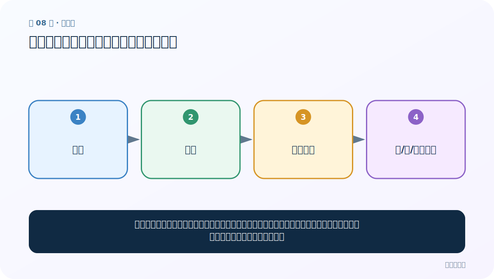
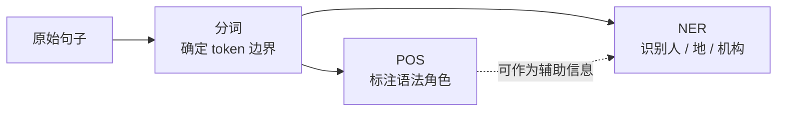

# 第 8 节：命名实体识别与词性标注：词是什么角色

> 笔记编号 8/33 · 对应原视频 P12 · [打开这一集](https://www.bilibili.com/video/BV14mdfBDE4Q?p=12)

[← 上一节：07 自定义词典：教分词器认识你的领域词](./07-custom-dictionary.md) · [返回总目录](./README.md) · [下一节：09 文本张量表示：模型为什么只接收数字 →](./09-text-to-tensor.md)

## 这节解决什么问题

分词只告诉我们边界；词性标注告诉我们它像名词、动词还是形容词；命名实体识别进一步找人名、地名、机构名等现实对象。



图要从左向右读。每个方框都是数据的一次变化，不是四个互不相关的名词。

## 辅助流程图


### 分词、POS 与 NER 的层级关系



## 老师原声整理稿（按讲解顺序）

### 0:00–3:50　NER 找“现实世界中的谁”

老师把命名实体识别与词性标注放在一起讲。NER（Named Entity Recognition）从文本中识别人名、地名、机构名、时间等实体。

以鲁迅介绍句为例，“鲁迅”是人名，“浙江绍兴”是地名。实体通常是名词性短语，但“名词”不自动等于“命名实体”；普通概念“桌子”是名词，却不是特定实体。

### 3:50–7:41　POS 标注词的语法角色

POS（Part-of-Speech tagging）先分词，再为每个 token 标注名词、动词、形容词等角色。同一个字/词在不同语境可能承担不同词性，老师用中文绕口句说明语境的重要性。

NER 与 POS 相关但任务不同。面试回答应先分别定义，再说 POS 可为 NER 提供特征，但现代上下文模型往往联合利用整句表示。

### 7:41–10:39　jieba.posseg 的返回结果

课程导入：

```python
import jieba.posseg as pseg
items = pseg.lcut("我爱自然语言处理")
```

每个 item 含 word 与 flag。flag 是词性代码，需要查 jieba 标记表解释。不要看到字母就猜含义。

### 10:39–17:35　写函数并暴露工具局限

老师定义 NER/POS 演示函数，遍历：

```python
for word, flag in pseg.lcut(text):
    print(word, flag)
```

课堂结果没有把某些地名正确识别出来。老师借此说明词典/规则工具有误判，用户词典可改善部分专名，但复杂 NER 还需要标注数据和上下文模型。

严格说，posseg 的主要输出是分词+词性，并不是完整的学习型 NER 系统。可把特定词性标记当作实体候选，但不能把它等同于可靠 NER。

### 17:35–24:02　总结与选择题

老师复习分词三种模式、繁体、用户词典、NER 与 POS，并用选择题检查：

- 分词：把句子切成 token；
- NER：识别人/地/机构等实体；
- POS：为每个词标语法角色。

大模型任务最终要理解人类语言，边界、角色和实体都是不同层面的辅助信息。

## 完整原声逐段记录

[查看本节按时间戳整理的完整音轨转写](./transcripts/p012.md)

这份记录用于核查老师讲过的内容是否遗漏；正文会纠正口误与语音识别中的技术术语。

## 零基础先记住

- jieba.posseg 可同时分词并给出词性标记
- NER 与 POS 有关联但不是同一任务
- 规则/词典系统会误判，领域数据和上下文模型能继续改善

## 最小可运行代码

在项目根目录运行下面代码。课程原理的标准库版本集中在 [text_preprocessing_from_scratch](../../text_preprocessing_from_scratch/README.md)；需要 jieba、PyTorch、FastText 等的示例，请先按代码注释安装依赖。

```python
import jieba.posseg as pseg
for item in pseg.lcut("李明在北京大学学习人工智能"):
    print(item.word, item.flag)
```

### 输入和输出怎么看

每行是“词语 + 词性代码”。代码如 n、v、a 等应查表理解，不必死背所有标记。

## 最容易踩的坑

不能因为某词被标成地名就认定它一定是实体。课程中的示例也会出现专名误判，这正说明结果要验证。

## 本节知识链

`句子 → 分词 → 词性角色 → 人/地/机构实体`

如果中间任意一个箭头说不清楚，就回到图上，用代码中的一个具体值手算一遍；能预测输出，才算真正理解。

## 自测

**问题：“苹果”是水果还是公司，单靠固定词典能总是判断对吗？**

<details>
<summary>点开核对答案</summary>

不能。它依赖上下文；NER 往往需要结合整句语义。

</details>

## 学完检查

- [ ] 我能不用术语，用自己的话解释“这节解决什么问题”
- [ ] 我能在运行前大致猜出代码输出
- [ ] 我知道本节方法不适用或容易出错的情况
- [ ] 我能回答自测题，而不只是记住答案

[← 上一节：07 自定义词典：教分词器认识你的领域词](./07-custom-dictionary.md) · [返回总目录](./README.md) · [下一节：09 文本张量表示：模型为什么只接收数字 →](./09-text-to-tensor.md)
