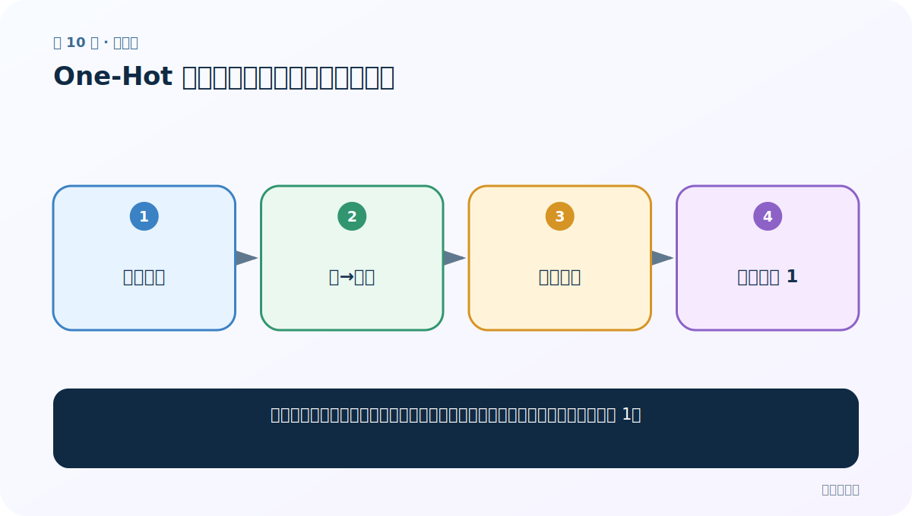
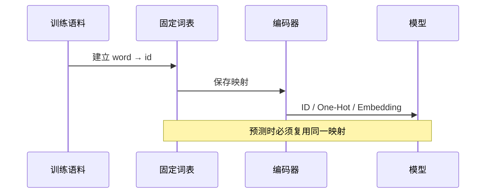

# 第 10 节：One-Hot 生成：从词表位置得到独热向量

> 笔记编号 10/33 · 对应原视频 P14 · [打开这一集](https://www.bilibili.com/video/BV14mdfBDE4Q?p=14)

[← 上一节：09 文本张量表示：模型为什么只接收数字](./09-text-to-tensor.md) · [返回总目录](./README.md) · [下一节：11 One-Hot 使用：加载同一映射并处理未知词 →](./11-one-hot-usage.md)

## 这节解决什么问题

给每个词一个唯一列号。看到某词，就创建全零数组，再把它对应的那一列设为 1。



图要从左向右读。每个方框都是数据的一次变化，不是四个互不相关的名词。

## 辅助流程图


### 词表到模型输入的时序



## 老师原声整理稿（按讲解顺序）

### 0:00–3:55　先把 One-Hot 用一句话讲清

老师定义 One-Hot：先分词，建立固定词表，把每个词映射为长度等于词表大小的 0/1 向量；对应列为 1，其余为 0。句子最终成为二维文本张量，可作为模型输入。

### 3:55–6:50　稀疏表示与稠密表示对比

老师联系以前的情感分析与神经网络输入层：One-Hot 是稀疏词向量；Word2Vec/Embedding 是稠密表示。Embedding 层把词 ID 当行号查参数表，不是自动从字符串理解语义。

### 6:50–12:48　课程旧版依赖与 Tokenizer

课堂尝试安装/导入 Keras 相关 Tokenizer，不同版本出现模块路径变化与安装速度差异。这个现场过程说明：旧教程 API 可能随版本更新，理解“拟合词表→固定索引→生成编码”比死记具体包路径更重要。

现在若复现，可用自己保存的 Python 字典或当前 tokenizer 库；不要为了旧 API 盲目降级整个环境。

### 12:48–21:49　拟合词表后索引如何变化

Tokenizer 根据训练文本建立 word_index。索引通常从 1 开始，0 留给补齐或保留位，因此手写 One-Hot 时要注意列号与数组下标是否需要减 1。

课堂打印过程中出现大量 0 和耗时变化。关键不是控制台每个数字，而是确认：

- 词表大小 V；
- 输入 token 数 L；
- 输出矩阵 shape [L,V]；
- 每行恰好一个 1（无 OOV 时）。

### 21:49–26:40　手工修改对应位置为 1

老师用全零数组演示：找到 token 的索引，将相应位置置 1。若索引从 1 开始而数组从 0 开始，需明确偏移，否则会越界或错一列。

更稳健的代码可直接按自己定义的 0-based vocab 生成。

### 26:40–29:46　为什么必须保存 tokenizer

老师最后强调每次重新训练/拟合词表，索引可能不同。模型权重已经把每列含义固定下来，预测时必须加载当时的 tokenizer/词表。

只保存模型而不保存词表，等于保留了一台机器却丢了输入插头定义。未知词应映射到 UNK，而不是临时追加新列改变维度。

## 完整原声逐段记录

[查看本节按时间戳整理的完整音轨转写](./transcripts/p014.md)

这份记录用于核查老师讲过的内容是否遗漏；正文会纠正口误与语音识别中的技术术语。

## 零基础先记住

- 训练集和验证集必须共用同一词表
- 映射要保存，预测时不能重新按新顺序编号
- 课程展示旧版 Keras Tokenizer；理解原理比绑定旧 API 更重要

## 最小可运行代码

在项目根目录运行下面代码。课程原理的标准库版本集中在 [text_preprocessing_from_scratch](../../text_preprocessing_from_scratch/README.md)；需要 jieba、PyTorch、FastText 等的示例，请先按代码注释安装依赖。

```python
from text_preprocessing_from_scratch.core import one_hot_corpus
vocab, matrix = one_hot_corpus(["我", "爱", "NLP", "我"])
print(vocab)
for row in matrix:
    print(row)
```

### 输入和输出怎么看

输入 4 个词、3 个不同词，输出形状为 4×3 的矩阵；两个“我”的行完全相同。

## 最容易踩的坑

先对训练集建词表，再冻结。若把测试集也用于建词表，会造成数据泄漏。

## 本节知识链

`去重词表 → 词→列号 → 全零向量 → 对应列置 1`

如果中间任意一个箭头说不清楚，就回到图上，用代码中的一个具体值手算一遍；能预测输出，才算真正理解。

## 自测

**问题：为什么要把 tokenizer/词表持久化保存？**

<details>
<summary>点开核对答案</summary>

为了保证训练和以后预测时，同一个词始终落在同一个位置。

</details>

## 学完检查

- [ ] 我能不用术语，用自己的话解释“这节解决什么问题”
- [ ] 我能在运行前大致猜出代码输出
- [ ] 我知道本节方法不适用或容易出错的情况
- [ ] 我能回答自测题，而不只是记住答案

[← 上一节：09 文本张量表示：模型为什么只接收数字](./09-text-to-tensor.md) · [返回总目录](./README.md) · [下一节：11 One-Hot 使用：加载同一映射并处理未知词 →](./11-one-hot-usage.md)
