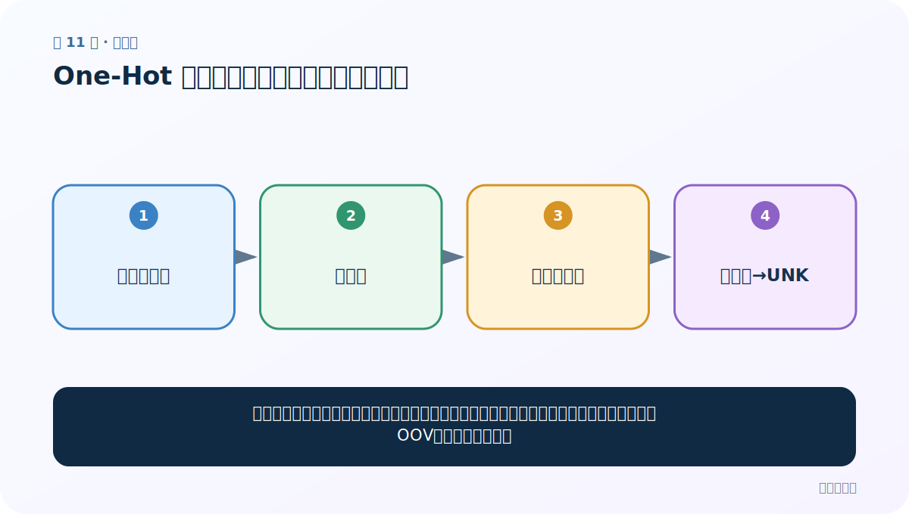
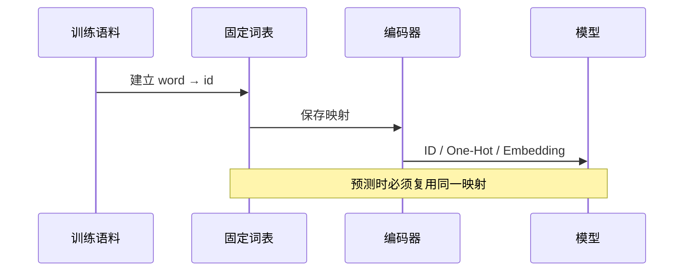

# 第 11 节：One-Hot 使用：加载同一映射并处理未知词

> 笔记编号 11/33 · 对应原视频 P15 · [打开这一集](https://www.bilibili.com/video/BV14mdfBDE4Q?p=15)

[← 上一节：10 One-Hot 生成：从词表位置得到独热向量](./10-one-hot-generation.md) · [返回总目录](./README.md) · [下一节：12 手写 One-Hot：看见稀疏表示的优点和代价 →](./12-simple-one-hot.md)

## 这节解决什么问题

模型上线后必须加载训练时的词表。新句子中的已知词按旧位置编码，没见过的词要有明确的 OOV（未知词）策略。



图要从左向右读。每个方框都是数据的一次变化，不是四个互不相关的名词。

## 辅助流程图


### 词表到模型输入的时序



## 零基础精讲：把这一节慢下来

### 先看一个具体场景

训练时词表里没有“量子猫”。上线遇到它时，系统不能报错，也不能临时改变所有编号，因此通常把它送到统一的未知词位置 UNK。

### 数据究竟怎样一步步变化

1. 加载训练时保存的词表
2. 已知词查回原来的 ID
3. 未知词映射到 UNK
4. 短句补齐时另用 PAD

把上面四步和流程图对照起来：

> 保存的词表 → 新句子 → 已知词查表 → 未知词→UNK

这里的箭头表示“左边的数据经过一次处理，变成右边的数据”，不是四个需要孤立背诵的名词。

### 第一次读代码，只盯住这一件事

逐个代入 vocab.get：我→1、爱→2、新词→默认值0。先手算 [1,2,0] 再执行。

运行前先在纸上写出你预计的结果；即使猜错，也要指出自己是在哪个箭头上理解错了。这样比复制代码后看到“能运行”更接近真正学会。

### 本节暂时不要误会

UNK 表示“这里有一个不认识的词”，PAD 表示“这里没有内容”，二者不该混为一谈。

用一句话过关：**模型上线后必须加载训练时的词表。新句子中的已知词按旧位置编码，没见过的词要有明确的 OOV（未知词）策略。**

## 老师原声整理稿（按讲解顺序）

### 0:00–1:59　加载的不只是模型，还有词到索引的规则

老师继续演示 One-Hot 的使用：先加载上一节保存的 tokenizer/词汇映射，再取 `word_index`。预测阶段的列含义必须与训练阶段一致。

序列化文件只应从可信来源加载；Python pickle 能执行对象反序列化逻辑，不能随意打开陌生文件。

### 1:59–4:54　给指定词构造 One-Hot

根据词表长度创建全零列表，查出词索引，再把对应位置改为 1。若 tokenizer 索引从 1 开始，数组下标需要做一致处理，或预留第 0 列。

核心不是写循环，而是保持三个不变量：向量长度固定、已知词列固定、未知词策略固定。

### 4:54–5:47　陌生词报错揭示 OOV 问题

课堂输入词表中不存在的名字/词，查表时报错。真实系统不应让任意新词导致崩溃，应在训练建词表时设置 `<UNK>`，预测时：

```python
idx = vocab.get(word, vocab["<UNK>"])
```

`<PAD>` 与 `<UNK>` 通常分开：PAD 表示没有内容，UNK 表示有内容但词表不认识。临时追加新词会改变模型输入含义，不能作为上线补救。

## 完整原声逐段记录

[查看本节按时间戳整理的完整音轨转写](./transcripts/p015.md)

这份记录用于核查老师讲过的内容是否遗漏；正文会纠正口误与语音识别中的技术术语。

## 零基础先记住

- 保存的是映射规则，不只是某批向量
- 常设置 <UNK> 接住词表外词
- 生产中还需 <PAD> 表示补齐位置

## 最小可运行代码

在项目根目录运行下面代码。课程原理的标准库版本集中在 [text_preprocessing_from_scratch](../../text_preprocessing_from_scratch/README.md)；需要 jieba、PyTorch、FastText 等的示例，请先按代码注释安装依赖。

```python
vocab = {"<UNK>": 0, "我": 1, "爱": 2, "NLP": 3}
def encode(words):
    return [vocab.get(word, vocab["<UNK>"]) for word in words]
print(encode(["我", "爱", "新词"]))
```

### 输入和输出怎么看

结果为 [1, 2, 0]；“新词”没有报错，而是安全映射到 <UNK>。

## 最容易踩的坑

直接写 vocab[word] 遇到新词会 KeyError。更糟的是临时把新词追加进词表，模型的输入维度和含义都会变化。

## 本节知识链

`保存的词表 → 新句子 → 已知词查表 → 未知词→UNK`

如果中间任意一个箭头说不清楚，就回到图上，用代码中的一个具体值手算一遍；能预测输出，才算真正理解。

## 自测

**问题：<UNK> 和 <PAD> 能共用一个编号吗？**

<details>
<summary>点开核对答案</summary>

通常不要。一个表示未知语义，一个表示没有内容；模型往往需要区分它们。

</details>

## 学完检查

- [ ] 我能不用术语，用自己的话解释“这节解决什么问题”
- [ ] 我能在运行前大致猜出代码输出
- [ ] 我知道本节方法不适用或容易出错的情况
- [ ] 我能回答自测题，而不只是记住答案

[← 上一节：10 One-Hot 生成：从词表位置得到独热向量](./10-one-hot-generation.md) · [返回总目录](./README.md) · [下一节：12 手写 One-Hot：看见稀疏表示的优点和代价 →](./12-simple-one-hot.md)
