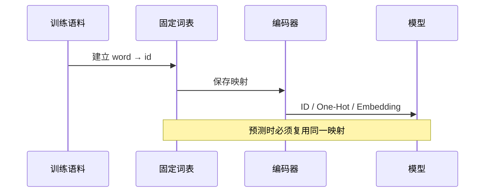

# 第 12 节：手写 One-Hot：看见稀疏表示的优点和代价

> 笔记编号 12/33 · 对应原视频 P16 · [打开这一集](https://www.bilibili.com/video/BV14mdfBDE4Q?p=16)

[← 上一节：11 One-Hot 使用：加载同一映射并处理未知词](./11-one-hot-usage.md) · [返回总目录](./README.md) · [下一节：13 Word2Vec 的 CBOW：用上下文猜中间词 →](./13-word2vec-cbow.md)

## 这节解决什么问题

手写一次能彻底看懂：One-Hot 不学习语义，它只是一个不会混淆的身份牌。


图要从左向右读。每个方框都是数据的一次变化，不是四个互不相关的名词。

## 辅助流程图


### 词表到模型输入的时序



## 零基础精讲：把这一节慢下来

### 先看一个具体场景

身份证能区分猫、狗、汽车，却不会告诉你猫和狗比汽车更相似。One-Hot 的优势是不会混淆身份，弱点是完全没有语义距离。

### 数据究竟怎样一步步变化

1. 为每个词分配唯一列
2. 创建大量为零的向量
3. 不同词的 1 出现在不同列
4. 所有不同词之间看起来同样远

把上面四步和流程图对照起来：

> 词的身份 → 唯一列 → 大量零 → 无语义距离

这里的箭头表示“左边的数据经过一次处理，变成右边的数据”，不是四个需要孤立背诵的名词。

### 第一次读代码，只盯住这一件事

手写循环时盯住 vector[vocab[word]]=1；它只选中一个位置，没有任何训练过程。

运行前先在纸上写出你预计的结果；即使猜错，也要指出自己是在哪个箭头上理解错了。这样比复制代码后看到“能运行”更接近真正学会。

### 本节暂时不要误会

One-Hot 并非错误方法；小型类别特征很好用，只是不适合表达大型词表的语义关系。

用一句话过关：**手写一次能彻底看懂：One-Hot 不学习语义，它只是一个不会混淆的身份牌。**

## 老师原声整理稿（按讲解顺序）

### 0:00–2:57　不用旧库也能手写 One-Hot

老师扩展最朴素实现：先得到稳定、不重复的词列表，为每个词建立索引。若直接用 set 去重，遍历顺序在不同运行/实现中可能不适合作为持久规则，因此应使用固定排序或首次出现顺序。

```python
vocab = {w: i for i, w in enumerate(dict.fromkeys(tokens))}
```

### 2:57–4:56　每个词生成全零列表并置 1

循环每个 token：

```python
vec = [0] * len(vocab)
vec[vocab[word]] = 1
```

老师强调这个实现不需要复杂工具：全零、找位置、改成 1。它适合帮助理解和处理很小的类别特征。

### 4:56–7:50　优点和两个核心缺点

优点是简单、确定、可解释。缺点一是维度随词表线性增长：10 万词就需要 10 万维。缺点二是极度稀疏，大多数元素为 0，浪费存储/计算。

此外，不同词的 One-Hot 彼此正交，不能表达“猫”比“汽车”更接近“狗”。这引出 Word2Vec 等稠密表示。

### 7:50–10:31　什么情况下仍然适合

One-Hot 也叫独热/零一编码，有该类别为 1、没有为 0。类别数量很少时，它仍是合理方案；例如几个颜色或有限标签。

老师用选择题让同学判断：类别取值非常多时不适合 One-Hot。结论不是“One-Hot 已淘汰”，而是词表规模和语义关系决定是否换 Embedding。

## 完整原声逐段记录

[查看本节按时间戳整理的完整音轨转写](./transcripts/p016.md)

这份记录用于核查老师讲过的内容是否遗漏；正文会纠正口误与语音识别中的技术术语。

## 零基础先记住

- 优点：简单、确定、容易解释
- 缺点：词表大时维度巨大且绝大多数为 0
- 任意两个不同词的 One-Hot 距离相同，无法表达语义相近

## 最小可运行代码

在项目根目录运行下面代码。课程原理的标准库版本集中在 [text_preprocessing_from_scratch](../../text_preprocessing_from_scratch/README.md)；需要 jieba、PyTorch、FastText 等的示例，请先按代码注释安装依赖。

```python
words = ["猫", "狗", "汽车"]
vocab = {w: i for i, w in enumerate(words)}
for word in words:
    vector = [0] * len(vocab)
    vector[vocab[word]] = 1
    print(word, vector)
```

### 输入和输出怎么看

猫、狗、汽车各占一列。虽然猫与狗更相近，向量本身并没有体现这一点。

## 最容易踩的坑

One-Hot 不是“落后的错误方法”。小型类别特征仍很合适；只是大型词表的语义表示通常需要 Embedding。

## 本节知识链

`词的身份 → 唯一列 → 大量零 → 无语义距离`

如果中间任意一个箭头说不清楚，就回到图上，用代码中的一个具体值手算一遍；能预测输出，才算真正理解。

## 自测

**问题：词表从 1 万扩大到 100 万，One-Hot 的主要问题是什么？**

<details>
<summary>点开核对答案</summary>

每个向量维度同步变成 100 万，存储和计算极其稀疏且不含语义关系。

</details>

## 学完检查

- [ ] 我能不用术语，用自己的话解释“这节解决什么问题”
- [ ] 我能在运行前大致猜出代码输出
- [ ] 我知道本节方法不适用或容易出错的情况
- [ ] 我能回答自测题，而不只是记住答案

[← 上一节：11 One-Hot 使用：加载同一映射并处理未知词](./11-one-hot-usage.md) · [返回总目录](./README.md) · [下一节：13 Word2Vec 的 CBOW：用上下文猜中间词 →](./13-word2vec-cbow.md)
