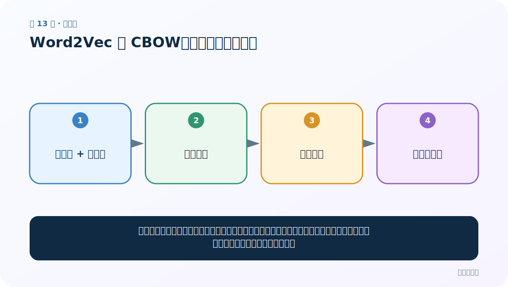
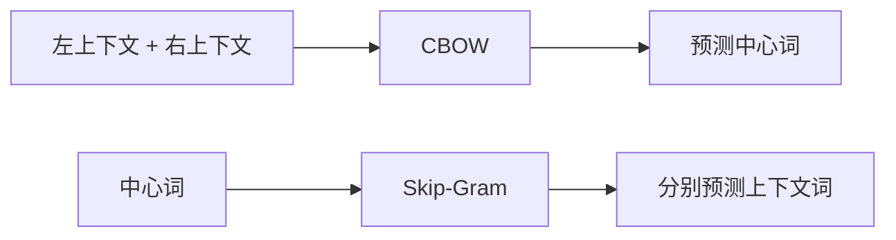
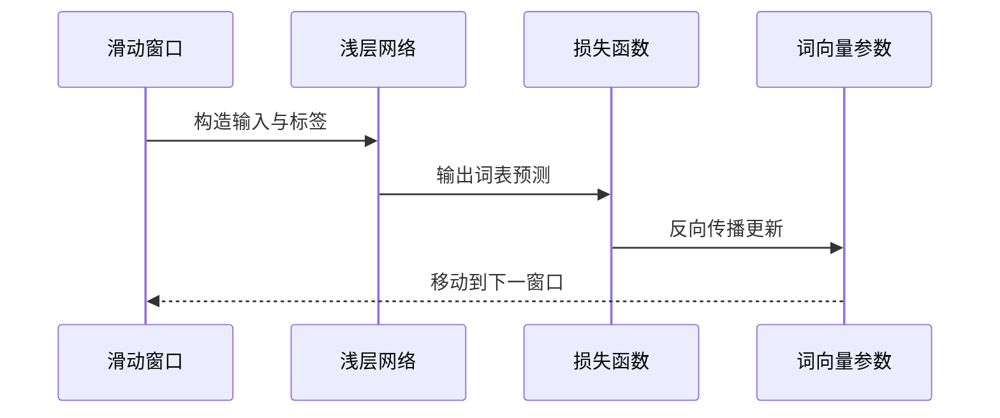

# 第 13 节：Word2Vec 的 CBOW：用上下文猜中间词

> 笔记编号 13/33 · 对应原视频 P17 · [打开这一集](https://www.bilibili.com/video/BV14mdfBDE4Q?p=17)

[← 上一节：12 手写 One-Hot：看见稀疏表示的优点和代价](./12-simple-one-hot.md) · [返回总目录](./README.md) · [下一节：14 Word2Vec 的 Skip-Gram：用中间词猜周围词 →](./14-word2vec-skipgram.md)

## 这节解决什么问题

把一句话切成许多小窗口，遮住中间词，让模型根据左右邻居猜它。长期训练后，经常出现在相似上下文里的词会得到相近向量。



图要从左向右读。每个方框都是数据的一次变化，不是四个互不相关的名词。

## 辅助流程图


### CBOW 与 Skip-Gram 方向对照



### 一次训练迭代时序



## 老师原声整理稿（按讲解顺序）

### 0:00–3:55　Word2Vec 用预测任务学习稠密向量

老师定义 Word2Vec：用浅层神经网络和上下文预测目标训练权重，再把某层权重矩阵作为词向量。没有人工标签也能构造监督信号，因为句子中的邻近词互相充当输入与标签。

课程指出两套方向：CBOW 用两边上下文预测中间词；Skip-Gram 用中心词预测周围词。本节重点先画 CBOW。

### 3:55–9:50　输入层、隐藏层、输出层的维度

假设语料库只有 5 个词，输入和输出都是 5 维 One-Hot；隐藏层设为 3 维。输入→隐藏权重矩阵把 5 维投到 3 维，隐藏→输出再投回 5 维词表 logits。

隐藏维 3 只是教学方便，实际可用 100、300 等。输入/输出维由词表大小决定，不能随意改成与词表不一致。

### 9:50–15:43　最终取哪张权重当词向量

老师围绕矩阵方向反复纠正 5×3 / 3×5。若采用行向量约定，One-Hot [1,V]×W[V,D] 得 [1,D]，W 的每一行对应一个词的 D 维向量；采用列向量时矩阵写法会转置。

不要只背“5×3”。先写输入在左还是右，再做矩阵乘法维度检查。课程最终要表达的是：输入到隐藏的权重表为每个词保存稠密表示。

### 15:43–22:42　CBOW 样本怎样构造

对长度窗口，选中中心词，两侧上下文作为输入，中心词为标签。例如：

```text
上下文（爱，语言） → 中心词“自然”
```

多个上下文 One-Hot 可求和/平均后送入网络。前向得到词表预测，和中心词真实 One-Hot 计算损失。

老师回顾深度学习训练三件事：前向传播得预测、损失函数衡量差异、反向传播更新权重。

### 22:42–25:41　CBOW 与 Skip-Gram 的一句话区别

老师在图旁写：

- CBOW：context → center；
- Skip-Gram：center → context。

无论哪种，训练的目标是让出现在相似上下文中的词形成有用向量，而不是最终部署一个“猜中间词”的产品。

### 25:41–40:34　手推一次矩阵乘法

老师放大输入—隐藏连接，逐项写 W11、W12 等。One-Hot 的作用是选中权重矩阵对应行：只有一个输入位置为 1，其余为 0，矩阵乘法后恰好取出该词向量。

上下文含多个词时，多个被选行会组合/平均形成隐藏表示，再乘隐藏→输出权重，Softmax 得到中心词概率。

### 40:34–45:29　损失、反向更新与遍历语料

预测分布与真实中心词计算损失，反向传播同时更新两张权重。移动窗口，重复构造下一组样本，直到多轮遍历语料。

训练完成后取输入权重（或按实现组合两套权重）作为词向量。老师最后强调这里讲的是 CBOW 的词向量获取；下一节把输入输出方向反过来讲 Skip-Gram。

## 完整原声逐段记录

[查看本节按时间戳整理的完整音轨转写](./transcripts/p017.md)

这份记录用于核查老师讲过的内容是否遗漏；正文会纠正口误与语音识别中的技术术语。

## 零基础先记住

- 训练样本形式：(上下文词集合 → 中心词)
- 输入经过共享的隐层权重，再预测整个词表概率
- 训练完成后通常取隐层权重矩阵作为词向量

## 最小可运行代码

在项目根目录运行下面代码。课程原理的标准库版本集中在 [text_preprocessing_from_scratch](../../text_preprocessing_from_scratch/README.md)；需要 jieba、PyTorch、FastText 等的示例，请先按代码注释安装依赖。

```python
from text_preprocessing_from_scratch.core import cbow_examples
tokens = "我 爱 自然 语言 处理".split()
for context, target in cbow_examples(tokens, window_size=1):
    print(context, "->", target)
```

### 输入和输出怎么看

例如 ('爱','语言') → '自然'。这些只是训练样本；真正 Word2Vec 会用大量语料学习权重。

## 最容易踩的坑

CBOW 不是把相邻词简单拼接成最终词向量；相邻预测任务只是学习表示的训练信号。

## 本节知识链

`左邻词 + 右邻词 → 共享隐层 → 词表概率 → 预测中心词`

如果中间任意一个箭头说不清楚，就回到图上，用代码中的一个具体值手算一遍；能预测输出，才算真正理解。

## 自测

**问题：窗口为 1 时，“我 爱 NLP”中以“爱”为中心的 CBOW 输入和标签是什么？**

<details>
<summary>点开核对答案</summary>

输入是上下文（我，NLP），标签是中心词“爱”。

</details>

## 学完检查

- [ ] 我能不用术语，用自己的话解释“这节解决什么问题”
- [ ] 我能在运行前大致猜出代码输出
- [ ] 我知道本节方法不适用或容易出错的情况
- [ ] 我能回答自测题，而不只是记住答案

[← 上一节：12 手写 One-Hot：看见稀疏表示的优点和代价](./12-simple-one-hot.md) · [返回总目录](./README.md) · [下一节：14 Word2Vec 的 Skip-Gram：用中间词猜周围词 →](./14-word2vec-skipgram.md)
