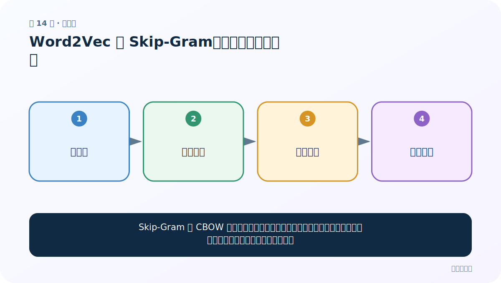
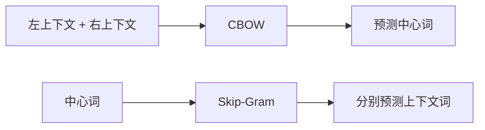
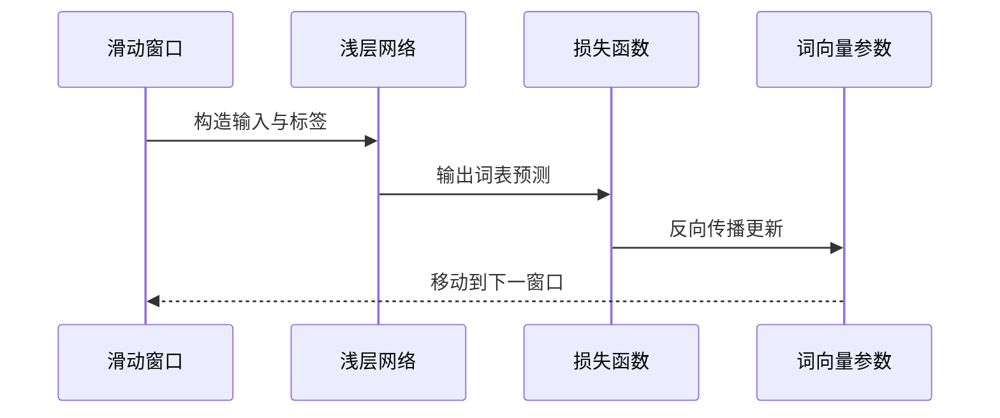

# 第 14 节：Word2Vec 的 Skip-Gram：用中间词猜周围词

> 笔记编号 14/33 · 对应原视频 P18 · [打开这一集](https://www.bilibili.com/video/BV14mdfBDE4Q?p=18)

[← 上一节：13 Word2Vec 的 CBOW：用上下文猜中间词](./13-word2vec-cbow.md) · [返回总目录](./README.md) · [下一节：15 FastText 准备：从大语料到可训练文件 →](./15-fasttext-setup.md)

## 这节解决什么问题

Skip-Gram 与 CBOW 方向相反：给一个中心词，分别预测窗口里的各个上下文词。一处中心会产生多对训练样本。



图要从左向右读。每个方框都是数据的一次变化，不是四个互不相关的名词。

## 辅助流程图


### CBOW 与 Skip-Gram 方向对照



### 一次训练迭代时序



## 老师原声整理稿（按讲解顺序）

### 0:00–2:56　Skip-Gram 从中心预测多个上下文

老师紧接 CBOW 反转任务。给定中心词，分别预测窗口左侧和右侧词。一个中心词可产生多个训练对，例如：

```text
爱 → 我
爱 → 自然
```

### 2:56–5:54　网络结构可复用，样本方向不同

输入、隐藏、输出三层与词表维度都可沿用。区别是输入 One-Hot 现在代表中心词，标签是某个上下文词。

老师复制上一张图修改箭头，提醒不要误以为 Skip-Gram 是全新网络；它主要改变训练样本与损失目标。

### 5:54–7:51　多个上下文损失怎样处理

中心词预测左词与右词会得到多个损失，可求和或平均，再反向更新同一套权重。实际高效 Word2Vec 常使用负采样等方法，不会每次对超大词表做完整 Softmax；课程先掌握基础原理。

### 7:51–9:53　最终拿到谁的词向量

Skip-Gram 同样从输入到隐藏的权重中取得中心词稠密表示。老师用“基于中间预测两边”作结。

常见经验是 CBOW 训练较快，Skip-Gram 对低频词更友好，但效果依赖语料、窗口、负采样等，不能把经验当绝对定律。

## 完整原声逐段记录

[查看本节按时间戳整理的完整音轨转写](./transcripts/p018.md)

这份记录用于核查老师讲过的内容是否遗漏；正文会纠正口误与语音识别中的技术术语。

## 零基础先记住

- 样本形式：(中心词 → 一个上下文词)
- 同一中心对应多个损失，再共同更新权重
- 计算通常更多，但对低频词往往更有帮助

## 最小可运行代码

在项目根目录运行下面代码。课程原理的标准库版本集中在 [text_preprocessing_from_scratch](../../text_preprocessing_from_scratch/README.md)；需要 jieba、PyTorch、FastText 等的示例，请先按代码注释安装依赖。

```python
from text_preprocessing_from_scratch.core import skipgram_examples
tokens = "我 爱 自然 语言 处理".split()
for center, context in skipgram_examples(tokens, window_size=1):
    print(center, "->", context)
```

### 输入和输出怎么看

“爱”会分别产生 爱→我、爱→自然；序列边缘只有一侧邻居。

## 最容易踩的坑

不要把 Skip-Gram 理解为跳着取词的 n-gram。它是一个预测任务，skip 指由中心预测窗口上下文。

## 本节知识链

`中心词 → 共享隐层 → 左上下文 → 右上下文`

如果中间任意一个箭头说不清楚，就回到图上，用代码中的一个具体值手算一遍；能预测输出，才算真正理解。

## 自测

**问题：CBOW 和 Skip-Gram 最核心的方向差异是什么？**

<details>
<summary>点开核对答案</summary>

CBOW：上下文→中心；Skip-Gram：中心→上下文。

</details>

## 学完检查

- [ ] 我能不用术语，用自己的话解释“这节解决什么问题”
- [ ] 我能在运行前大致猜出代码输出
- [ ] 我知道本节方法不适用或容易出错的情况
- [ ] 我能回答自测题，而不只是记住答案

[← 上一节：13 Word2Vec 的 CBOW：用上下文猜中间词](./13-word2vec-cbow.md) · [返回总目录](./README.md) · [下一节：15 FastText 准备：从大语料到可训练文件 →](./15-fasttext-setup.md)
