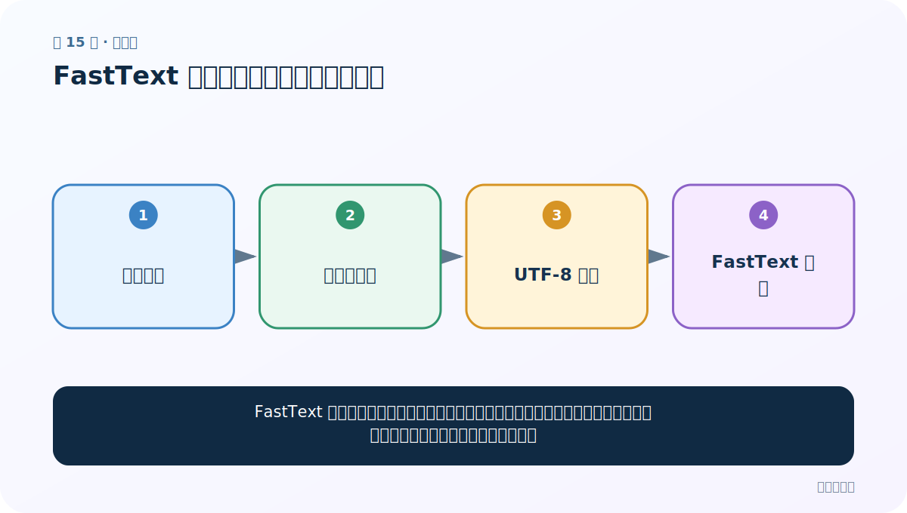

# 第 15 节：FastText 准备：从大语料到可训练文件

> 笔记编号 15/33 · 对应原视频 P19 · [打开这一集](https://www.bilibili.com/video/BV14mdfBDE4Q?p=19)

[← 上一节：14 Word2Vec 的 Skip-Gram：用中间词猜周围词](./14-word2vec-skipgram.md) · [返回总目录](./README.md) · [下一节：16 FastText 训练与保存：让语料自己产生监督信号 →](./16-fasttext-training.md)

## 这节解决什么问题

FastText 能从普通文本语料学习词向量。训练前最重要的不是立刻调参，而是确认语料编码、分词质量、体量和文件路径。



图要从左向右读。每个方框都是数据的一次变化，不是四个互不相关的名词。

## 辅助流程图


### FastText 实验生命周期


## 零基础精讲：把这一节慢下来

### 先看一个具体场景

FastText 像学语言的学生，教材若是一整行没有空格的中文，它可能把整句当成一个单位。训练前必须先保证每行文本、空格分词和编码都正确。

### 数据究竟怎样一步步变化

1. 收集与任务匹配的语料
2. 去掉乱码和明显重复
3. 中文分词并用空格连接
4. 以 UTF-8 按行写成训练文件

把上面四步和流程图对照起来：

> 原始语料 → 清洗与分词 → UTF-8 文本 → FastText 输入

这里的箭头表示“左边的数据经过一次处理，变成右边的数据”，不是四个需要孤立背诵的名词。

### 第一次读代码，只盯住这一件事

打开生成的 wiki_sample.txt，确认你能肉眼看到词间空格和换行；数据格式不对时先别启动训练。

运行前先在纸上写出你预计的结果；即使猜错，也要指出自己是在哪个箭头上理解错了。这样比复制代码后看到“能运行”更接近真正学会。

### 本节暂时不要误会

更多语料不必然更好，领域错位或大量噪声会让模型稳定地学到错误规律。

用一句话过关：**FastText 能从普通文本语料学习词向量。训练前最重要的不是立刻调参，而是确认语料编码、分词质量、体量和文件路径。**

## 老师原声整理稿（按讲解顺序）

### 0:00–3:54　从手推原理转向 FastText 工具

老师说明 CBOW/Skip-Gram 原理已经讲完，接下来不手写完整高效训练器，而使用 Facebook Research 开源的 FastText 工具。Word2Vec 由 Tomas Mikolov 等人在 Google 推动；FastText 是另一套加入子词信息的模型/库，不能把两者作者和实现完全等同。

### 1:56–5:53　准备百科语料

课程使用预处理后的维基百科中文语料。原始压缩/解压体积较大，已通过正则清洗、分词，并用空格隔开 token。

FastText 无监督训练输入通常一行一段已分词文本。若中文整句没有空格，库可能把整句当一个 token，无法学到预期词向量。

### 5:53–8:53　大文件拆分与编辑器显示限制

老师展示资料中的文本文件。文件过大时 IDE 只显示一部分，不代表数据被截断；应用命令行统计行数/大小，并用流式读取抽样。

拆成多个小文件便于演示和调试，正式训练要明确到底传入哪份语料、编码是否 UTF-8、是否有空行/乱码。

### 8:53–11:50　把原理写进项目说明

老师再次记录：Word2Vec/稠密词向量通过上下文预测训练，无论 CBOW 还是 Skip-Gram，都会利用隐藏层权重形成词表示。项目文档应写清数据来源、预处理步骤、训练模式和维度。

### 11:50–14:33　安装 fasttext 与编译问题

课程建议安装 fasttext，课堂版本约 0.9.2。部分系统需要 C++ 编译工具，直接 pip 安装可能失败；可根据官方发行方式、Python/系统版本选择兼容构建。

不要只追求和老师版本完全一致。先在独立环境中确认：

```python
import fasttext
print(fasttext.__file__)
```

安装完成后再用极小语料跑通，避免在数 GB 数据上才发现环境问题。

## 完整原声逐段记录

[查看本节按时间戳整理的完整音轨转写](./transcripts/p019.md)

这份记录用于核查老师讲过的内容是否遗漏；正文会纠正口误与语音识别中的技术术语。

## 零基础先记住

- 课程使用预处理后的百科语料并切分大文件
- 安装 fasttext 可能涉及本机编译环境
- 流程分为：准备数据、训练保存、加载评估、调参

## 最小可运行代码

在项目根目录运行下面代码。课程原理的标准库版本集中在 [text_preprocessing_from_scratch](../../text_preprocessing_from_scratch/README.md)；需要 jieba、PyTorch、FastText 等的示例，请先按代码注释安装依赖。

```python
from pathlib import Path
corpus = Path("wiki_sample.txt")
corpus.write_text("自然 语言 处理 很 有趣\n机器 学习 需要 数据\n", encoding="utf-8")
print(corpus.read_text(encoding="utf-8"))
```

### 输入和输出怎么看

FastText 无监督训练文件通常一行一段已分词文本，词之间由空格分开。

## 最容易踩的坑

不要把未切分的整句中文直接当作一个“词”。这会让词表几乎全是句子，学不到期望的词向量。

## 本节知识链

`原始语料 → 清洗与分词 → UTF-8 文本 → FastText 输入`

如果中间任意一个箭头说不清楚，就回到图上，用代码中的一个具体值手算一遍；能预测输出，才算真正理解。

## 自测

**问题：语料越大就一定越好吗？**

<details>
<summary>点开核对答案</summary>

不一定。大量乱码、重复或领域错位文本会放大噪声；质量与任务匹配同样重要。

</details>

## 学完检查

- [ ] 我能不用术语，用自己的话解释“这节解决什么问题”
- [ ] 我能在运行前大致猜出代码输出
- [ ] 我知道本节方法不适用或容易出错的情况
- [ ] 我能回答自测题，而不只是记住答案

[← 上一节：14 Word2Vec 的 Skip-Gram：用中间词猜周围词](./14-word2vec-skipgram.md) · [返回总目录](./README.md) · [下一节：16 FastText 训练与保存：让语料自己产生监督信号 →](./16-fasttext-training.md)
