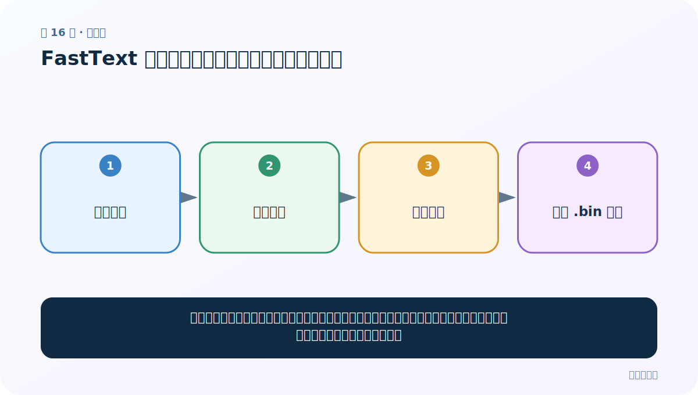

# 第 16 节：FastText 训练与保存：让语料自己产生监督信号

> 笔记编号 16/33 · 对应原视频 P20 · [打开这一集](https://www.bilibili.com/video/BV14mdfBDE4Q?p=20)

[← 上一节：15 FastText 准备：从大语料到可训练文件](./15-fasttext-setup.md) · [返回总目录](./README.md) · [下一节：17 FastText 加载、查看与评估：向量好不好要验证 →](./17-fasttext-evaluation.md)

## 这节解决什么问题

无监督训练不需要人工标签。窗口中的词互相充当预测目标，模型边猜边调整向量；训练结束要保存模型，才能复用同一空间。



图要从左向右读。每个方框都是数据的一次变化，不是四个互不相关的名词。

## 辅助流程图


### FastText 实验生命周期


## 零基础精讲：把这一节慢下来

### 先看一个具体场景

无监督并不是“没有正确答案”。窗口里的真实邻居天然就是答案，模型每猜错一次就微调词向量，遍历大量窗口后形成稳定空间。

### 数据究竟怎样一步步变化

1. 从语料窗口自动造输入和目标
2. 前向计算预测概率
3. 用真实邻居计算损失
4. 反向更新并保存完整模型

把上面四步和流程图对照起来：

> 分词语料 → 窗口预测 → 反向更新 → 保存 .bin 模型

这里的箭头表示“左边的数据经过一次处理，变成右边的数据”，不是四个需要孤立背诵的名词。

### 第一次读代码，只盯住这一件事

第一次只用极小语料跑通 train→save，不用追求语义质量；日志里的 loss 是训练信号，不是最终业务分数。

运行前先在纸上写出你预计的结果；即使猜错，也要指出自己是在哪个箭头上理解错了。这样比复制代码后看到“能运行”更接近真正学会。

### 本节暂时不要误会

小样本能验证代码通路，却不足以证明学到可靠词义。

用一句话过关：**无监督训练不需要人工标签。窗口中的词互相充当预测目标，模型边猜边调整向量；训练结束要保存模型，才能复用同一空间。**

## 老师原声整理稿（按讲解顺序）

### 0:00–2:55　train_unsupervised 开始无监督训练

老师进入 FastText 训练与保存。调用 `fasttext.train_unsupervised`，输入分词语料文件。无监督表示“不需要人工类别标签”，不是没有训练目标；窗口里的上下文仍构造预测信号。

默认模型/参数应以当前安装版本文档为准。课堂查看函数定义，看到 model、dim、epoch、lr、thread 等默认值。

### 2:55–4:50　先用一份文件跑通流程

老师选择拆分语料中的一个文件作为 input，并指定保存路径。小文件用于验证代码与环境；正式质量需要更大且干净的语料。

训练函数会读取词表、统计 token，再多轮更新。文件路径、编码和分词格式错误会在这里暴露。

### 4:50–8:47　怎样读训练日志

控制台日志包含进度、词数/词表规模、每秒处理词数、学习率、损失与预计时间。老师解释“去重后不同词数量”和总 token 不是同一个概念。

速度受 CPU 线程、文件缓存、语料大小和参数影响；不要只看每秒数字判断模型好坏。损失是否可比较也要求语料和配置一致。

### 8:47–9:04　更大文件通常信息更多，但不是必然更好

老师提出用 file9 等更大语料训练，通常比很小样例得到更丰富的词关系。但若大文件包含乱码、重复、错误分词或领域不匹配，规模会放大噪声。

训练完成后必须 `save_model("xxx.bin")`。模型文件保存统一向量空间，后面才能加载查询与评估。

## 完整原声逐段记录

[查看本节按时间戳整理的完整音轨转写](./transcripts/p020.md)

这份记录用于核查老师讲过的内容是否遗漏；正文会纠正口误与语音识别中的技术术语。

## 零基础先记住

- fasttext.train_unsupervised(input, model='skipgram')
- 常见默认概念：dim=100、epoch=5、lr=0.05（以安装版本文档为准）
- 日志关注进度、学习率、平均损失和预计剩余时间

## 最小可运行代码

在项目根目录运行下面代码。课程原理的标准库版本集中在 [text_preprocessing_from_scratch](../../text_preprocessing_from_scratch/README.md)；需要 jieba、PyTorch、FastText 等的示例，请先按代码注释安装依赖。

```python
# 需要：pip install fasttext
import fasttext
model = fasttext.train_unsupervised(
    "wiki_sample.txt", model="skipgram", dim=50, epoch=5, lr=0.05
)
model.save_model("wiki_skipgram.bin")
```

### 输入和输出怎么看

输入分词语料，输出二进制模型文件。该文件不仅含词向量，还含生成词向量所需的模型参数。

## 最容易踩的坑

一次训练成功不代表向量就好。小样本仅适合跑通流程，语义质量需要足够且匹配领域的语料。

## 本节知识链

`分词语料 → 窗口预测 → 反向更新 → 保存 .bin 模型`

如果中间任意一个箭头说不清楚，就回到图上，用代码中的一个具体值手算一遍；能预测输出，才算真正理解。

## 自测

**问题：为什么训练后必须保存模型而不能只保存几个查询结果？**

<details>
<summary>点开核对答案</summary>

未来要查询任意词、做近邻或继续使用统一向量空间，需要完整模型或完整向量表。

</details>

## 学完检查

- [ ] 我能不用术语，用自己的话解释“这节解决什么问题”
- [ ] 我能在运行前大致猜出代码输出
- [ ] 我知道本节方法不适用或容易出错的情况
- [ ] 我能回答自测题，而不只是记住答案

[← 上一节：15 FastText 准备：从大语料到可训练文件](./15-fasttext-setup.md) · [返回总目录](./README.md) · [下一节：17 FastText 加载、查看与评估：向量好不好要验证 →](./17-fasttext-evaluation.md)
