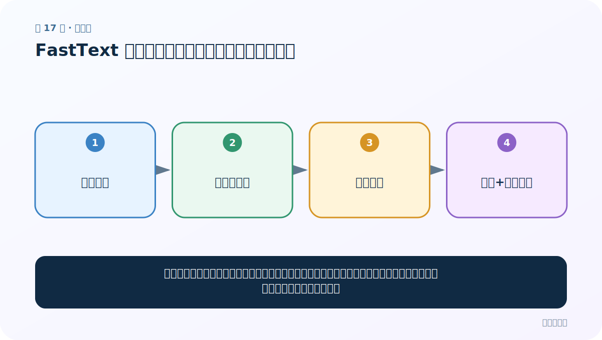

# 第 17 节：FastText 加载、查看与评估：向量好不好要验证

> 笔记编号 17/33 · 对应原视频 P21 · [打开这一集](https://www.bilibili.com/video/BV14mdfBDE4Q?p=21)

[← 上一节：16 FastText 训练与保存：让语料自己产生监督信号](./16-fasttext-training.md) · [返回总目录](./README.md) · [下一节：18 FastText 超参数：每个旋钮改变什么 →](./18-fasttext-hyperparameters.md)

## 这节解决什么问题

加载模型后可以取单词向量，也可以查最近邻。最近邻看起来合理是直观检查，但正式项目还应有与任务相关的量化评估。



图要从左向右读。每个方框都是数据的一次变化，不是四个互不相关的名词。

## 辅助流程图


### FastText 实验生命周期


## 老师原声整理稿（按讲解顺序）

### 0:00–2:54　评估先分“直观看”与“任务验证”

老师准备加载已保存模型，查看单词向量和最近邻。最近邻能直观判断相似词是否合理，但属于内在/主观检查；真正项目还要在下游分类、检索等验证集上量化。

### 2:54–5:52　get_word_vector 返回 dim 个数字

```python
model = fasttext.load_model(path)
vector = model.get_word_vector("目标词")
```

若 dim=100，返回形状 [100]。老师打印具体数值并尝试一个个人名字。标准 FastText 可用字符 n-gram 为未登录词组合向量，因此 OOV 不一定报错；得到向量也不等于语义一定可靠。

### 5:52–8:46　get_nearest_neighbors 看近邻

```python
model.get_nearest_neighbors(word, k=10)
```

返回若干（相似度，词）。老师说明默认数量并用它检验模型是否学到语义关联。

相似度通常基于向量空间方向，表示分布式用法接近，不保证事实关系、因果或同义。

### 8:46–11:37　多查几组，不要挑成功案例

课堂观察前几个近邻“还不错”，并建议更多语料改善质量。更可靠流程是固定一批常见词、低频词、领域词和歧义词，批量记录结果。

若目标是情感分类，最近邻合理仍不足以证明有效；应把向量放入分类器，与随机/其他预训练表示比较验证 F1。

## 完整原声逐段记录

[查看本节按时间戳整理的完整音轨转写](./transcripts/p021.md)

这份记录用于核查老师讲过的内容是否遗漏；正文会纠正口误与语音识别中的技术术语。

## 零基础先记住

- fasttext.load_model(path) 恢复模型
- get_word_vector(word) 返回长度为 dim 的 NumPy 向量
- get_nearest_neighbors(word) 返回（相似度，词）列表

## 最小可运行代码

在项目根目录运行下面代码。课程原理的标准库版本集中在 [text_preprocessing_from_scratch](../../text_preprocessing_from_scratch/README.md)；需要 jieba、PyTorch、FastText 等的示例，请先按代码注释安装依赖。

```python
import fasttext
model = fasttext.load_model("wiki_skipgram.bin")
vector = model.get_word_vector("语言")
print(vector.shape)
for score, word in model.get_nearest_neighbors("语言", k=5):
    print(round(score, 3), word)
```

### 输入和输出怎么看

先看到向量形状，再看到若干相近词及分数。分数高只表示向量空间相近，不等于事实关系成立。

## 最容易踩的坑

只挑一个成功案例容易自我欺骗。应准备固定词表、类比/相似度数据或下游任务指标批量评估。

## 本节知识链

`加载模型 → 查询词向量 → 计算近邻 → 人工+任务评估`

如果中间任意一个箭头说不清楚，就回到图上，用代码中的一个具体值手算一遍；能预测输出，才算真正理解。

## 自测

**问题：最近邻都是常见词，是否足以证明模型适合情感分类？**

<details>
<summary>点开核对答案</summary>

不足。它只做内在检查；还需在情感分类验证集上比较实际效果。

</details>

## 学完检查

- [ ] 我能不用术语，用自己的话解释“这节解决什么问题”
- [ ] 我能在运行前大致猜出代码输出
- [ ] 我知道本节方法不适用或容易出错的情况
- [ ] 我能回答自测题，而不只是记住答案

[← 上一节：16 FastText 训练与保存：让语料自己产生监督信号](./16-fasttext-training.md) · [返回总目录](./README.md) · [下一节：18 FastText 超参数：每个旋钮改变什么 →](./18-fasttext-hyperparameters.md)
