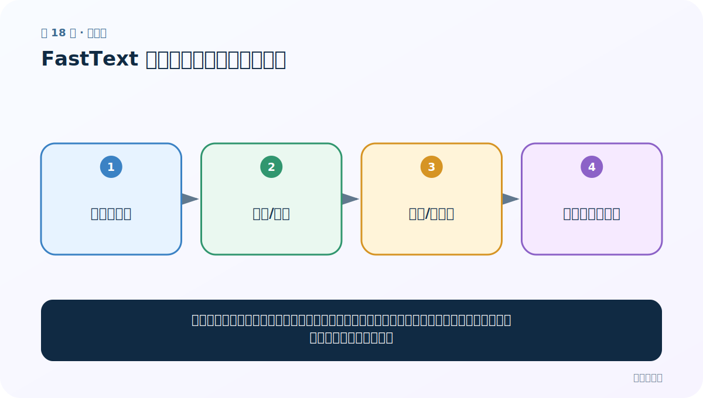

# 第 18 节：FastText 超参数：每个旋钮改变什么

> 笔记编号 18/33 · 对应原视频 P22 · [打开这一集](https://www.bilibili.com/video/BV14mdfBDE4Q?p=22)

[← 上一节：17 FastText 加载、查看与评估：向量好不好要验证](./17-fasttext-evaluation.md) · [返回总目录](./README.md) · [下一节：19 Word2Vec 与 Embedding：预训练方法和查表层的区别 →](./19-embedding-vs-word2vec.md)

## 这节解决什么问题

调参不是盲目把数字变大，而是理解资源、语料与目标之间的交换：更高维、更久训练通常更贵，也更可能过拟合噪声。



图要从左向右读。每个方框都是数据的一次变化，不是四个互不相关的名词。

## 辅助流程图


### FastText 实验生命周期


## 零基础精讲：把这一节慢下来

### 先看一个具体场景

调参像调收音机：一次拧五个旋钮，即使声音变清楚也不知道是哪一个起作用。先固定语料和评估集，每次只比较一个关键参数。

### 数据究竟怎样一步步变化

1. 保存一个可复现的基线
2. 只改变维度、轮次或学习率之一
3. 记录训练成本和固定评估结果
4. 根据下游任务而不是直觉选方案

把上面四步和流程图对照起来：

> 语料与任务 → 模型/维度 → 轮次/学习率 → 速度与质量权衡

这里的箭头表示“左边的数据经过一次处理，变成右边的数据”，不是四个需要孤立背诵的名词。

### 第一次读代码，只盯住这一件事

把参数看成实验条件，不是越大越好。先建立一张“参数—耗时—指标”小表再做决定。

运行前先在纸上写出你预计的结果；即使猜错，也要指出自己是在哪个箭头上理解错了。这样比复制代码后看到“能运行”更接近真正学会。

### 本节暂时不要误会

维度和轮次增加会提高成本，也可能拟合噪声；没有统一的神奇参数。

用一句话过关：**调参不是盲目把数字变大，而是理解资源、语料与目标之间的交换：更高维、更久训练通常更贵，也更可能过拟合噪声。**

## 老师原声整理稿（按讲解顺序）

### 0:00–1:59　调参前先记录默认基线

老师最后讲 FastText 超参数。先保留一套默认配置和固定语料/评估集，否则每次变化没有比较基准。

### 1:59–4:57　model、dim、epoch、lr

- model：cbow 或 skipgram，决定预测方向；
- dim：词向量维度，控制容量、内存和查询成本；
- epoch：完整遍历语料次数；
- lr：每次更新步长。

课堂把默认 Skip-Gram 改为 CBOW，并指出 epoch、lr 都可调。参数越大不代表越好：维度过高可能需要更多数据，epoch 过多会拟合噪声，lr 过大可能不稳定。

### 4:57–6:54　训练、保存与评估必须成套

修改配置后重新训练并保存不同文件名，再用相同词表/下游指标比较。不要覆盖唯一模型，否则无法回退。

建议每次只改一个关键变量，同时记录语料版本、随机种子、线程数、训练时间和指标。多参数同时改变，结果变好也无法知道原因。

CBOW 通常更快，Skip-Gram 常对低频词更友好，但这是经验，不是保证；以自己的语料和任务验证。

## 完整原声逐段记录

[查看本节按时间戳整理的完整音轨转写](./transcripts/p022.md)

这份记录用于核查老师讲过的内容是否遗漏；正文会纠正口误与语音识别中的技术术语。

## 零基础先记住

- model：cbow 更快，skipgram 常更照顾低频词
- dim 控制向量容量和存储；epoch 控制遍历语料次数
- lr 控制每次更新幅度；thread 控制并行线程数

## 最小可运行代码

在项目根目录运行下面代码。课程原理的标准库版本集中在 [text_preprocessing_from_scratch](../../text_preprocessing_from_scratch/README.md)；需要 jieba、PyTorch、FastText 等的示例，请先按代码注释安装依赖。

```python
config = {
    "model": "skipgram",
    "dim": 100,
    "epoch": 10,
    "lr": 0.05,
    "thread": 4,
}
for key, value in config.items():
    print(f"{key:>6} = {value}")
```

### 输入和输出怎么看

这段先把实验配置明确打印出来。真实训练应连同随机种子、语料版本和评估结果一起记录。

## 最容易踩的坑

每次同时改 5 个参数，结果变好也不知道原因。初学时固定其他项，一次只比较一个关键变量。

## 本节知识链

`语料与任务 → 模型/维度 → 轮次/学习率 → 速度与质量权衡`

如果中间任意一个箭头说不清楚，就回到图上，用代码中的一个具体值手算一遍；能预测输出，才算真正理解。

## 自测

**问题：维度从 100 提到 1000，为什么不保证效果提升？**

<details>
<summary>点开核对答案</summary>

容量和成本都增加，但数据可能不足、噪声可能被拟合，下游任务也未必需要这么多维度。

</details>

## 学完检查

- [ ] 我能不用术语，用自己的话解释“这节解决什么问题”
- [ ] 我能在运行前大致猜出代码输出
- [ ] 我知道本节方法不适用或容易出错的情况
- [ ] 我能回答自测题，而不只是记住答案

[← 上一节：17 FastText 加载、查看与评估：向量好不好要验证](./17-fasttext-evaluation.md) · [返回总目录](./README.md) · [下一节：19 Word2Vec 与 Embedding：预训练方法和查表层的区别 →](./19-embedding-vs-word2vec.md)
