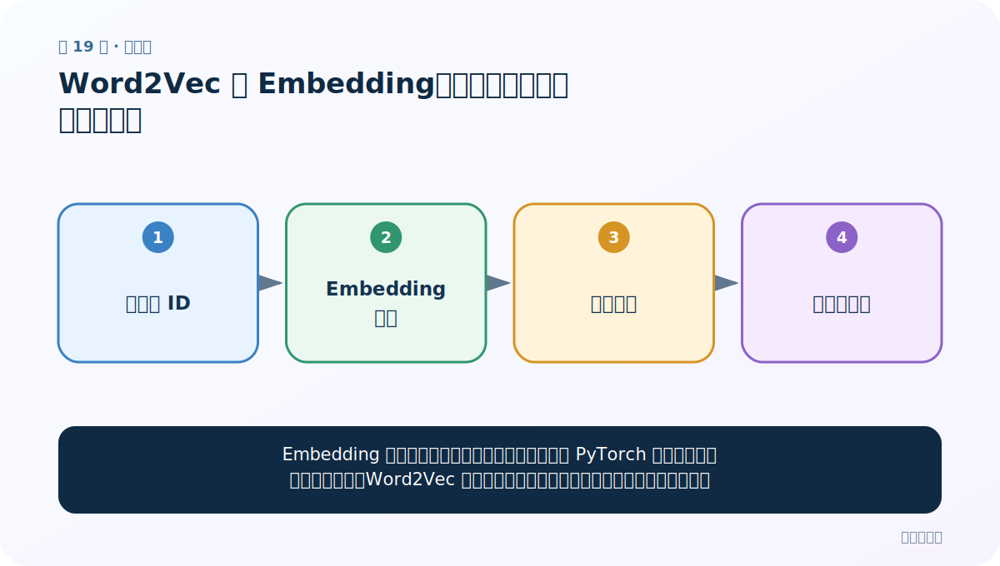
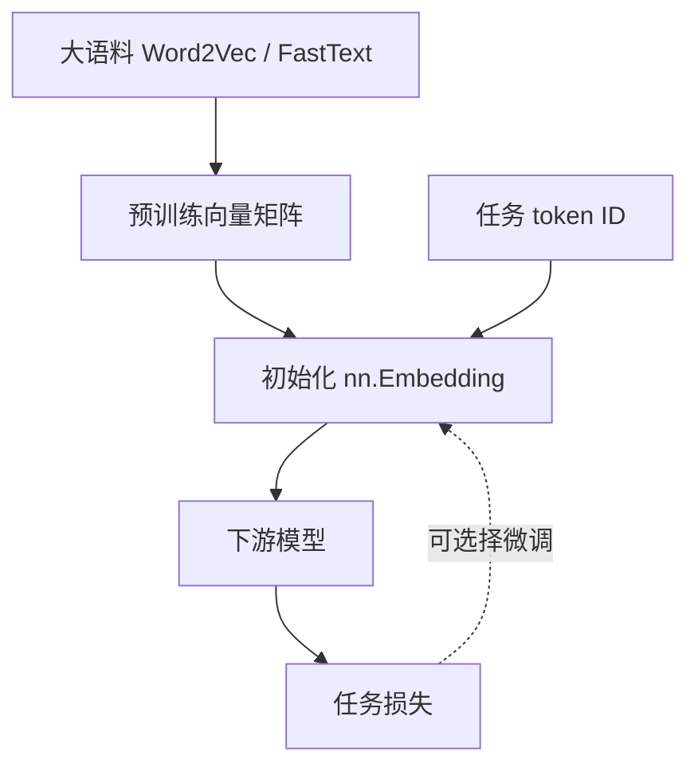

# 第 19 节：Word2Vec 与 Embedding：预训练方法和查表层的区别

> 笔记编号 19/33 · 对应原视频 P23 · [打开这一集](https://www.bilibili.com/video/BV14mdfBDE4Q?p=23)

[← 上一节：18 FastText 超参数：每个旋钮改变什么](./18-fasttext-hyperparameters.md) · [返回总目录](./README.md) · [下一节：20 Embedding 取词向量：从句子到三维张量 →](./20-embedding-lookup.md)

## 这节解决什么问题

Embedding 广义上指把离散对象变成稠密向量；在 PyTorch 中也特指一张可训练查找表。Word2Vec 是用上下文预测任务预训练这张向量表的一类方法。



图要从左向右读。每个方框都是数据的一次变化，不是四个互不相关的名词。

## 辅助流程图


### 预训练与任务内 Embedding 关系



## 老师原声整理稿（按讲解顺序）

### 0:00–2:55　Embedding 的广义与狭义

老师说明广义 Word Embedding 是所有把离散词变成稠密向量的技术，Word2Vec、FastText 都属于其中。狭义课堂语境常指神经网络里的词嵌入层（如 nn.Embedding）。

### 2:55–7:48　预训练 Word2Vec 与任务内 Embedding 的流程差异

Word2Vec/FastText 通常先在大语料单独训练、保存，再把向量用于下游任务。nn.Embedding 则可以作为模型第一层，与分类/翻译损失一起端到端更新。

两者也能结合：加载预训练矩阵初始化 Embedding，再选择冻结或微调。

### 7:48–12:53　再复习 CBOW、Skip-Gram 与权重矩阵

老师回到前向—损失—反向传播，强调输入到隐藏的权重矩阵可作为词向量。CBOW 用上下文预测中心，Skip-Gram 用中心预测上下文。

nn.Embedding 只完成 ID 查表，本身没有 CBOW/Skip-Gram 训练目标；它的语义来自下游损失或加载的预训练权重。

### 12:53–18:51　函数复习与选择题

课堂复习 FastText 的训练、保存、加载、取向量、最近邻和超参数，并用题目检查两种模式方向与经验差异。

窗口扩大时，CBOW 会聚合更多上下文预测中心；Skip-Gram 会让中心产生更多上下文训练对。

### 18:51–27:54　课堂扩展阅读与图示纠正

老师讨论 CBOW/Skip-Gram 哪个更适合高频/低频词，并借助外部生成的解释检查图。重要结论是：CBOW 聚合上下文时常先求和或平均，再预测中心；图中矩阵方向要以实际输入约定核对。

课程现场也说明生成式辅助内容可能写错，必须用公式和维度验证。最终可记经验：CBOW 速度快、对高频稳定；Skip-Gram 训练对更多、常照顾低频。具体效果仍以实验为准。

## 完整原声逐段记录

[查看本节按时间戳整理的完整音轨转写](./transcripts/p023.md)

这份记录用于核查老师讲过的内容是否遗漏；正文会纠正口误与语音识别中的技术术语。

## 零基础先记住

- Word2Vec 向量可先在大语料学好，再放入下游模型
- nn.Embedding 通常随当前任务的损失继续更新
- 预训练提供起点，任务内训练提供针对性；两者可以结合

## 最小可运行代码

在项目根目录运行下面代码。课程原理的标准库版本集中在 [text_preprocessing_from_scratch](../../text_preprocessing_from_scratch/README.md)；需要 jieba、PyTorch、FastText 等的示例，请先按代码注释安装依赖。

```python
import torch
layer = torch.nn.Embedding(num_embeddings=5, embedding_dim=3)
ids = torch.tensor([1, 3, 1])
vectors = layer(ids)
print(vectors.shape)
print(torch.equal(vectors[0], vectors[2]))
```

### 输入和输出怎么看

输出形状是 [3, 3]；相同 ID 查到相同向量。训练后权重会被梯度更新。

## 最容易踩的坑

课程把未知词近似为“找已知最近词”容易误解。真正 FastText 可用字符 n-gram 为 OOV 词组合向量，这是它的重要特点。

## 本节知识链

`离散词 ID → Embedding 查表 → 稠密向量 → 随任务更新`

如果中间任意一个箭头说不清楚，就回到图上，用代码中的一个具体值手算一遍；能预测输出，才算真正理解。

## 自测

**问题：nn.Embedding 会自动理解“猫”和“狗”相近吗？**

<details>
<summary>点开核对答案</summary>

不会。初始只是参数表，必须通过训练目标或加载预训练权重才逐渐形成语义。

</details>

## 学完检查

- [ ] 我能不用术语，用自己的话解释“这节解决什么问题”
- [ ] 我能在运行前大致猜出代码输出
- [ ] 我知道本节方法不适用或容易出错的情况
- [ ] 我能回答自测题，而不只是记住答案

[← 上一节：18 FastText 超参数：每个旋钮改变什么](./18-fasttext-hyperparameters.md) · [返回总目录](./README.md) · [下一节：20 Embedding 取词向量：从句子到三维张量 →](./20-embedding-lookup.md)
