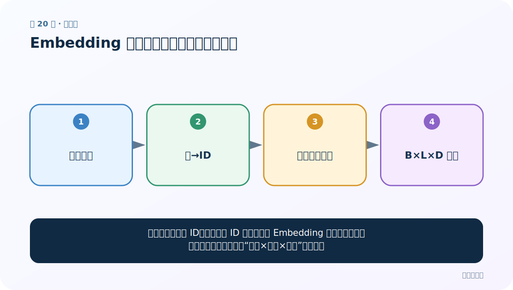
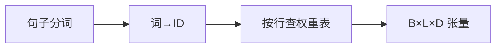
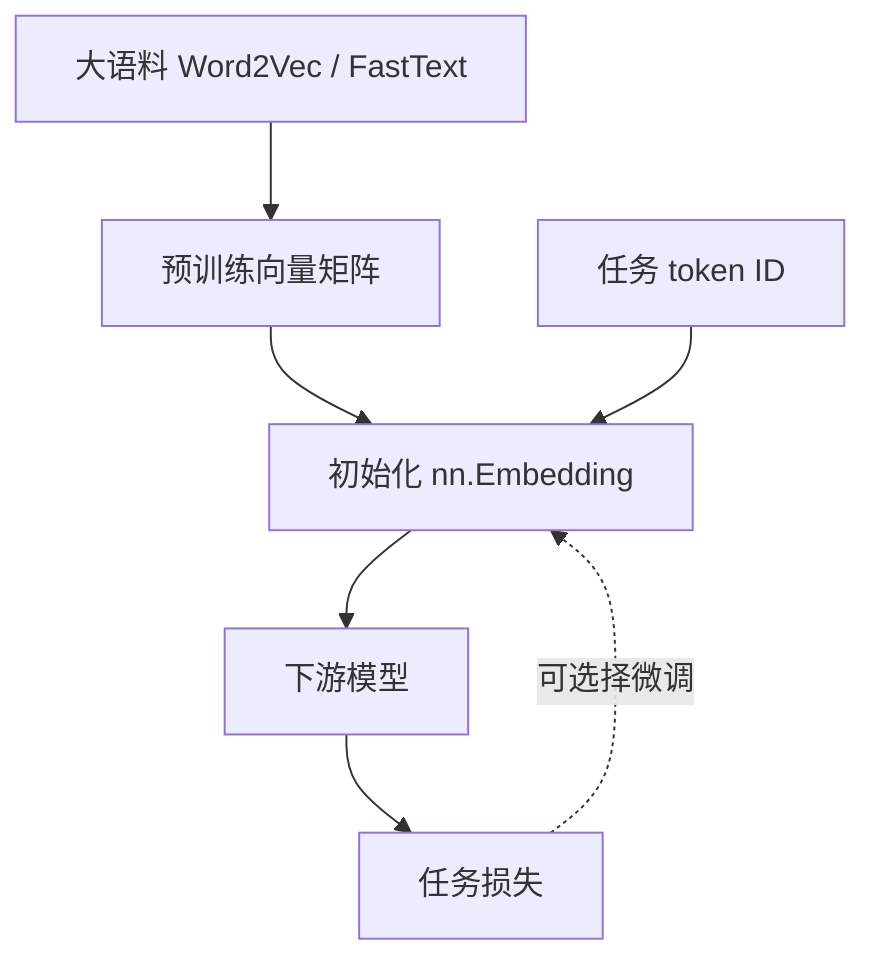

# 第 20 节：Embedding 取词向量：从句子到三维张量

> 笔记编号 20/33 · 对应原视频 P24 · [打开这一集](https://www.bilibili.com/video/BV14mdfBDE4Q?p=24)

[← 上一节：19 Word2Vec 与 Embedding：预训练方法和查表层的区别](./19-embedding-vs-word2vec.md) · [返回总目录](./README.md) · [下一节：21 Embedding 可视化：把高维空间投影到屏幕 →](./21-embedding-visualization.md)

## 这节解决什么问题

先分词并映射成 ID，再把每个 ID 当作行号去 Embedding 权重表中取一行。批量句子最终常形成“批次×长度×维度”的张量。



图要从左向右读。每个方框都是数据的一次变化，不是四个互不相关的名词。

## 辅助流程图



### 预训练与任务内 Embedding 关系



## 老师原声整理稿（按讲解顺序）

### 0:00–3:57　从表示法进入词向量可视化案例

老师总结稀疏 One-Hot 与稠密 Word2Vec/Embedding，并提出案例目标：准备两句话，分词、建词表、取 Embedding 权重，再把词向量可视化观察关系。

### 3:57–7:44　新项目与依赖

课堂新建工程，导入 jieba、TensorFlow/Keras Tokenizer 与后续可视化工具。旧版依赖今天可能变化；核心流程可用 Python 字典和 PyTorch 完成，不必绑定某个 Tokenizer 版本。

### 7:44–13:28　两句话先分词并放进列表

老师定义句子列表，遍历每句调用 jieba，把结果保存为“句子列表中的 token 列表”。要打印检查，避免把 generator 对象直接塞入后续。

若环境日志过多，可调日志级别，但不要因此忽略真正异常。

### 13:28–17:22　Tokenizer 建词表

将分词结果拟合为 token→id 映射。老师纠正输入对象：应传 token 列表而不是未切分原句。查看 word_index 的 keys/values 可理解词与编号。

词表顺序一旦用于 Embedding 必须固定保存。

### 17:22–20:20　文本序列化为 ID

每个句子中的 token 按映射变为整数序列。例如同一个“我”无论出现在何处都应得到相同 ID。

不同句长尚未补齐时是变长列表；若要组成 batch 张量，后面还需 padding。

### 20:20–24:30　Embedding 查表与权重矩阵

创建 Embedding(num_embeddings=V,embedding_dim=D)，ID [B,L] 查表后为 [B,L,D]。老师查看权重参数：矩阵每一行就是某个 ID 当前的词向量。

随机初始化的向量没有语义，只是为可视化流程准备数据；要看到可靠聚类，需要训练或加载预训练向量。本节先完成“词→ID→按行查向量”的链路。

## 完整原声逐段记录

[查看本节按时间戳整理的完整音轨转写](./transcripts/p024.md)

这份记录用于核查老师讲过的内容是否遗漏；正文会纠正口误与语音识别中的技术术语。

## 零基础先记住

- num_embeddings 是词表行数，embedding_dim 是每个词的向量长度
- 输入形状可以是任意 ID 网格，输出会在末尾多一个 embedding 维
- 同一个 ID 在同一次权重状态下查到同一行

## 最小可运行代码

在项目根目录运行下面代码。课程原理的标准库版本集中在 [text_preprocessing_from_scratch](../../text_preprocessing_from_scratch/README.md)；需要 jieba、PyTorch、FastText 等的示例，请先按代码注释安装依赖。

```python
import torch
vocab = {"我": 0, "爱": 1, "NLP": 2}
ids = torch.tensor([[vocab["我"], vocab["爱"], vocab["NLP"]]])
embedding = torch.nn.Embedding(len(vocab), 4)
print("输入：", ids.shape)
print("输出：", embedding(ids).shape)
```

### 输入和输出怎么看

输入形状 [1, 3]，输出形状 [1, 3, 4]：1 个句子、3 个词、每词 4 维。

## 最容易踩的坑

词表编号必须从 0 到 num_embeddings-1；任何越界 ID 都会报错。

## 本节知识链

`句子分词 → 词→ID → 按行查权重表 → B×L×D 张量`

如果中间任意一个箭头说不清楚，就回到图上，用代码中的一个具体值手算一遍；能预测输出，才算真正理解。

## 自测

**问题：输入是 [32, 20]，embedding_dim=128，输出形状是什么？**

<details>
<summary>点开核对答案</summary>

[32, 20, 128]，分别是批量、序列长度和词向量维度。

</details>

## 学完检查

- [ ] 我能不用术语，用自己的话解释“这节解决什么问题”
- [ ] 我能在运行前大致猜出代码输出
- [ ] 我知道本节方法不适用或容易出错的情况
- [ ] 我能回答自测题，而不只是记住答案

[← 上一节：19 Word2Vec 与 Embedding：预训练方法和查表层的区别](./19-embedding-vs-word2vec.md) · [返回总目录](./README.md) · [下一节：21 Embedding 可视化：把高维空间投影到屏幕 →](./21-embedding-visualization.md)
