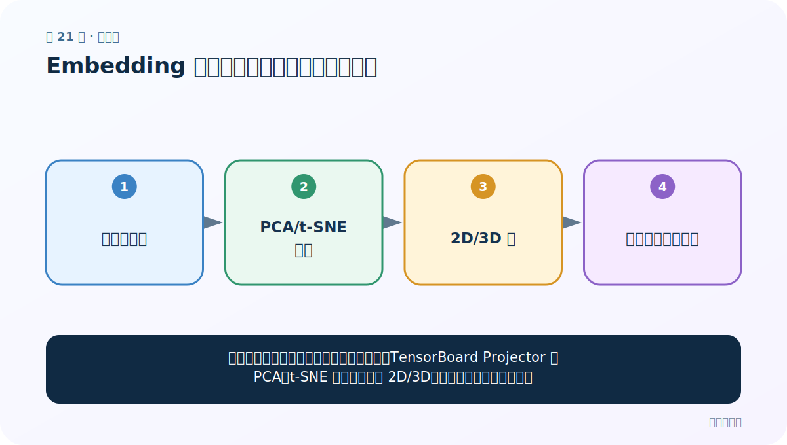

# 第 21 节：Embedding 可视化：把高维空间投影到屏幕

> 笔记编号 21/33 · 对应原视频 P25 · [打开这一集](https://www.bilibili.com/video/BV14mdfBDE4Q?p=25)

[← 上一节：20 Embedding 取词向量：从句子到三维张量](./20-embedding-lookup.md) · [返回总目录](./README.md) · [下一节：22 标签数量分布：先发现类别不平衡 →](./22-label-distribution.md)

## 这节解决什么问题

词向量通常有几十到几百维，肉眼看不了。TensorBoard Projector 用 PCA、t-SNE 等方法投影到 2D/3D，帮助观察聚类和离群点。



图要从左向右读。每个方框都是数据的一次变化，不是四个互不相关的名词。

## 辅助流程图


## 老师原声整理稿（按讲解顺序）

### 0:00–3:53　把词与对应向量一起写入日志

老师在已取得 Embedding 权重后做可视化。需要两份一一对应的数据：

- 词向量矩阵 [V,D]；
- V 个词标签，顺序与矩阵行一致。

课堂例子约 20 个词、每词 8 维，因此矩阵 [20,8]。词数量与权重表行数若不匹配，Projector 标签会错位。

### 3:53–8:35　从 word_index 按 ID 顺序取向量

Tokenizer 的 word_index 是 word→index。老师遍历字典，将每个 index 转为张量，送入 Embedding 取对应行，并同步保存 word。

必须按索引排序，而不是依赖任意字典遍历顺序。若索引从 1 开始，Embedding 行数与第 0 行保留位也要一致。

### 8:35–12:22　SummaryWriter.add_embedding

```python
writer.add_embedding(vectors, metadata=words, tag="demo")
writer.close()
```

TensorBoard 日志写入 runs 目录。vectors 应是二维 [V,D]；metadata 长度为 V。

### 12:22–16:22　启动 TensorBoard 并进入 Projector

终端切到日志所在项目，运行：

```bash
tensorboard --logdir=runs --host=127.0.0.1
```

浏览器通常打开 6006 端口。若提示 No dashboards/data，检查 logdir 是否指到实际事件文件，而不是反复刷新空目录。

Projector 可选择 PCA、t-SNE 等投影，每个点代表一个词。搜索词只能帮助定位，不代表投影距离必然可靠。

### 16:22–22:42　高维图只能探索，不能代替评估

老师点击点观察相近词，并总结流程：句子列表→分词→建词表→ID→Embedding→日志→浏览器可视化。

降维会扭曲距离。图中靠近的词还应回到原始 D 维向量计算余弦相似度；随机未训练 Embedding 形成的“聚类”没有语义证据。

课堂最后扩展张量 reshape 的问题。无论怎样变形，都要保持元素总数不变，并明确词标签仍对应哪一行。

## 完整原声逐段记录

[查看本节按时间戳整理的完整音轨转写](./transcripts/p025.md)

这份记录用于核查老师讲过的内容是否遗漏；正文会纠正口误与语音识别中的技术术语。

## 零基础先记住

- SummaryWriter.add_embedding 写入向量和词标签
- TensorBoard 读取 runs 日志目录并在浏览器展示
- 投影会丢失信息，只适合探索，不是最终质量证明

## 最小可运行代码

在项目根目录运行下面代码。课程原理的标准库版本集中在 [text_preprocessing_from_scratch](../../text_preprocessing_from_scratch/README.md)；需要 jieba、PyTorch、FastText 等的示例，请先按代码注释安装依赖。

```python
import torch
from torch.utils.tensorboard import SummaryWriter
words = ["猫", "狗", "汽车"]
vectors = torch.randn(3, 8)
writer = SummaryWriter("runs/words")
writer.add_embedding(vectors, metadata=words, tag="demo")
writer.close()
# 终端运行：tensorboard --logdir=runs
```

### 输入和输出怎么看

浏览器打开通常是 http://localhost:6006，在 Projector 中可切换投影方法并搜索词。

## 最容易踩的坑

若张量需要梯度，直接 .numpy() 会报错；先 tensor.detach().cpu().numpy()。另外，二维近邻不一定等于原高维近邻。

## 本节知识链

`高维词向量 → PCA/t-SNE 投影 → 2D/3D 点 → 观察后再量化验证`

如果中间任意一个箭头说不清楚，就回到图上，用代码中的一个具体值手算一遍；能预测输出，才算真正理解。

## 自测

**问题：投影图中两个词靠得近，能断言它们在原空间也最近吗？**

<details>
<summary>点开核对答案</summary>

不能。降维会扭曲距离，需要回到原向量计算余弦相似度验证。

</details>

## 学完检查

- [ ] 我能不用术语，用自己的话解释“这节解决什么问题”
- [ ] 我能在运行前大致猜出代码输出
- [ ] 我知道本节方法不适用或容易出错的情况
- [ ] 我能回答自测题，而不只是记住答案

[← 上一节：20 Embedding 取词向量：从句子到三维张量](./20-embedding-lookup.md) · [返回总目录](./README.md) · [下一节：22 标签数量分布：先发现类别不平衡 →](./22-label-distribution.md)
