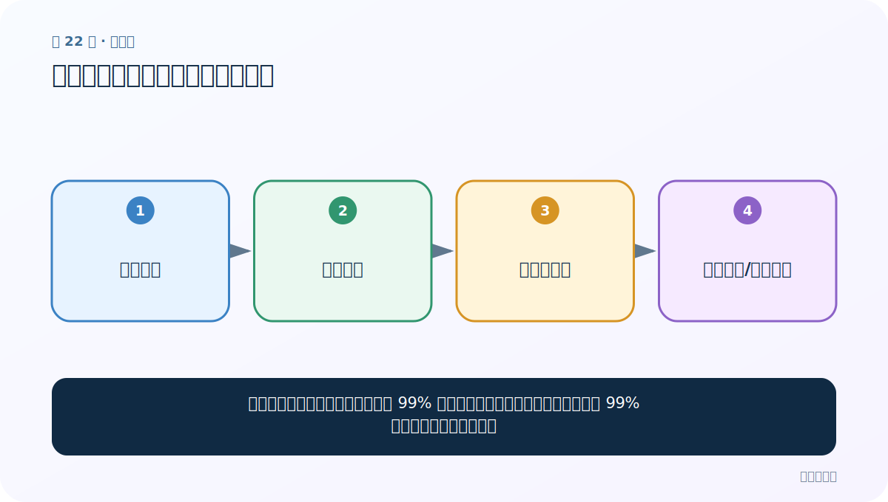
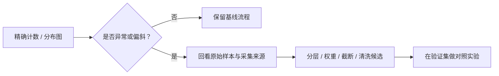

# 第 22 节：标签数量分布：先发现类别不平衡

> 笔记编号 22/33 · 对应原视频 P26 · [打开这一集](https://www.bilibili.com/video/BV14mdfBDE4Q?p=26)

[← 上一节：21 Embedding 可视化：把高维空间投影到屏幕](./21-embedding-visualization.md) · [返回总目录](./README.md) · [下一节：23 map：把同一个函数依次用到每条数据 →](./23-map-function.md)

## 这节解决什么问题

分类前先数每类有多少样本。如果 99% 都是正类，一个永远猜正类的模型也有 99% 准确率，却几乎没有用。



图要从左向右读。每个方框都是数据的一次变化，不是四个互不相关的名词。

## 辅助流程图


### 从分析发现到处理决策



## 零基础精讲：把这一节慢下来

### 先看一个具体场景

1000 条样本中 950 条是正面，模型永远猜正面也有 95% 准确率。这个数字很好看，却一次负面都找不到。

### 数据究竟怎样一步步变化

1. 分别统计每个标签数量
2. 换算比例并检查数据划分
3. 用混淆矩阵查看各类错法
4. 必要时使用权重、重采样和更合适指标

把上面四步和流程图对照起来：

> 读取标签 → 分类计数 → 发现不平衡 → 调整评估/训练策略

这里的箭头表示“左边的数据经过一次处理，变成右边的数据”，不是四个需要孤立背诵的名词。

### 第一次读代码，只盯住这一件事

先手算 Counter 结果，再区分“数量”和“比例”。不要看到不平衡就立即删除多数类。

运行前先在纸上写出你预计的结果；即使猜错，也要指出自己是在哪个箭头上理解错了。这样比复制代码后看到“能运行”更接近真正学会。

### 本节暂时不要误会

准确率在类别不平衡时可能严重误导，需同时看 precision、recall 和 F1。

用一句话过关：**分类前先数每类有多少样本。如果 99% 都是正类，一个永远猜正类的模型也有 99% 准确率，却几乎没有用。**

## 老师原声整理稿（按讲解顺序）

### 0:00–3:54　文本分析章节要回答哪些问题

老师进入下半章：标签数量、句长、词频、样本散点、缺失值与脏数据。分析不是为了画漂亮图，而是帮助发现会影响训练和评估的问题。

### 3:54–8:50　先看标签是否平衡

评论数据使用 0/1 表示负面/正面。老师用生活中的反讽差评说明：文本情感不能只靠星级或单个关键词。

分类数据理想情况下各类数量接近，但不必机械追求严格 1:1。若极不平衡，应考虑分层划分、类别权重、重采样，并同时看 precision、recall、F1。

### 8:50–13:46　CSV 与 TSV 的分隔符

老师现场展示数据文件，发现读取后只有一列，原因是实际以 Tab 分隔。Pandas 应：

```python
pd.read_csv(path, sep="\t")
```

CSV/TSV 文件扩展名不是绝对保证，最好打开前几行或检查列数。分隔符读错会让后续标签列不存在。

### 13:46–18:42　导入分析与绘图库

课程使用 pandas、matplotlib、seaborn、jieba.posseg 等，并设置中文字体。不同系统字体名不同；字体配置只影响显示，不应改变数据。

### 18:42–23:38　countplot 绘制训练/测试标签数量

读取 train/test 后，用 countplot 或 value_counts 统计 label。hue、palette 等参数控制分组与颜色；标题和紧凑布局帮助解释。

### 23:38–26:13　读图结论

老师观察 0/1 数量很接近，认为不需大幅调整。还应分别检查训练、验证、测试比例是否一致，并保存精确计数。

图只是摘要。决定策略时应用表格记录数量/比例，并建立“恒猜多数类”的基线，避免被表面准确率欺骗。

## 完整原声逐段记录

[查看本节按时间戳整理的完整音轨转写](./transcripts/p026.md)

这份记录用于核查老师讲过的内容是否遗漏；正文会纠正口误与语音识别中的技术术语。

## 零基础先记住

- Pandas 读取 TSV 时明确 sep='\t'
- countplot 或 value_counts 展示每类数量
- 不平衡时同时关注 precision、recall、F1、混淆矩阵

## 最小可运行代码

在项目根目录运行下面代码。课程原理的标准库版本集中在 [text_preprocessing_from_scratch](../../text_preprocessing_from_scratch/README.md)；需要 jieba、PyTorch、FastText 等的示例，请先按代码注释安装依赖。

```python
from text_preprocessing_from_scratch.core import label_distribution
labels = ["正面", "正面", "负面", "正面", "中性"]
print(label_distribution(labels))
```

### 输入和输出怎么看

输出每个标签的样本数。真实数据还应计算比例，并分别查看训练/验证/测试集。

## 最容易踩的坑

不要为了“平衡”就随意删除大量多数类。可考虑分层划分、类别权重、重采样，并用验证集比较。

## 本节知识链

`读取标签 → 分类计数 → 发现不平衡 → 调整评估/训练策略`

如果中间任意一个箭头说不清楚，就回到图上，用代码中的一个具体值手算一遍；能预测输出，才算真正理解。

## 自测

**问题：正类 950、负类 50，恒猜正类准确率多少？**

<details>
<summary>点开核对答案</summary>

95%。这说明只看 accuracy 会掩盖模型完全识别不了负类的问题。

</details>

## 学完检查

- [ ] 我能不用术语，用自己的话解释“这节解决什么问题”
- [ ] 我能在运行前大致猜出代码输出
- [ ] 我知道本节方法不适用或容易出错的情况
- [ ] 我能回答自测题，而不只是记住答案

[← 上一节：21 Embedding 可视化：把高维空间投影到屏幕](./21-embedding-visualization.md) · [返回总目录](./README.md) · [下一节：23 map：把同一个函数依次用到每条数据 →](./23-map-function.md)
