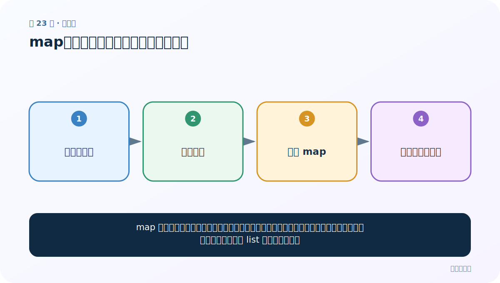
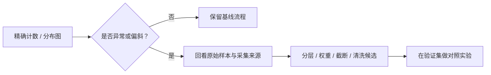

# 第 23 节：map：把同一个函数依次用到每条数据

> 笔记编号 23/33 · 对应原视频 P27 · [打开这一集](https://www.bilibili.com/video/BV14mdfBDE4Q?p=27)

[← 上一节：22 标签数量分布：先发现类别不平衡](./22-label-distribution.md) · [返回总目录](./README.md) · [下一节：24 句子长度分布：为截断和补齐找依据 →](./24-sentence-length-distribution.md)

## 这节解决什么问题

map 像一条流水线：左边不断来元素，中间执行同一个函数，右边才产生结果。它默认惰性计算，所以通常要 list 才能直接查看。



图要从左向右读。每个方框都是数据的一次变化，不是四个互不相关的名词。

## 辅助流程图


### 从分析发现到处理决策



## 零基础精讲：把这一节慢下来

### 先看一个具体场景

你有一万句话，要对每句执行同一个 len。map 像传送带：元素走到工位时才计算，结果被取走后不会自动倒带。

### 数据究竟怎样一步步变化

1. 准备可迭代的句子
2. 把同一个函数交给 map
3. 遍历时逐项计算
4. 消费结束后若要重用就重新创建

把上面四步和流程图对照起来：

> 可迭代数据 → 统一函数 → 惰性 map → 消费后得到结果

这里的箭头表示“左边的数据经过一次处理，变成右边的数据”，不是四个需要孤立背诵的名词。

### 第一次读代码，只盯住这一件事

预测两次 list(lengths) 的差别。第一次把传送带取空，第二次因此得到空列表。

运行前先在纸上写出你预计的结果；即使猜错，也要指出自己是在哪个箭头上理解错了。这样比复制代码后看到“能运行”更接近真正学会。

### 本节暂时不要误会

惰性迭代器节省内存，但不适合在不知情时反复遍历。

用一句话过关：**map 像一条流水线：左边不断来元素，中间执行同一个函数，右边才产生结果。它默认惰性计算，所以通常要 list 才能直接查看。**

## 老师原声整理稿（按讲解顺序）

### 0:00–3:59　统计句长前先补 map 基础

老师准备给每条评论计算长度，但先单独讲 map。后面将把 `len` 或分词长度函数应用到 DataFrame 每条文本。

### 3:59–7:52　map(function, iterable)

定义一个简单函数，再：

```python
result = map(fn, [1,2,3,4,5])
```

map 会把同一个 fn 依次用于每个元素，但返回迭代器，不会在创建时马上把全部结果算成列表。

### 7:52–9:51　惰性计算与一次消费

打印 map 只看到对象。调用 `list(result)` 才触发/消费结果；同一个迭代器再次 list 可能为空。

惰性适合大数据流，若后面要反复画图或统计，应及时转成 Series/list 保存。

### 9:51–12:41　lambda 是短函数写法

```python
list(map(lambda x: x * x, [1,2,3]))
```

等价于先定义一行函数再传入。lambda 只适合简单表达式；清洗逻辑复杂时应写有名字的函数，便于测试和记录异常。

回到句长任务，`map(len, texts)` 得到字符长度。若模型输入单位是 jieba token 或子词，就应传相应 tokenizer 计数函数，不能混用。

## 完整原声逐段记录

[查看本节按时间戳整理的完整音轨转写](./transcripts/p027.md)

这份记录用于核查老师讲过的内容是否遗漏；正文会纠正口误与语音识别中的技术术语。

## 零基础先记住

- map(function, iterable) 返回迭代器
- lambda 适合非常短的一次性函数
- Pandas Series 也可用 .map 或 .apply，但语义稍有差别

## 最小可运行代码

在项目根目录运行下面代码。课程原理的标准库版本集中在 [text_preprocessing_from_scratch](../../text_preprocessing_from_scratch/README.md)；需要 jieba、PyTorch、FastText 等的示例，请先按代码注释安装依赖。

```python
sentences = ["我爱NLP", "文本预处理很重要", "短句"]
lengths = map(len, sentences)
print(list(lengths))
print(list(lengths))
```

### 输入和输出怎么看

第一行输出长度列表；第二行是空列表，因为同一个 map 迭代器已经被消费。

## 最容易踩的坑

惰性迭代器节省内存，但重复使用前要转成列表，或重新创建 map。

## 本节知识链

`可迭代数据 → 统一函数 → 惰性 map → 消费后得到结果`

如果中间任意一个箭头说不清楚，就回到图上，用代码中的一个具体值手算一遍；能预测输出，才算真正理解。

## 自测

**问题：map 会在创建的一刻把所有结果算完吗？**

<details>
<summary>点开核对答案</summary>

不会。通常在迭代取值时才逐个计算，这叫惰性求值。

</details>

## 学完检查

- [ ] 我能不用术语，用自己的话解释“这节解决什么问题”
- [ ] 我能在运行前大致猜出代码输出
- [ ] 我知道本节方法不适用或容易出错的情况
- [ ] 我能回答自测题，而不只是记住答案

[← 上一节：22 标签数量分布：先发现类别不平衡](./22-label-distribution.md) · [返回总目录](./README.md) · [下一节：24 句子长度分布：为截断和补齐找依据 →](./24-sentence-length-distribution.md)
