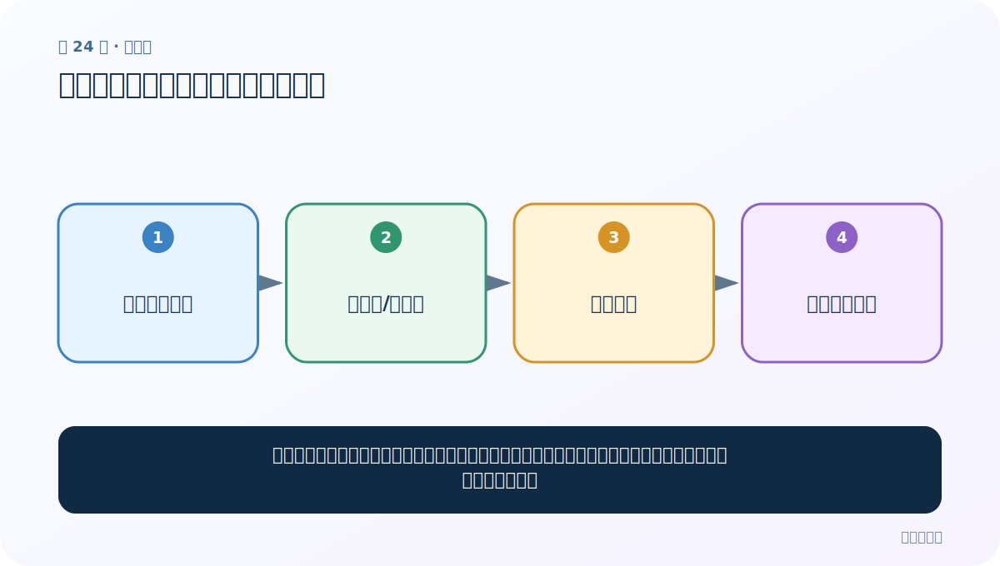
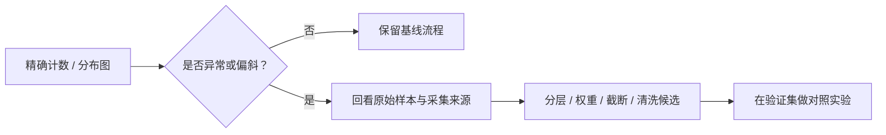

# 第 24 节：句子长度分布：为截断和补齐找依据

> 笔记编号 24/33 · 对应原视频 P28 · [打开这一集](https://www.bilibili.com/video/BV14mdfBDE4Q?p=28)

[← 上一节：23 map：把同一个函数依次用到每条数据](./23-map-function.md) · [返回总目录](./README.md) · [下一节：25 按标签比较长度：长度本身也可能泄露规律 →](./25-length-by-label.md)

## 这节解决什么问题

先测每条文本多长，再看直方图和分位数。目标长度应覆盖大多数样本，同时避免被少数极长异常值拖得太大。



图要从左向右读。每个方框都是数据的一次变化，不是四个互不相关的名词。

## 辅助流程图


### 从分析发现到处理决策



## 零基础精讲：把这一节慢下来

### 先看一个具体场景

99% 的评论不超过 80 个 token，只有一条粘贴了整篇说明书、长度 5000。若按最大值补齐，每条普通评论都会浪费大量空位置。

### 数据究竟怎样一步步变化

1. 用模型实际 tokenizer 计算每条长度
2. 画直方图并查看 95/99 分位
3. 抽查长尾样本是否异常
4. 结合显存和验证效果选择目标长度

把上面四步和流程图对照起来：

> 计算每条长度 → 直方图/分位数 → 检查长尾 → 选择目标长度

这里的箭头表示“左边的数据经过一次处理，变成右边的数据”，不是四个需要孤立背诵的名词。

### 第一次读代码，只盯住这一件事

先比较中位数、95 分位和最大值，理解为什么一个 100 不应强迫其他数据全部补到 100。

运行前先在纸上写出你预计的结果；即使猜错，也要指出自己是在哪个箭头上理解错了。这样比复制代码后看到“能运行”更接近真正学会。

### 本节暂时不要误会

字符数、jieba 词数和模型 token 数不是同一个长度单位。

用一句话过关：**先测每条文本多长，再看直方图和分位数。目标长度应覆盖大多数样本，同时避免被少数极长异常值拖得太大。**

## 老师原声整理稿（按讲解顺序）

### 0:00–3:54　把 map 应用到训练集与测试集

老师回到评论数据，为 train/test 增加 sentence_length 列。对每条 sentence 计算 len；课堂说明后续可据此选择截断/补齐长度。

若中文字符串直接 len，统计的是字符数；若模型按 token 输入，应先 tokenize 再 len。

### 3:54–6:52　先查看具体长度和异常值

新增列后打印前几行，并观察最大/常见长度。老师举 48、80 等数，让同学思考目标长度。

不要直接把最大值作为 padding 长度。极少数超长评论会让所有样本浪费显存，应结合分位数、任务和长文本策略。

### 6:52–9:49　旧版 distplot 与弃用问题

课堂先展示 seaborn distplot，然后指出新版本已弃用。旧代码可能仍能运行但有警告，应改为：

```python
sns.histplot(data=df, x="sentence_length", kde=True)
```

### 9:49–13:48　直方图与 KDE 分别怎么看

直方图柱子表示某长度区间有多少句子；KDE 曲线是平滑密度估计，帮助看整体形状，但受带宽影响，不能代替原始计数。

训练集和测试集应使用相同 bins/坐标范围比较，避免视觉尺度造成误判。

### 13:48–15:50　从分布选择规范长度

老师观察大量句子集中在约 25 左右，少数形成长尾。实际应计算 90/95/99 分位，再比较不同 max_len 对截断比例、显存和任务指标的影响。

分布告诉你“数据是什么样”，不是自动给出唯一阈值。

## 完整原声逐段记录

[查看本节按时间戳整理的完整音轨转写](./transcripts/p028.md)

这份记录用于核查老师讲过的内容是否遗漏；正文会纠正口误与语音识别中的技术术语。

## 零基础先记住

- 长度可以按字符、词元或子词计算，必须与模型输入单位一致
- 直方图看整体形状，分位数给出可操作阈值
- Seaborn 的 distplot 已弃用，可用 histplot(kde=True)

## 最小可运行代码

在项目根目录运行下面代码。课程原理的标准库版本集中在 [text_preprocessing_from_scratch](../../text_preprocessing_from_scratch/README.md)；需要 jieba、PyTorch、FastText 等的示例，请先按代码注释安装依赖。

```python
lengths = [5, 8, 8, 10, 12, 13, 20, 100]
lengths = sorted(lengths)
def percentile(p):
    i = round((len(lengths) - 1) * p)
    return lengths[i]
print("中位数", percentile(0.5))
print("约95分位", percentile(0.95))
```

### 输入和输出怎么看

少数 100 的长文本不会迫使所有样本都补到 100；可结合 95/99 分位与任务损失选择长度。

## 最容易踩的坑

用 Python len(中文字符串) 得到字符数，不是 jieba 词数，更不是模型 tokenizer 的子词数。

## 本节知识链

`计算每条长度 → 直方图/分位数 → 检查长尾 → 选择目标长度`

如果中间任意一个箭头说不清楚，就回到图上，用代码中的一个具体值手算一遍；能预测输出，才算真正理解。

## 自测

**问题：为什么通常不直接用数据集中最大长度？**

<details>
<summary>点开核对答案</summary>

最大值常是极少数异常样本，会造成大量 padding、浪费显存和计算。

</details>

## 学完检查

- [ ] 我能不用术语，用自己的话解释“这节解决什么问题”
- [ ] 我能在运行前大致猜出代码输出
- [ ] 我知道本节方法不适用或容易出错的情况
- [ ] 我能回答自测题，而不只是记住答案

[← 上一节：23 map：把同一个函数依次用到每条数据](./23-map-function.md) · [返回总目录](./README.md) · [下一节：25 按标签比较长度：长度本身也可能泄露规律 →](./25-length-by-label.md)
