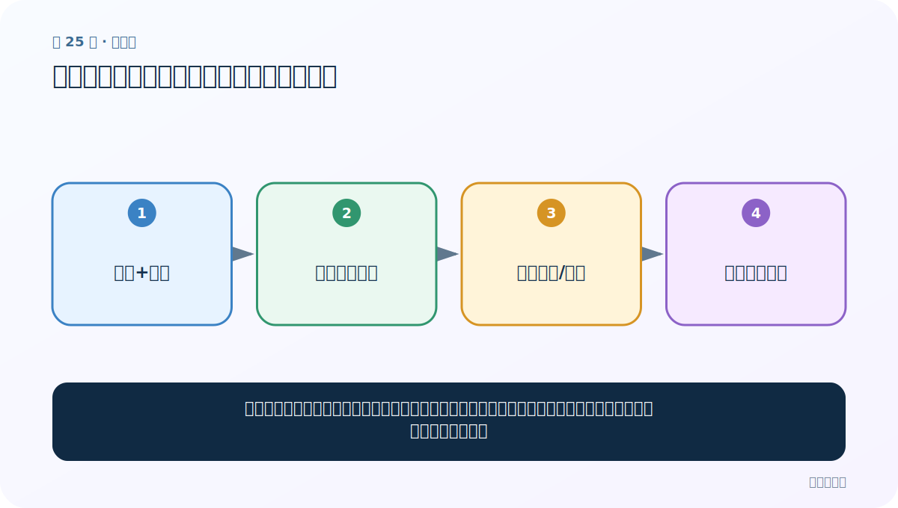

# 第 25 节：按标签比较长度：长度本身也可能泄露规律

> 笔记编号 25/33 · 对应原视频 P29 · [打开这一集](https://www.bilibili.com/video/BV14mdfBDE4Q?p=29)

[← 上一节：24 句子长度分布：为截断和补齐找依据](./24-sentence-length-distribution.md) · [返回总目录](./README.md) · [下一节：26 chain：把嵌套词列表铺平成一个词流 →](./26-itertools-chain.md)

## 这节解决什么问题

把正负样本的长度分别画出来，可以看到某类是否明显更长、异常点集中在哪类，也能发现采集流程带来的偏差。



图要从左向右读。每个方框都是数据的一次变化，不是四个互不相关的名词。

## 辅助流程图


### 从分析发现到处理决策


## 老师原声整理稿（按讲解顺序）

### 0:00–2:59　为什么还要按标签看长度

总体直方图可能掩盖类别差异。老师接着画正负样本长度散点，检查某一类是否更长、极端长评论集中在哪类。

课堂还建议打印三千多字符的异常评论回看原文。异常可能是真实长文本、重复抓取、HTML 或拼接错误，处理策略不同。

### 2:59–5:57　stripplot 的 x、y 与 hue

横轴 label（0/1），纵轴 sentence_length，每个点是一条样本。hue 可按标签着色，jitter 让重叠点稍微错开。

训练集与测试集可画成并列子图，坐标范围保持一致。

### 5:57–7:03　读图不要把所有离群点当脏数据

老师解释分组参数并观察散点。发现极长点后，第一步是回到原文，不是直接删除。

若正样本全部来自长评论、负样本来自短标题，模型可能只学长度捷径；若长度差异来自真实表达，也可能是有效信号。应做去除/保留长度特征的对照实验，并检查数据采集来源。

## 完整原声逐段记录

[查看本节按时间戳整理的完整音轨转写](./transcripts/p029.md)

这份记录用于核查老师讲过的内容是否遗漏；正文会纠正口误与语音识别中的技术术语。

## 零基础先记住

- stripplot 能展示每个样本点，箱线图可概括中位数与四分位
- 长度差异可能是真实规律，也可能是数据采集漏洞
- 极长、极短样本要回到原文人工复查

## 最小可运行代码

在项目根目录运行下面代码。课程原理的标准库版本集中在 [text_preprocessing_from_scratch](../../text_preprocessing_from_scratch/README.md)；需要 jieba、PyTorch、FastText 等的示例，请先按代码注释安装依赖。

```python
samples = [("正", 8), ("正", 10), ("正", 80), ("负", 7), ("负", 9)]
for label in sorted({x[0] for x in samples}):
    values = [length for y, length in samples if y == label]
    print(label, "数量", len(values), "平均长度", sum(values) / len(values))
```

### 输入和输出怎么看

按类输出数量和平均长度；正类中的 80 会明显拉高平均值，提示进一步检查。

## 最容易踩的坑

看到两类长度不同，不能立即删除长度信息。先判断它是有意义的语言信号还是标签泄漏。

## 本节知识链

`文本+标签 → 分组长度散点 → 发现差异/离群 → 回看原文原因`

如果中间任意一个箭头说不清楚，就回到图上，用代码中的一个具体值手算一遍；能预测输出，才算真正理解。

## 自测

**问题：若所有正样本来自长评论、负样本来自短标题，模型可能学到什么捷径？**

<details>
<summary>点开核对答案</summary>

只按长度猜标签，而不是理解语义；换数据来源后性能会崩。

</details>

## 学完检查

- [ ] 我能不用术语，用自己的话解释“这节解决什么问题”
- [ ] 我能在运行前大致猜出代码输出
- [ ] 我知道本节方法不适用或容易出错的情况
- [ ] 我能回答自测题，而不只是记住答案

[← 上一节：24 句子长度分布：为截断和补齐找依据](./24-sentence-length-distribution.md) · [返回总目录](./README.md) · [下一节：26 chain：把嵌套词列表铺平成一个词流 →](./26-itertools-chain.md)
