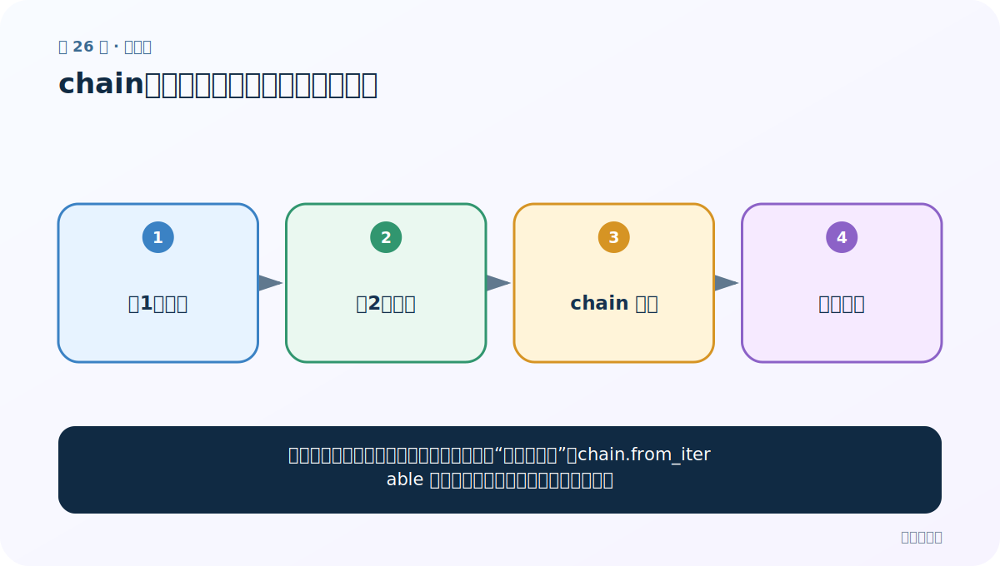
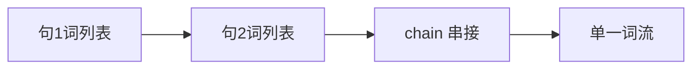
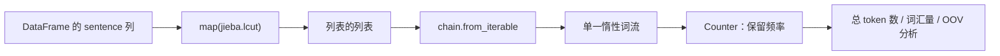

# 第 26 节：chain：把嵌套词列表铺平成一个词流

> 笔记编号 26/33 · 对应原视频 P30 · [打开这一集](https://www.bilibili.com/video/BV14mdfBDE4Q?p=30)

[← 上一节：25 按标签比较长度：长度本身也可能泄露规律](./25-length-by-label.md) · [返回总目录](./README.md) · [下一节：27 词汇量统计：不同词有多少、各出现几次 →](./27-vocabulary-count.md)

## 这节解决什么问题

每句话分词后得到一个列表，整个语料就是“列表的列表”。chain.from_iterable 能把它惰性串起来，便于做全局词频。



图要从左向右读。每个方框都是数据的一次变化，不是四个互不相关的名词。

## 辅助流程图



### 从嵌套语料到词汇统计的数据流



## 零基础精讲：把这一节慢下来

### 先看一个具体场景

分词后得到 [[我,爱,NLP],[我,学,分词]]。做全局词频前要把两层列表铺成一个连续词流，但没必要反复复制整批数据。

### 数据究竟怎样一步步变化

1. 每句话各自得到词列表
2. chain 依次接上这些列表
3. 遍历时才产出下一个词
4. 直接交给 Counter 做全局计数

把上面四步和流程图对照起来：

> 句1词列表 → 句2词列表 → chain 串接 → 单一词流

这里的箭头表示“左边的数据经过一次处理，变成右边的数据”，不是四个需要孤立背诵的名词。

### 第一次读代码，只盯住这一件事

和 map 一样，先预测为什么第二次 list(words) 为空；它也是一次性惰性迭代器。

运行前先在纸上写出你预计的结果；即使猜错，也要指出自己是在哪个箭头上理解错了。这样比复制代码后看到“能运行”更接近真正学会。

### 本节暂时不要误会

若把一个字符串误传给 chain，它会逐字符展开，因此要先确认嵌套层级。

用一句话过关：**每句话分词后得到一个列表，整个语料就是“列表的列表”。chain.from_iterable 能把它惰性串起来，便于做全局词频。**

## 老师原声整理稿（按讲解顺序）

### 0:00–1:57　先学 chain，再做全语料词汇统计

老师要统计训练集和测试集分别有多少种词。每句话分词后是一个列表，整个数据集就成了“列表的列表”；在计数之前，必须先把里面的词串成一条词流。因此老师暂时离开业务代码，先单独演示 `itertools.chain`。

```python
from itertools import chain

left = [1, 2, 3]
right = [2, 4]
stream = chain(left, right)
```

### 1:57–4:53　chain 返回惰性迭代器

创建 chain 对象时不会马上遍历底层数据，真正调用 `list(stream)`、for 循环或交给其他消费者时才逐个取元素。老师把它与前面学过的 map 对照：两者都返回惰性迭代器。

迭代器一旦消费完，同一个对象再次转成列表通常为空。若后续要重复使用结果，应第一次就保存为 list；若数据很大且只消费一次，保留迭代器更省内存。

### 4:53–7:50　从两个列表过渡到“每句话的分词列表”

普通 `list.extend` 会修改原列表；chain 则只是提供统一的遍历视图。老师重新定义两个句子，先用 map 对每个句子调用 jieba 分词：

```python
tokenized = map(lambda sentence: jieba.lcut(sentence), sentences)
```

此时 tokenized 中的每个元素仍是一个词列表，还没有铺平。

### 7:50–10:50　星号解包与去重

课堂写法用 `chain(*tokenized)`：星号先把 map 产生的多个词列表逐个取出，再作为多个参数传给 chain。

```python
unique_words = set(chain(*map(jieba.lcut, sentences)))
```

这行代码完成三件事：全部句子分词、铺平成一个词流、用 set 去重。更直接且不需要星号展开的写法是：

```python
unique_words = set(chain.from_iterable(map(jieba.lcut, sentences)))
```

### 10:50–12:21　一行代码的边界

老师把整段压成一行，强调以后熟练后代码会更短。但短不等于总是更好：若还要统计频率，就不能过早变成 set；应把平坦词流交给 Counter。若需要调试分词错误，也应拆开中间步骤打印抽样结果。

## 完整原声逐段记录

[查看本节按时间戳整理的完整音轨转写](./transcripts/p030.md)

这份记录用于核查老师讲过的内容是否遗漏；正文会纠正口误与语音识别中的技术术语。

## 零基础先记住

- itertools.chain(a, b, c) 依次遍历多个可迭代对象
- chain.from_iterable(nested) 适合列表的列表
- 它不复制全部数据，但仍是一次性迭代器

## 最小可运行代码

在项目根目录运行下面代码。课程原理的标准库版本集中在 [text_preprocessing_from_scratch](../../text_preprocessing_from_scratch/README.md)；需要 jieba、PyTorch、FastText 等的示例，请先按代码注释安装依赖。

```python
from itertools import chain
sentences = [["我", "爱", "NLP"], ["我", "学", "分词"]]
words = chain.from_iterable(sentences)
print(list(words))
print(list(words))
```

### 输入和输出怎么看

第一次得到一个平坦词列表，第二次为空。大语料中可直接把它交给 Counter，避免额外复制。

## 最容易踩的坑

不要用 sum(nested_lists, []) 铺平超大数据，它会反复复制列表，效率很差。

## 本节知识链

`句1词列表 → 句2词列表 → chain 串接 → 单一词流`

如果中间任意一个箭头说不清楚，就回到图上，用代码中的一个具体值手算一遍；能预测输出，才算真正理解。

## 自测

**问题：chain 会把字符串当一个整体还是逐字符遍历？**

<details>
<summary>点开核对答案</summary>

字符串本身也是可迭代对象，会逐字符遍历；所以输入结构要确认正确。

</details>

## 学完检查

- [ ] 我能不用术语，用自己的话解释“这节解决什么问题”
- [ ] 我能在运行前大致猜出代码输出
- [ ] 我知道本节方法不适用或容易出错的情况
- [ ] 我能回答自测题，而不只是记住答案

[← 上一节：25 按标签比较长度：长度本身也可能泄露规律](./25-length-by-label.md) · [返回总目录](./README.md) · [下一节：27 词汇量统计：不同词有多少、各出现几次 →](./27-vocabulary-count.md)
