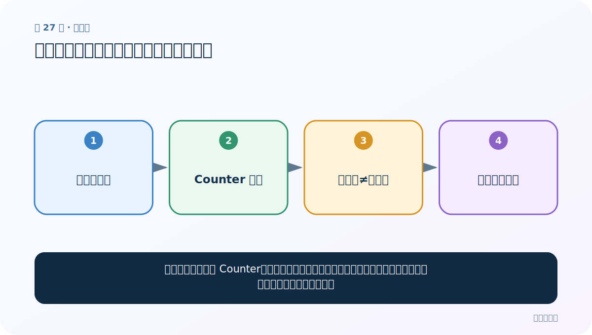
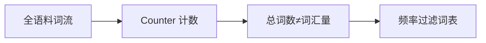
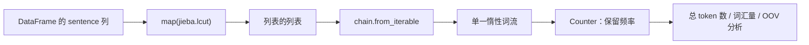

# 第 27 节：词汇量统计：不同词有多少、各出现几次

> 笔记编号 27/33 · 对应原视频 P31 · [打开这一集](https://www.bilibili.com/video/BV14mdfBDE4Q?p=31)

[← 上一节：26 chain：把嵌套词列表铺平成一个词流](./26-itertools-chain.md) · [返回总目录](./README.md) · [下一节：28 形容词词云：先按词性筛选，再按频率画图 →](./28-adjective-wordcloud.md)

## 这节解决什么问题

把全语料词流交给 Counter，可以同时得到词频和词汇表。词汇量不是越大越好，低频噪声会让模型和词表膨胀。



图要从左向右读。每个方框都是数据的一次变化，不是四个互不相关的名词。

## 辅助流程图



### 从嵌套语料到词汇统计的数据流



## 零基础精讲：把这一节慢下来

### 先看一个具体场景

“我 爱 NLP 我”总词数是 4，但不同词只有 3 个。前者决定处理了多少位置，后者决定词表和 Embedding 大约需要多少行。

### 数据究竟怎样一步步变化

1. 把训练语料铺成词流
2. Counter 累加每个词出现次数
3. len(counts) 得到不同词数量
4. 按最低频率过滤并加入 PAD、UNK

把上面四步和流程图对照起来：

> 全语料词流 → Counter 计数 → 总词数≠词汇量 → 频率过滤词表

这里的箭头表示“左边的数据经过一次处理，变成右边的数据”，不是四个需要孤立背诵的名词。

### 第一次读代码，只盯住这一件事

先手算示例里的总词数、词汇量和最高频词，再与程序输出核对。

运行前先在纸上写出你预计的结果；即使猜错，也要指出自己是在哪个箭头上理解错了。这样比复制代码后看到“能运行”更接近真正学会。

### 本节暂时不要误会

严格实验只用训练集建词表；提前看测试集会产生数据泄漏。

用一句话过关：**把全语料词流交给 Counter，可以同时得到词频和词汇表。词汇量不是越大越好，低频噪声会让模型和词表膨胀。**

## 老师原声整理稿（按讲解顺序）

### 0:00–1:00　把 chain 用回训练集与测试集

上一节解决了“如何铺平词列表”，这一节回到业务需求：分别获取训练集和测试集的不同词汇总数。老师把函数命名为类似 `word_count`，提醒这里要数的是去重后的词汇量，不是包含重复的总 token 数。

### 1:00–2:59　把示例中的两句话换成整列数据

老师让同学不要重新发明代码，而是辨认示例和真实数据之间唯一的差别：示例输入是两个句子，业务输入是 DataFrame 中的整列句子。

```python
from itertools import chain
import jieba

def vocabulary_size(sentences):
    token_lists = map(jieba.lcut, sentences)
    unique_words = set(chain.from_iterable(token_lists))
    return len(unique_words)
```

map 对每个句子分词，chain 铺平，set 去重，len 才得到“不同词汇数”。

### 2:59–3:59　把精确数字写进可读报告

老师继续组织输出，让训练集和测试集的词汇总数以完整中文句子显示。实际项目除了打印，还应保存以下量：

- 总 token 数：`sum(counter.values())`；
- 不同词汇数：`len(counter)`；
- 只出现一次的词数；
- 测试集中训练词表未覆盖的 OOV 比例。

### 3:59–6:40　课堂互动与可靠实现的补充

后半段主要是围绕格式化输出的课堂提问和反复纠正，没有引入新的算法步骤。更稳妥的实现是使用 Counter：它既保留频率，也能随时得到词汇量；等确定最低频率阈值后再建词表，避免大量拼写错误和只出现一次的噪声词膨胀输入空间。

```python
from collections import Counter
counts = Counter(chain.from_iterable(map(jieba.lcut, sentences)))
print("总 token 数：", sum(counts.values()))
print("不同词汇数：", len(counts))
```

## 完整原声逐段记录

[查看本节按时间戳整理的完整音轨转写](./transcripts/p031.md)

这份记录用于核查老师讲过的内容是否遗漏；正文会纠正口误与语音识别中的技术术语。

## 零基础先记住

- 总词数包含重复，词汇量只数不同词
- Counter.most_common 查看高频词
- 可设置最低频率并为其余词保留 <UNK>

## 最小可运行代码

在项目根目录运行下面代码。课程原理的标准库版本集中在 [text_preprocessing_from_scratch](../../text_preprocessing_from_scratch/README.md)；需要 jieba、PyTorch、FastText 等的示例，请先按代码注释安装依赖。

```python
from collections import Counter
words = "我 爱 NLP 我 爱 分词".split()
counts = Counter(words)
print("总词数", sum(counts.values()))
print("词汇量", len(counts))
print("高频词", counts.most_common())
```

### 输入和输出怎么看

总词数为 6，词汇量为 4；“我”和“爱”各出现 2 次。

## 最容易踩的坑

在分割数据前用全量语料统计词表会窥见测试集。严格实验应只用训练集建立词表和频率阈值。

## 本节知识链

`全语料词流 → Counter 计数 → 总词数≠词汇量 → 频率过滤词表`

如果中间任意一个箭头说不清楚，就回到图上，用代码中的一个具体值手算一遍；能预测输出，才算真正理解。

## 自测

**问题：总词数 100 万、不同词 5 万，Embedding 表有多少行？**

<details>
<summary>点开核对答案</summary>

通常约 5 万行，再加 PAD、UNK 等特殊词；不是 100 万行。

</details>

## 学完检查

- [ ] 我能不用术语，用自己的话解释“这节解决什么问题”
- [ ] 我能在运行前大致猜出代码输出
- [ ] 我知道本节方法不适用或容易出错的情况
- [ ] 我能回答自测题，而不只是记住答案

[← 上一节：26 chain：把嵌套词列表铺平成一个词流](./26-itertools-chain.md) · [返回总目录](./README.md) · [下一节：28 形容词词云：先按词性筛选，再按频率画图 →](./28-adjective-wordcloud.md)
