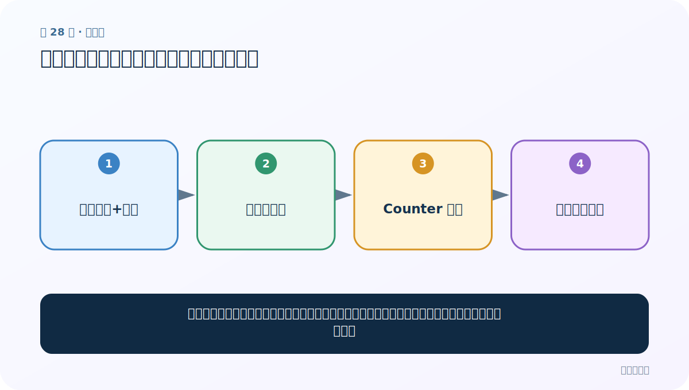
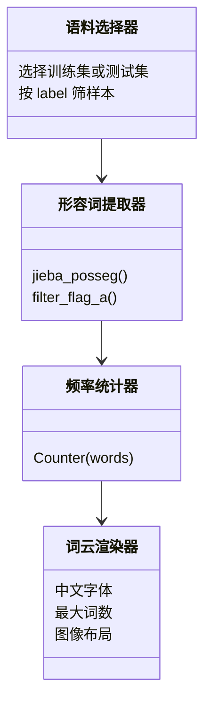

# 第 28 节：形容词词云：先按词性筛选，再按频率画图

> 笔记编号 28/33 · 对应原视频 P32 · [打开这一集](https://www.bilibili.com/video/BV14mdfBDE4Q?p=32)

[← 上一节：27 词汇量统计：不同词有多少、各出现几次](./27-vocabulary-count.md) · [返回总目录](./README.md) · [下一节：29 zip：把多个等长位置对齐成元组 →](./29-zip-function.md)

## 这节解决什么问题

词云把出现次数映射成字体大小。若我们只关心评价用语，可先用词性标注筛出形容词，再统计频率。



图要从左向右读。每个方框都是数据的一次变化，不是四个互不相关的名词。

## 辅助流程图


### 词云模块的职责关系



## 老师原声整理稿（按讲解顺序）

### 0:00–1:54　任务：比较正负样本中的高频形容词

老师准备分别绘制训练集正样本、负样本中的高频形容词词云。形容词只是示例；把词性条件换成名词或动词，整条流程不变。这个任务需要三个独立函数：从一句话取形容词、从词列表绘词云、组织某个数据集和标签。

### 1:54–5:44　函数一：词性标注后筛选形容词

```python
import jieba.posseg as pseg

def get_adjectives(text):
    result = []
    for item in pseg.lcut(text):
        if item.flag.startswith("a"):
            result.append(item.word)
    return result
```

老师先打印 `item.word` 和 `item.flag`，让同学确认每个对象同时含词和词性，再添加判断。课程口头说“等于 a”；实际 jieba 还可能出现 ad、an 等形容词细类，按任务决定用 `== "a"` 还是 `startswith("a")`。

### 5:44–9:36　函数二：配置 WordCloud 并生成图

词云需要中文字体路径、最多显示词数和背景色。课堂先把词列表用空格 join 成字符串，再调用 `generate`：

```python
cloud = WordCloud(
    font_path="可显示中文的字体.ttf",
    max_words=100,
    background_color="white",
).generate(" ".join(words))
```

若已计算词频，`generate_from_frequencies(Counter(words))` 更明确，也不会让词云自己再次切分。

### 9:36–12:02　Matplotlib 只负责显示

老师依次创建画布、`imshow(cloud, interpolation="bilinear")`、关闭坐标轴并显示。这里的 bilinear 是图像缩放插值，不决定文字横排还是竖排；词的方向由 WordCloud 的布局参数控制。这是对课堂口头解释的一处技术校正。

### 12:02–18:46　函数三：筛标签、逐句提取、铺平后画图

先读取训练集，筛出 `label == 1` 的 sentence 列。对每句话调用 get_adjectives，会得到列表的列表；老师复用 map 与 chain 将它铺平，再交给词云函数。

```python
positive_texts = train.loc[train["label"] == 1, "sentence"]
adjectives = chain.from_iterable(map(get_adjectives, positive_texts))
draw_wordcloud(list(adjectives))
```

### 18:46–23:49　正负样本都可能出现“相反”词

正样本词云里也可能出现“差”“吵”，负样本里也可能出现“好”。老师用酒店评论解释：一句话可以先抱怨装修噪声，再称赞前台和性价比，最终标签仍为正。词云丢掉上下文和否定关系，所以只能用于找线索，不能直接判定标注错误。

将标签条件改为 0 就能查看负样本；训练/测试与正/负四种场景的结构完全相同，适合封装成可复用函数。

### 23:49–29:29　从图回到人工审核与分析流程

若某些异常词频繁出现，应回到包含这些词的原句，判断是混合情感、标注错误还是敏感内容。老师强调程序不能替代人工抽查。

随后复习文本分析的顺序：先看 X、Y、标签分布、句长、词频和词云，再决定分词、词性、NER、n-gram、长度规范或增强策略。

### 29:29–35:21　直方图、柱状图与 API 复习

柱状图比较离散类别计数；直方图统计连续数值落入各区间的数量。老师复习 `histplot` 取代已弃用的 `distplot`，map 把同一函数作用于每个元素，stripplot 比较类别下的连续值分布，并通过选择题回顾 zip 的行为。

最后的工程建议是把已经验证的分析代码保存成模板，但必须理解输入、输出和假设，不能只会机械套用。

## 完整原声逐段记录

[查看本节按时间戳整理的完整音轨转写](./transcripts/p032.md)

这份记录用于核查老师讲过的内容是否遗漏；正文会纠正口误与语音识别中的技术术语。

## 零基础先记住

- jieba.posseg 产生词和词性，常按 a 开头标记筛形容词
- Counter 计算频率，WordCloud.generate_from_frequencies 绘制
- 中文词云必须指定可显示中文的字体文件

## 最小可运行代码

在项目根目录运行下面代码。课程原理的标准库版本集中在 [text_preprocessing_from_scratch](../../text_preprocessing_from_scratch/README.md)；需要 jieba、PyTorch、FastText 等的示例，请先按代码注释安装依赖。

```python
from collections import Counter
import jieba.posseg as pseg
texts = ["画面非常漂亮", "操作简单但是速度很慢"]
adjectives = []
for text in texts:
    adjectives.extend(w.word for w in pseg.lcut(text) if w.flag.startswith("a"))
print(Counter(adjectives))
```

### 输入和输出怎么看

先得到形容词及次数；安装 wordcloud 后可把这个 Counter 传给 generate_from_frequencies。

## 最容易踩的坑

词云适合探索和展示，不适合精确比较。字体面积会误导，重要结论要配词频表或条形图。

## 本节知识链

`评论分词+词性 → 筛选形容词 → Counter 频率 → 字号映射词云`

如果中间任意一个箭头说不清楚，就回到图上，用代码中的一个具体值手算一遍；能预测输出，才算真正理解。

## 自测

**问题：为什么中文词云常出现方框？**

<details>
<summary>点开核对答案</summary>

默认字体没有中文字形；需要提供有效的中文 font_path。

</details>

## 学完检查

- [ ] 我能不用术语，用自己的话解释“这节解决什么问题”
- [ ] 我能在运行前大致猜出代码输出
- [ ] 我知道本节方法不适用或容易出错的情况
- [ ] 我能回答自测题，而不只是记住答案

[← 上一节：27 词汇量统计：不同词有多少、各出现几次](./27-vocabulary-count.md) · [返回总目录](./README.md) · [下一节：29 zip：把多个等长位置对齐成元组 →](./29-zip-function.md)
